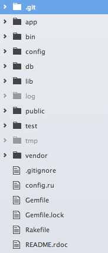
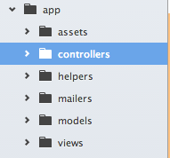
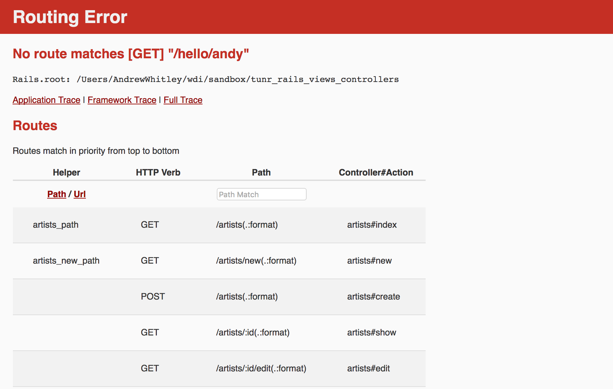
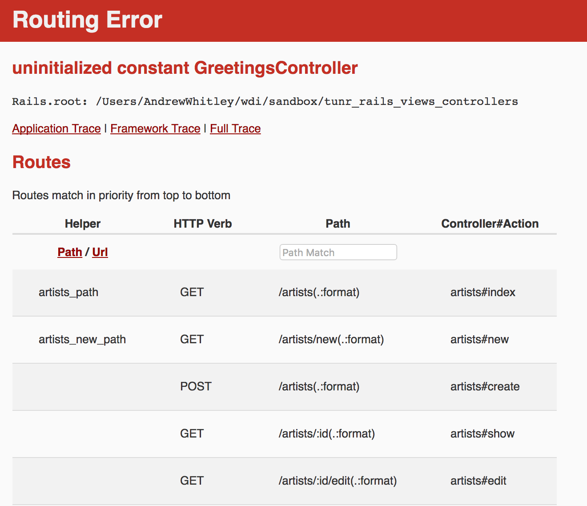
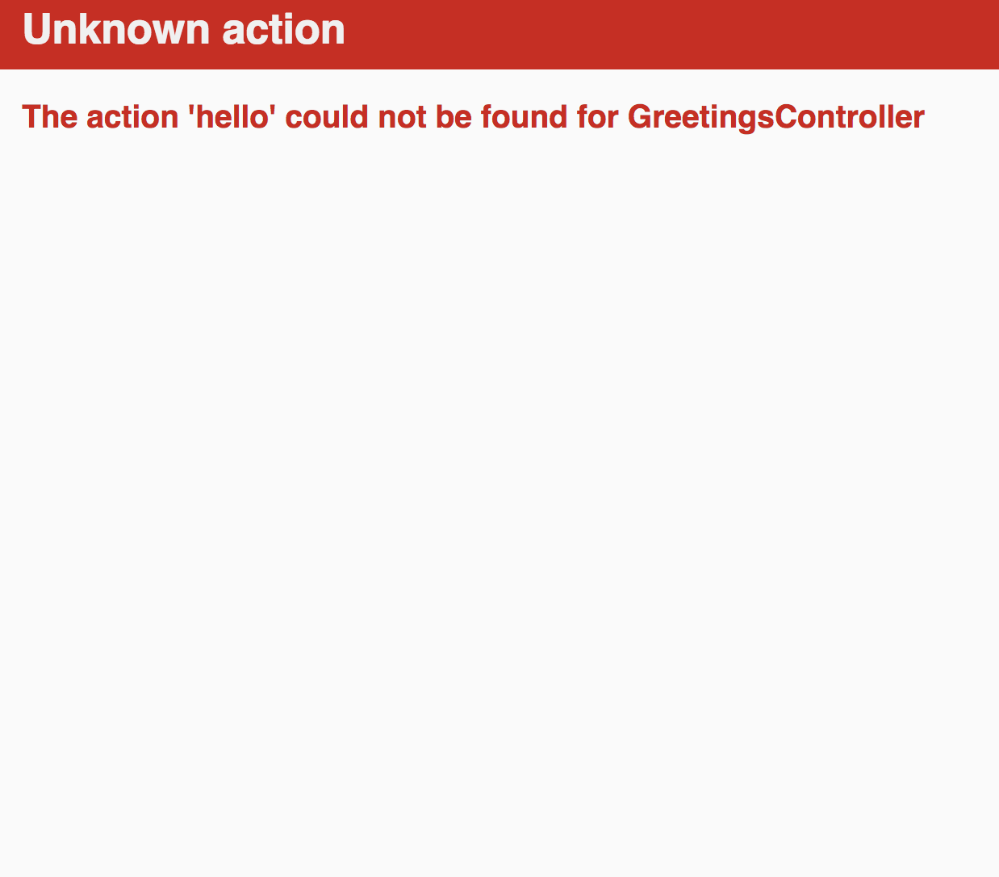
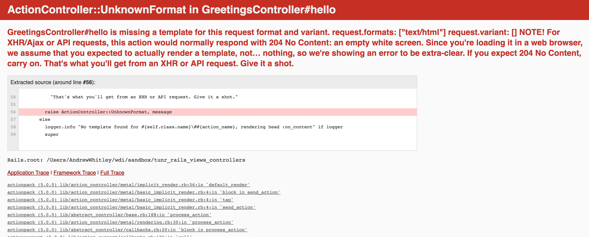

# Intro to MVC and Rails

## Learning Objectives

- Describe the role of a web framework such as Rails
- Describe the components of an MVC application
- Explain how Ruby on Rails implements MVC
- Diagram & annotate the lifecycle of an HTTP request in Ruby on Rails
- List the most common folders in a Rails application and describe their purpose
- Explain how Convention over Configuration relates to Ruby on Rails
- Describe how to read, understand, and fix errors in a Rails application

## Framing (10 minutes / 0:10)

This lesson is our first foray into Rails, but hardly our first pass at building a fullstack web application. Concepts and links between will feel familiar, but the implementation will be different. Its purpose is to give you a brief introduction into  what developing is like with Rails, and its configuration and conventions. 

By the end of this lesson, you are NOT expected to know the meaning behind each file and folder. All we want to focus on during this lesson is to get a feel for what Rails is all about and make comparisons between it and Express. We'll get into the nitty-gritty of Rails in subsequent lessons.

As our applications get more complicated, we need ways to help manage the*complexity* and *size*. We have lots of tools, some in the form of organizational patterns, to help us do this.

<strong>What are some of these tools?</strong>

  > Breaking code into separate files. Each file has code related to one "job."
  >
  > Object-oriented design. Model our program as objects with data and behavior (properties and methods)

There are other tools we have as programmers. One tool is the idea of a **design pattern**. A design pattern is a higher-level pattern that shapes how we build and structure our code.

We've seen one such pattern for designing full-stack applications, MVC (**Model, View, Controller**).

We're going to talk about MVC, because that's the pattern that Rails implements.

### MVC in Express
- Express has provided us a way to create *controllers* to handle HTTP requests.
  > The routing handling callback function is like a controller method in Rails.

- We've used Handlebars (.hbs) to construct *views*.
- We constructed models with mongoose Schemas.

### MVC Elsewhere
There are MVC-style frameworks for building native desktop apps (e.g., Microsoft's ASP.net, Cocoa for Mac), mobile apps (iOS and Android toolkits) or other web frameworks like Django (which uses a variant of MVC called MVT) or CakePHP.

MVC is *not* the only design pattern for applications, but it's a popular one. We'll also see somewhat related but different patterns in Javascript frameworks like Angular or Backbone.

> Some others include [MVVM](https://en.wikipedia.org/wiki/Model%E2%80%93view%E2%80%93viewmodel) (Model-View-ViewModel) - e.g. Vue, AngularJS, Knockout.js - and [MVP](https://en.wikipedia.org/wiki/Model%E2%80%93view%E2%80%93presenter) (Model-View-Presenter).

## What Is MVC?

MVC is all about separating your code into separate sections...

* **Models**: represent the data in our application
* **Views**: describe how to present your data in a way that the user can see in the browser
* **Controllers**: are responsible for responding to user requests, interacting with models and loading views

## Rails and MVC (20 minutes / 0:30)

Because Rails is for web apps, there's one additional component it adds to MVC: a router. A router connects incoming requests on the server to the application's controller. Thus we sometimes say that Rails is built around **rMVC** - a router, models, views and controllers.


As a result, the request-response cycle looks like this for Rails...

  1. A user of our web application submits a request to our application's server.
  It can come in a myriad of ways. It could be someone typing in a URL and hitting
  enter, clicking a link or submitting a form on our application.

  2. The request hits the router of the application.

  3. The application then either doesn't recognize the route (error) or it does
  recognize it (route) and sends it to the appropriate controller.

  4. Once the controller gets the request, it performs any necessary actions. This
  might include fetching, updating, deleting, or creating information using one
  or more models.

  5. Once the controller has performed any actions / retrieved any information
  from the model(s), it uses a view to *render* an HTML page.

  6. The rendered view is then sent back to the client as a response.

<!-- ## [We Do: In-Person MVC (20 minutes / 0:40)](exercise.md) -->

## Rails Apps

### Convention Over Configuration in Rails

The phrase "convention over configuration" often pops up in the context of frameworks. Frameworks have some default configuration that spares us from making a lot of decisions about the set-up and structure of our applications. The framework's convention is preferable to manually configuring things, and this probably a core reason for using a framework in the first place (get things done more quickly, but in a predictable way shaped by the conventions of the framework).

With our example and assignment Express applications, we often implicitly followed a set of conventions...
  - Pluralized collection (or table, if in SQL) names (e.g., `artists`)
  - Singular, capitalized model names (e.g., `Artist`)
  - Singular, lowercase model file names (e.g., `artist.js`)


Rails follows the conventions above in relatively strict fashion. Rails projects will usually have very similar if not the same overall file structure. This structure makes the debugging process easier and eases the confusion of jumping headfirst into a Rails project created by other developers.

> Rails, and other application frameworks, is designed to make programming web applications easier by making assumptions about what every developer needs to get started. It makes the assumption that there is a "best" way to do things, and it's designed to encourage that way - and in some cases to discourage alternatives. -- [Ruby on Rails guide](http://guides.rubyonrails.org/)

Rails is a framework with lots of rules/conventions. Pay attention to the
conventions you'll need to follow for Rails throughout the coming classes.


### Rails Walkthrough (5 minutes / 0:35)

Let's walk through a Rails App to get comfortable with its file structure and
identify where we will be configuring all of the concepts we discussed
above.

Today, we'll be taking a look at [Tunr](https://git.generalassemb.ly/ga-wdi-exercises/tunr_rails_views_controllers/tree/solution)...

```bash
$ git clone https://git.generalassemb.ly/ga-wdi-exercises/tunr_rails_views_controllers
$ cd tunr_rails_views_controllers
$ git checkout solution
```

As we go through the app and code, you will notice how everything is abstracted
into individual files and directories. Why?

- Separation of concerns
- Readability
- Rails Conventions

## You Do: Scavenger Hunt (15 minutes / 0:50)

> 10 minute exercise. 5 minutes review.

We'll talk about what all these files and folders mean in just a moment, but first, we want to give you a chance to explore.

Your job is to look through the application and find the Rails equivalents for the following, making sure to focus your search on the `app`, `db` and `config` directories...

* Schema
* Routes
* An `Artist` model
* Code that should be run when we visit the index page for artists
* The view that should be displayed when we visit the index page for artists
* The `layout.erb` file
* Directories for CSS and Javascript files
* A file named `connection.rb`

> Make note of anything that reminds you of the Express apps we've seen so far.

<strong>Answers...</strong>

  * Schema - `db/schema.rb`
  * Routes - `config/routes.rb`
  * An `Artist` Model - `app/models/artist.rb`
  * Artist Index Code - `app/controllers/artists_controller.rb`
  * Artist Index View - `app/views/artists/index.html.erb`
  * `layout.erb` - `app/views/layouts/application.html.erb`
  * CSS/JS Directories - `app/assets`
  * `connection.rb` - `config/database.yml`


### Break (10 minutes / 1:00)

### What Does a Rails App Look Like? (5 minutes / 1:05)

As soon as we generate a Rails app, you can see there are already many folders
and files generated from just the one command, `rails new`...



While all these files may be daunting at first, you're already familiar with an MVC file structure from your work with Express. For the time being, you can ignore a lot of the other configuration files until you have a need to customize your app or incorporate some specific functionality or gem.

As we scale to a Rails size application, We can quickly see the need for conventions in such a massive framework. Specifically for folder and file structure, Rails can be quite particular about how we name things. Throughout this week we'll be going through a bunch of different conventions we need to follow.

The first folder we'll talk about is the `app` folder...



This folder is the the most important folder in your entire application. It will contain most of the programs functionality.

- **`assets`**: this will be where all of your CSS, JS, and image files belong.
- **`controllers`**: this folder will contain all controllers.
- **`models`**: this folder will contain our models.
- **`views`**: this folder contains all of the views in this application.

The `bin` folder contains binstubs. We're not going over this in the scope of this class, but basically they're used as wrappers around ruby gem executables - like `pry` - to be used in lieu of `bundle exec`. Their purpose is to prepare the environment for the executable.

The `config` is another folder that's pretty important. The file you'll most be visiting is `routes.rb` This is the router in rMVC.

The `db` folder is one you'll be working in for a bit of time as well. This contains the schema and seed files. Additionally, it will also contain your migrations, which you'll be going over in the next class.

In the root directory of the application you will also see a `Gemfile` and, if you've run `bundle install`, `Gemfile.lock`

### You Do: Setup Commands (10 minutes / 1:15)

> 5 minutes exercise. 5 minutes review.

The following are commands that are often run when setting up a Rails application. Your task is to run these in order and, based on the context clues (e.g., terminal output), figure out what they're doing. You answers don't need to be technical - keep it high-level or general.

| Command | What does it do? |
|---------|------------------|
| `bundle install` | |
| `rails db:drop` | |
| `rails db:create` | |
| `rails db:migrate` | |
| `rails db:seed` | |
| `rails s` | |

> NOTE: The `rails` command took the place of `rake` in Rails 5.0.0. You will likely still see older examples that use `rake` in Rails-related search results.


<details>
  <summary><strong>Answers...</strong></summary>

  * `bundle install` - Loads and sets up the local dependencies
  * `rails db:drop` - Drops the database, if it exists
  * `rails db:create` - Creates the database, equivalent to `createdb db_name`
  * `rails db:migrate` - Sets up schema, equivalent to `psql -d db_name < schema_file.sql`. Creates the tables in the database
  * `rails db:seed` - Runs seed file. Populates the tables.
  * `rails s` - Starts the server

</details>

------

After we've done all that and run `rails s`, we should see something like this in the Terminal...

```bash
=> Booting WEBrick
=> Rails 4.2.6 application starting in development on http://localhost:3000
=> Run `rails server -h` for more startup options
=> Ctrl-C to shutdown server
[2016-03-09 09:02:00] INFO  WEBrick 1.3.1
[2016-03-09 09:02:00] INFO  ruby 2.2.3 (2015-08-18) [x86_64-darwin15]
[2016-03-09 09:02:00] INFO  WEBrick::HTTPServer#start: pid=97614 port=3000
```

Let's focus on this particular line...

```bash
=> Rails 4.2.6 application starting in development on http://localhost:3000
```

`http://localhost:3000` is where we can begin interacting with our Rails application in the browser.

> `3000` is the default port number in a Rails Application

### You Do: Follow A Request (20 minutes / 1:35)

> 10 minutes exercise. 10 minutes review.

Using your knowledge of the MVC request-response cycle and the files/folders you discovered during the scavenger hunt exercise, try following the path of an HTTP request through a Rails application. HTTP is a protocol - a system of rules - that determines how web pages (see:'hypertext') get sent (see:'transferred') from one place to another. Among other things, it defines the format of the messages passed between HTTP clients and HTTP servers. Since the web is a service, it works through a combination of clients (which make requests) and servers (which receive requests).

Do that for each of the following.

- `GET` artist info
- `PUT` changed info on the artist page
- `POST` a new artist
- `DELETE` an artist

### Questions (10 minutes / 1:45)

#### Routes

- Where do we configure our routes in a Rails Application?
- What is the syntax for writing routes in a Rails App?
- Why are we including a symbol again in `artists/:id` in our path?
- What are `artists#index` and `artists#show` referring to?

<strong>Answers</strong>

  > 1. config/routes.rb
  >
  > 2. `GET` request example: `get "artists" => "artists#index"``
  >
  > 3. Can dynamically change the id of artist and grab those params as needed in our application
  >
  > 4. On the right side of the hash rocket `"artists#index"` its specifying the ***controller*** and an ***action*** within that controller. In this case, when a user of our site accesses the `artists` path(`http://localhost:3000/artists`), that request will be sent to the artists controller and execute the index action inside that controller.

#### Views

- What is this `index.html.erb` file type?
- Does it matter what we name our views folders? Does it matter if it's plural or singular?
- What is the layouts directory used for?

<strong>Answers</strong>

  > 1. html.erb is an html file type that allows for in line ruby code. As we will see, developers use embedded ruby tags such as ```<% %>```
  >
  > 2. Yes! it does matter that we make these folder names plural. Rails convention says to make the folders in the views match up with the controllers
  >
  > 3. This creates the base layout of your page. If you have a nav bar that should remain throughout your app, the layout is the place to be! It also allows you to link script and css files in one place.

#### Models

- Where does the model get used?
- Where have we seen models like this before?
- What does `has_many` and `belongs_to` mean?
- What conventions do we see here?

<strong>Answers</strong>

  > 1. Corresponding controllers
  >
  > 2. These are ActiveRecord models!
  >
  > 3. These define the relationships between models. In the case of Tunr, we have a simple one-many relationship: one artist has many songs
  >
  > 4. These model names must be capitalized.

### Break (10 minutes / 1:55)

## Reading Rails Errors (15 minutes / 2:10)

One of Rails' best features are its errors. Why?

Rails provides detailed, understandable errors that provide guidance when building an application. We won't go too deep into them during
this class, but you will get plenty of exposure during the upcoming lessons.

To demonstrate, let's visit `http://localhost:3000/hello/andy` in the browser. We should see...



To fix this, let's create a route for this request in `config/routes.rb`. We will point this route to a `greetings` controller:
```rb
get "hello/:name" => "greetings#hello"
```

Now when we refresh the page, we should see a new error:



This mean that rails cannot find the controller that the route is pointing to. To fix this, lets create a new file in `app/controllers` with the filename `greetings_controller.rb`. Inside of that file, lets create a *class* that defines the controller:

```rb
class GreetingsController < ApplicationController

end
```

When we refresh, we get a new error! This tells us that rails can find the relevant controller, but no method on the controller that matches the action in our `config/routes.rb` (`greetings#hello`).



Let's add a method to our controller and define any relevant data in it.

```rb
class GreetingsController < ApplicationController
  def hello
    @name = params[:name]
  end
end
```

When we refresh the page, we have one last error to address:



To fix, we need to add a folder inside of the `views` folder that matches the controller name: `views/greetings`. Then create a file in this new folder that matches the method name `hello`:
`views/greetings/hello.html.erb`. Once it is created, we can use embedded ruby (erb) to template a view using any instance variables we defined in the controller:

```html
<h2>Hello <%= @name %></h2>
```
Now when we refresh the page, we should see the correct page and name displayed.

## You Do: Reading Errors (10 minutes / 2:20)

Follow the same process above to make the link `http://localhost:3000/goodbye/andy` load in your browser.  


## Closing / Questions (10 minutes / 2:30)

- What are some ways Rails differs from Express?
	- lots of strict convention to follow! also: routes are separated out from controller 
- What are the components of an MVC app and what roles do they play?
	- model: represents the structure of the data in the application
	- view: what is rendered in the browser
	- controller: responds to user requests; interacts with model and figures out what view to render
- What are some of the most commonly used folders in Rails and what do they do?
	- app: 
		- assets: CSS and JS
		- controllers
		- models
		- views
	- config
		- routes.rb
	- db
		- schema.rb
		- migrations
- What does Convention over Configuration mean?
	- A lot more rigid structure, but a lot more "magic" of things working if you put the building blocks in the right place.
- Where are my routes listed?
	- config/routes.rb
- What is an example of Separation of Concerns in regards to Rails?
	- models, views, routes, controllers are all very much separated out. so configuring each one is a separate exercise, and Rails pieces them all together for you!
- What CL command can I use to start my Rails server?
	- `rails s`
- There are too many files, I feel scared! Is that normal?  (Yes!)

## Additional Resources
- [Rails Documentation](http://api.rubyonrails.org/)
- [Rails Github](https://github.com/rails/rails)
