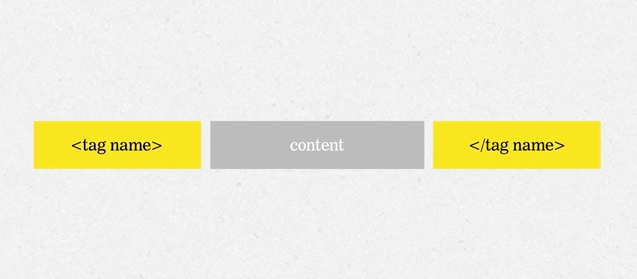
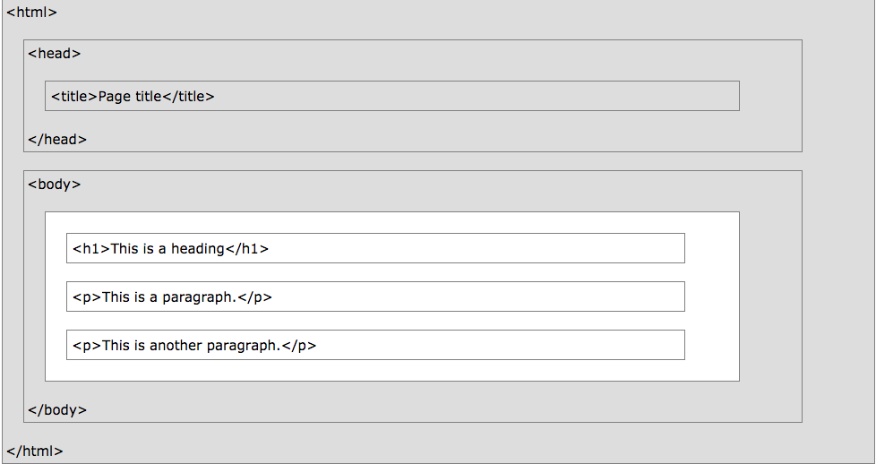
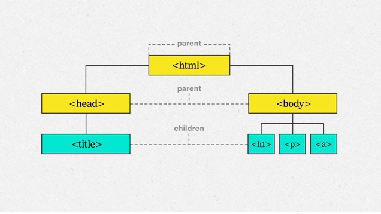

# Intro To HTML

## Learning Objectives

* Define HTML and describe its use
* Use HTML to structure a website
* Create a base template for sites using HTML

## Introduction to Web Languages

There are three main languages that make websites: HTML, CSS, and JavaScript.


* CSS focuses on the styling of a web page -- or what it looks like. We could make a page red, the font comic sans, or center content using CSS.
* JavaScript brings the interactivity to websites. You can add pop ups, allow the user to draw a picture, or write a game using JavaScript.
* HTML contains the content for our sites. We could have a header, a paragraph of text, or a link to another website in HTML.

Today, we are going to look more in depth at HTML.

## Introduction to HTML

HTML exists to solve the problem of how a rich document can be expressed in plain text. That is to say what are the parts of the document, what role does each part serve (e.g. heading, image, list, emphasized text, tables, link etc.), and how do they relate to one another.

HTML expresses the **structure and semantics** of a document in plain text.

The acronym HTML stands for:
<ul>
    <li><b>H</b> - Hyper</li>
    <li><b>T</b> - Text</li>
    <li><b>M</b> - Markup</li>
    <li><b>L</b> - Language</li>
</ul>
HyperText is text that links to other texts or pages -- you see hypertext everywhere! For example, if you click on somebody's name on Facebook, it links to that person's profile. 

Markup is some sort of symbol that tells the web browser how a piece of text should be formatted. In HTML we will use tags as our symbols -- for example:
```html
<b>Hello World</b>
```
Tells the browser that the text Hello World should be bolded.

Finally, the l stands for language -- HTML is language the browser can understand!

> Though HTML is a language that tells the browser how to format text, it isn't usually considered a programming language -- we can't write full programs using it.

## Using HTML
We can write HTML using tags and content. The tag tells the browser how to format the content -- which is the text we want to actually show up on the page.



The tag and content combined make an HTML element. Tags are denoted by brackets (`<` `>`). Close tags also have a `\` after the `<` symbol as well.

There are a bunch of different tags!
* `<h1>` creates a header
* `<p>` creates a paragraph
* `<a>` is a link

Let's try some out!
* Navigate to your Sandbox directory on your computer
```bash
$ cd wdi/sandbox/
```
* Create an HTML file -- by convention our homepage for our website will go in the `index` file.
```bash
$ touch index.html
```
* Open that file in your text editor.
```bash
$ code index.html
```
* Write some HTML in that file.
```html
<p>Hello World!</p>
```
* Now open that HTML file in your browser.
```bash
$ open index.html
```
* Change the `<p>` tags to `<h1>`'s what happens? How about `<h2>`'s or `<a>`'s?
    * p - stands for paragraph! These contain the main body content of our site.
    * h - stands for header. `h1` tags are the biggest headers and `h6`'s are the smallest.
    * a - stands for anchor. These contain links from one site to another or from one part of the site to another part of the site.

> When you learn a new technology or programming language, it is customary to have your first piece of code in it be a "hello world" program! You just wrote your first one!


> Each web page we create will be in a different HTML file. You will want to title your file descriptively -- like `about.html` for an about page.

### You Do: Writing Your First Site
* Let's start with some content! Copy the text below into your editor.
```
My first website!
by a talented student
Built at GA.
```
* Next, open (and close) a level one heading tag (h1) at the very beginning where it says, "My first website!"

* Open and close level two heading tag on the second line that says, "by a talented student."

* Lastly, wrap this sentence in a paragraph tag: "Built at GA."

* Link to your GitHub account. Make the link content "See my GitHub!"

#### Checkpoint!
Fill out the review questions on my.generalassemb.ly for section 1 of HTML!

### Attributes
Some tags need more information attached to them.
```html
<tagName attributeName="value">
```
We briefly looked at the `<a>` tag which contains links -- in the above example it was clickable but the link didn't lead anywhere. Let's add our first attribute to our `<a>` tag. The `href` attribute, or hypertext reference, tells the browser which page our `<a>` tag should link to.

The following code uses the `href` attribute to link to `twitter.com`!
```html
<a href="twitter.com">Twitter</a>
```
 By convention, we use a "#" as a placeholder for the `href` if we don't have a url yet.


## HTML Template

Now that we've learned a bit about HTML tags, let's think about how to organize them properly.

An HTML boilerplate is a set of common HTML elements that helps us easily organize and begin building our code. Watch the video in the next slide to understand how to create an HTML boilerplate.

The tags `html`, `doctype`, `head`, and `body` add organization to our code, and they transfer important information to the browser on what content our file will contain.

#### Document Type Declaration
```html
<!DOCTYPE html>
```

This element tells the browser that the document you are giving to it is written in HTML. There are other templating languages out there -- though HTML is by far the most widely used! We have to communicate to our browser which we are using.

> The !DOCTYPE tag is self contained, it doesn't need a closing tag! We will come back to that in a bit.

#### The html tag
```html
<!DOCTYPE html>
<html>
</html>
````
The `html` tags tell the browser where the HTML code is written. All of our code must be written between these tags.

#### The head and body tags 
```html
<!DOCTYPE html>
<html>
    <head>
    </head>
    <body>
    </body>
</html>
````
The `head` element contains the "behind the scenes" code for your site. Usually you will have your title for the site (in `title` tags), links to your CSS, and meta data within the `head`.

The `body` element contains the actual content for your site.

For example, your body code could look like this:



As you may have noticed, HTML tags can have other tags within them -- these inner tags are called children. You can visualize them like a tree!



The boilerplate code doesn't add much visually to your web page, but it does communicate important information to your browser, and some browsers will only be able to read your code if you have this information!

### Shortcut: Emmet
Try typing `html:5` in a fresh HTML file and then enter -- your boilerplate will be generated for you!

### You Do: Your Second Site
* Create an HTML boilerplate complete with `head`, `body`, `html`, `doctype`, and `title` tags.

* Write the text "Hi, I'm awesome." as a `h1`.

* Write the text "Follow me on Twitter. Send me an email." as a paragraph.

* Wrap the text, "Follow me" in an anchor element.

* Link to your Twitter account within that anchor tag.

* Add another anchor tag around the word "email".

* Put `mailto:` in front of your email address in your `href` attribute so the browser knows it's not a web page.

## Singleton Tags
We just saw that the !DOCTYPE tag doesn't need a closing tag. There are a couple other tags that we don't need closing tags for since they don't have content! `` allows us to embed images on our websites.

```html

```

Renders as...


This code will add a cute animal to our site!

Note, there isn't any text 

Some others include:
* input
* br
* meta
* link

### You Do: Add an image to your webpage
* Use an `img` tag to add an image to one of your in-progress webpages from this class.

#### Checkpoint!
Fill out the review questions on my.generalassemb.ly for section 2 of HTML!

### Activity: Learning more tags
There are a **ton** of HTML tags out there! Please don't memorize them! Run through the list below and jot down which each does. If you can figure it out by using it, do so, if not then use Google to research!
* ul
* ol
* li
* b
* em
* table
    * tr
    * td
* q
* code
* strong
* blockquote
* address
* del
* button
* mark
* small
* marquee

#### Checkpoint!
Fill out the review questions on my.generalassemb.ly for the HTML class!

## Homework: Memory Game
* Follow the instructions on the `my.generalassemb.ly` site to finish the unit three homework!

## If you want to learn more...
* [HTML Cheat Sheet](https://ga-instruction.s3.amazonaws.com/json/WDI-Fundamentals/assets/studyguides/U3-studyguide.pdf)
* [Codeacademy](https://www.codecademy.com/learn/learn-html)
* [MDN](https://developer.mozilla.org/en-US/docs/Web/HTML)
* [W3 Schools](https://www.w3schools.com/html/)

## Bonus Content: Divs and Spans
Two HTML tags that you may see a lot are `<div>`'s and `<span>`'s. These tags don't actually do anything by themselves. They just demarcate an area that we will be adding a style to when we get to CSS! Divs add a new line when they end, spans are within the same line. 

## Bonus Content: Escape Characters
You may have noticed that spaces show up if you put them between words in HTML. You also may have noticed that enters, tabs, and spaces in our code don't end up showing up. Therefore, if we want to add extra spaces, or spaces between tags they may not always show up. Also, '>' and '<' are special characters in HTML -- how would we use them in our writing? HTML has special characters we can use in these cases to render these characters.

* space  - `&nbsp;`
* & - `&amp;`
* '>' - `&gt;`
* '<' - `&lt;`