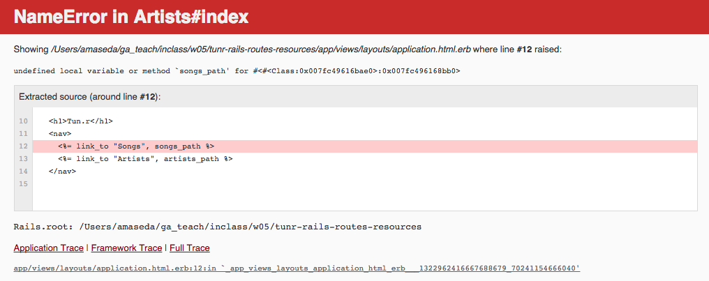

# Solving Coding Problems

## Learning Objectives

- List the steps for problem solving
- Identify the role of pseudocode
- Describe how to ask for support
- Demonstrate how to leverage your community
- Identify acceptable results from a Google search
- Demonstrate how to use Stack Overflow

## Framing

This class is about dealing with problems.  Specifically, we will be discussing how to identify and solve coding problems.  None of us have all the answers.  We need others.  We will focus on how to leverage your community, both local and online, to find pragmatic solutions to your issues.

## Approaching a coding problem (15 min)

There are many tools and resources to help you solve your problems.  Before we solve the problem, we need to clearly identify what the problem is.  You should be familiar with this.  It's a similar situation, but coding problems usually get more granular than UX problems.  In this particular instance, with this particular data we aren't getting quite what we want.

Here are some steps that can help with problem solving:

- Identify the Problem
- Conceptualize
- Break it down
- Start small
- Iterate

### Identify the Problem

- What exactly are we trying to solve?  
- From who's viewpoint?
- Who will benefit?
- What are we delivering?

### Conceptualize

- Look at the big picture, the major steps
- Avoid details
- At this stage we recommend drawing on whiteboards or with crayon, anything that screams "temporary", "play", or "brainstorm".

### Break it down

- We break the conceptual models down into concrete steps, actionable items.
- We identify risks (gaps in knowledge, technology, and infrastructure).

### Start small, stay small

Finally, we take some action.  This is when we finally start writing code.  We fight hard to take small steps, verify that each step achieves what we want, what we expect, before continuing on.  If we do too much at once and things break, which they always do, we won't know what is causing the problem.  We won't know which part to trust.  Humans thrive on easy wins. We need to see forward progress.  Remember that.  Use that.  Celebrate your wins.

### Iterate

These steps are more of a spiral than a list.  As you start to work on a problem, this informs you current understanding, providing more information about your problem.  Causing you to question and reevaluate earlier decisions, to form new conceptual models, and to identify new technical approaches.

### Review: the Steps

- Identify the Problem
- Conceptualize
- Break it down
- Start small
- Iterate

## Dealing with an Error (10 min)

When dealing with technical issues, you will usually have a specific, small problem you need to solve.  If you are lucky, you have a specific error.  If you are really lucky, the error will clearly indicate what the problem is and what is causing it.

For a Rails developer, this error contains a lot of helpful information.  You may not feel the same.  It indicates:
- what file contains the code,
- which code has a problem,
- what the problem is, and,
- if we were viewing this page, we could even see the state of our system when the error occurred..

Each item is another piece of the puzzle.  This particular error is indicating that a method we are using `songs_path` does not exist.

Q. What are some possible causes?
---

> A. typo (singular/plural, misspelling, underscore/hyphen), method name has changed,

## Attention to detail

There are two major shifts that happen to our brains as we shift into development mode.  Both are different facets of "Attention to detail".
1. What **exactly** is needed here?
2. Finding the needle in the haystack.

### 1. What **exactly** is needed here?

In development, everything matters.  Everything.

Every semicolon, the spacing, the use of parens, the spelling, the case (UPPER/lower), the position, what else is on the same line.

ALL OF IT!
---

All of it matters to the computer, therefore we have to care.

### 2. Finding the needle in the haystack.

As a developer, your brain will learn to look at a page of text and identify what is important in it.

### Investigate the error

Let's go back to our example:

The computer is complaining that it doesn't know that method.  We didn't provide the right name.

How do I know that?  My brain identified, which of those lines matter to me.  Now.

"undefined local variable or method"

## What do I know?
I see that it is happening in the `app/layouts/applcation.html.erb` file.  I know that this is the layout for my application.

Q. Given this information, how would **you** solve this?
---

> A. Considering that we know next to nothing about Rails, we phone a friend. Ask google.  You would be amazed at how helpful Google is.

This link will [search for the error text](https://www.google.com/search?client=safari&rls=en&q=undefined+local+variable+or+method+songs_path&ie=UTF-8&oe=UTF-8)

I just typed the text into google and then copied the url for the lesson.  See the error in the google search area?

Now remember, songs_path is something specific to OUR application.  Let's look at some of the results.

- The [first link](http://stackoverflow.com/questions/22741975/undefined-local-variable-or-method-root-path) deals with RSpec.  I know this has something to do with testing.  That's not my problem.
- The [2nd link](http://stackoverflow.com/questions/9852487/undefined-local-variable-or-method-new-media-path-resources-to-resource) looks hopeful.  I see information about rails routes.

I think I'm on the right path.

ProTip:  I start a new window for each problem.  I open each interesting result in a new tab.  When I solve my problem, I can just close that window and all of its tabs.

## Trust?

- Look for stackoverflow
- Recency?
- Related information?

### Review

Q. When we get an error, what's the first thing we do?
---

> A. Investigate the error for helpful information.

Q. If we still don't know what to do?

> A. Google it.

Steps:

- identify the problem.
  - action: investigate error
- google it
  - Trust?  StackOverflow!  Recency, related info.

## Your Community

Your community, your peers, your instructors, managers, user groups, and the myriad online resources can help you every step of the way. Use them.  Each and every one of them is an invaluable resource.

## How To Ask For Support

- So many people are interested in helping
- Remember you are taking your **need** to the market
  - make it as **easy** as possible for that person to help.
  - more is better

### What to provide:

- What you want to achieve
- Steps to recreate
- Expected results
- Any error messages
- What you have tried and the results

# Conclusion

1. What site do we want to see in a google result page?
- What can google help with?
- What do we paste into google?
- Who wants to help us?
