# https://www.github.com/ga-wdi-exercises/whenpresident
> This commit history created using [Diffshot](https://github.com/RobertAKARobin/diffshot)

# npm init && npm install --save express

> [cfa8443](https://www.github.com/ga-wdi-exercises/whenpresident/commit/cfa8443)

When creating a new Express app, the first steps you'll always do are:
1. Create and `cd` into a new folder
- `$ npm init`, then hold down "Return" to answer "yes" to all the questions
- `$ npm install --save express`
- `$ echo "node_modules" > .gitignore`

When downloading someone else's Express app, you will simply:
1. `$ npm install`

Questions:
- What is NPM?
- What does `package.json` do?
- What does the `--save` in `npm install --save express` do?
- Why is putting `node_modules` in `.gitignore` important?

### [npm init && npm install --save express: `.gitignore`](https://www.github.com/ga-wdi-exercises/whenpresident/blob/cfa8443/.gitignore)
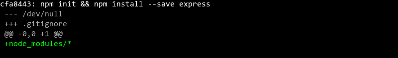
### [npm init && npm install --save express: `package.json`](https://www.github.com/ga-wdi-exercises/whenpresident/blob/cfa8443/package.json)
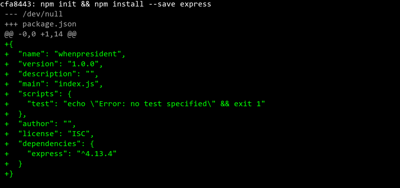
 
# Added index.js

> [c39c5a7](https://www.github.com/ga-wdi-exercises/whenpresident/commit/c39c5a7)

- What does `nodemon` do?
- What does `require` do?
- What's the difference between `require("hello")`, `require("./hello")`, and `require("./hello.js")`?
- Note the `()` at the end of `express()`. This means `require("express")` must be returning what kind of object?
- What does the `.get` in `app.get` indicate?
- What do `req` and `res` stand for?
- What happens if you don't include `res.send`?
- What is `3001`, and how does it affect what you do in your browser?

### [Added index.js: `index.js`](https://www.github.com/ga-wdi-exercises/whenpresident/blob/c39c5a7/index.js)
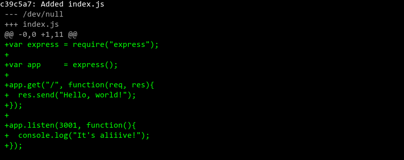

-----
# STOP
-----
 
# npm install --save express-handlebars

> [a69ec2c](https://www.github.com/ga-wdi-exercises/whenpresident/commit/a69ec2c)

- Whenever you `npm install --save` something, you'll also probably need to do what?
- Whenever you `require` something, you'll probably need to do what first?

### [npm install --save express-handlebars: `index.js`](https://www.github.com/ga-wdi-exercises/whenpresident/blob/a69ec2c/index.js)

### [npm install --save express-handlebars: `package.json`](https://www.github.com/ga-wdi-exercises/whenpresident/blob/a69ec2c/package.json)
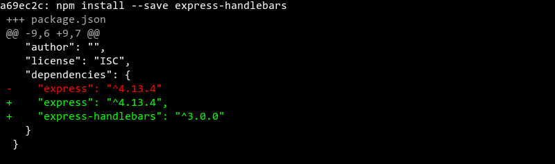
 
# Added views

> [e13f24f](https://www.github.com/ga-wdi-exercises/whenpresident/commit/e13f24f)

- `<%= yield %>` in Rails is like what in Handlebars?
- What's the difference between a `.hbs` file and a `.html` file?

### [Added views: `views/app-welcome.hbs`](https://www.github.com/ga-wdi-exercises/whenpresident/blob/e13f24f/views/app-welcome.hbs)

### [Added views: `views/layout-main.hbs`](https://www.github.com/ga-wdi-exercises/whenpresident/blob/e13f24f/views/layout-main.hbs)

 
# Configured handlebars

> [83a9879](https://www.github.com/ga-wdi-exercises/whenpresident/commit/83a9879)

- What's the difference between `res.send` and `res.render`?

### [Configured handlebars: `index.js`](https://www.github.com/ga-wdi-exercises/whenpresident/blob/83a9879/index.js)

 
-----
# STOP
-----

# Added express.static and CSS

> [6fb87cf](https://www.github.com/ga-wdi-exercises/whenpresident/commit/6fb87cf)

- What do the two arguments in `app.use` in this snippet do?
- Why is `app.use` called "middleware"?
- If I write `app.use("/wombat", express.static("chicken"))`...
  - In which folder should I put all my CSS files?
  - When I `<link>` to my CSS, with what will the `href` path begin?
  
### [Added express.static and CSS: `index.js`](https://www.github.com/ga-wdi-exercises/whenpresident/blob/6fb87cf/index.js)

### [Added express.static and CSS: `public/css/styles.css`](https://www.github.com/ga-wdi-exercises/whenpresident/blob/6fb87cf/public/css/styles.css)
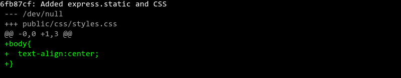
### [Added express.static and CSS: `views/layout-main.hbs`](https://www.github.com/ga-wdi-exercises/whenpresident/blob/6fb87cf/views/layout-main.hbs)

 
# Added front-end Javascript

> [8f061d3](https://www.github.com/ga-wdi-exercises/whenpresident/commit/8f061d3)

- What's the difference between front-end Javascript and back-end Javascript?

### [Added front-end Javascript: `public/js/app.js`](https://www.github.com/ga-wdi-exercises/whenpresident/blob/8f061d3/public/js/app.js)
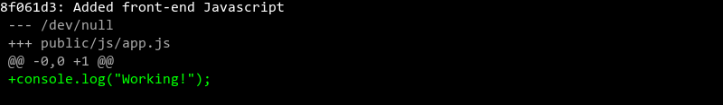
### [Added front-end Javascript: `views/layout-main.hbs`](https://www.github.com/ga-wdi-exercises/whenpresident/blob/8f061d3/views/layout-main.hbs)

-----
# STOP
-----

# Added candidates#index route

> [3da2c67](https://www.github.com/ga-wdi-exercises/whenpresident/commit/3da2c67)

- What does the second argument in `res.render` do? What kind of data type should it be?

### [Added candidates#index route: `index.js`](https://www.github.com/ga-wdi-exercises/whenpresident/blob/3da2c67/index.js)

### [Added candidates#index route: `views/candidates-index.hbs`](https://www.github.com/ga-wdi-exercises/whenpresident/blob/3da2c67/views/candidates-index.hbs)

 
# Added fake data

> [0e2c37d](https://www.github.com/ga-wdi-exercises/whenpresident/commit/0e2c37d)

- What is `module.exports` and how is it related to `require`?

### [Added fake data: `db/connection.js`](https://www.github.com/ga-wdi-exercises/whenpresident/blob/0e2c37d/db/connection.js)

### [Added fake data: `db/seeds.json`](https://www.github.com/ga-wdi-exercises/whenpresident/blob/0e2c37d/db/seeds.json)
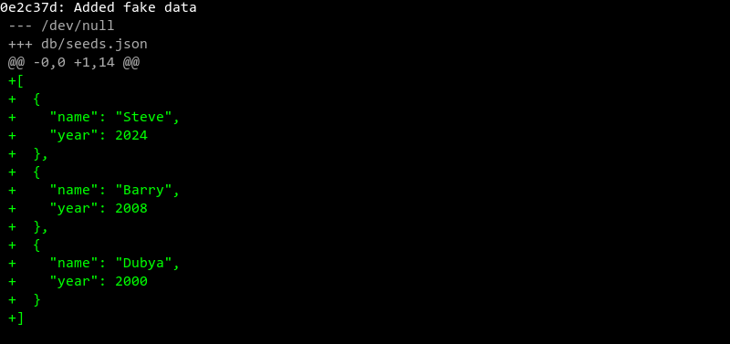
### [Added fake data: `index.js`](https://www.github.com/ga-wdi-exercises/whenpresident/blob/0e2c37d/index.js)
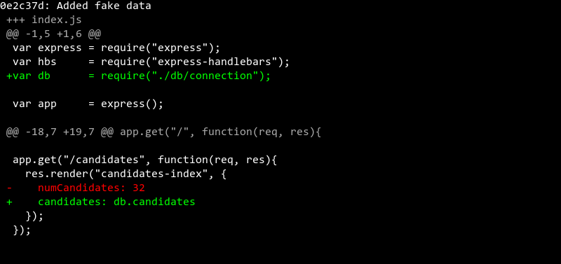
### [Added fake data: `views/candidates-index.hbs`](https://www.github.com/ga-wdi-exercises/whenpresident/blob/0e2c37d/views/candidates-index.hbs)
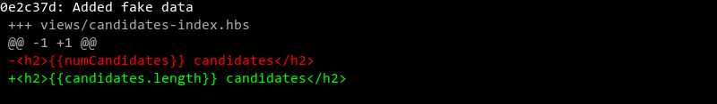
 
# Added #each in index

> [6f3ebaf](https://www.github.com/ga-wdi-exercises/whenpresident/commit/6f3ebaf)

- What's the difference between how you begin an end an `each` loop in Handlebars?
- How is Handlebars' `#each` similar to Ruby's `.each`?

### [Added #each in index: `views/candidates-index.hbs`](https://www.github.com/ga-wdi-exercises/whenpresident/blob/6f3ebaf/views/candidates-index.hbs)
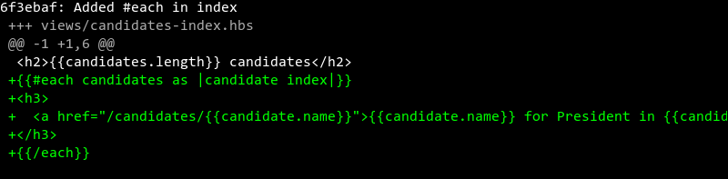
 
-----
# STOP
-----

# Added candidates#show route

> [7bbe33d](https://www.github.com/ga-wdi-exercises/whenpresident/commit/7bbe33d)

### [Added candidates#show route: `index.js`](https://www.github.com/ga-wdi-exercises/whenpresident/blob/7bbe33d/index.js)

### [Added candidates#show route: `views/candidates-show.hbs`](https://www.github.com/ga-wdi-exercises/whenpresident/blob/7bbe33d/views/candidates-show.hbs)

 
# Included data in candidates#show

> [c7dc775](https://www.github.com/ga-wdi-exercises/whenpresident/commit/c7dc775)

### [Included data in candidates#show: `index.js`](https://www.github.com/ga-wdi-exercises/whenpresident/blob/c7dc775/index.js)
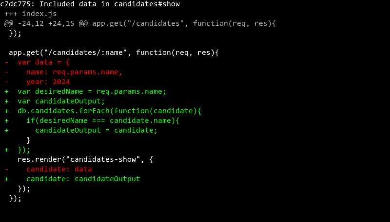
 
# Added #if in candidates#show

> [ea5eeaf](https://www.github.com/ga-wdi-exercises/whenpresident/commit/ea5eeaf)

### [Added #if in candidates#show: `views/candidates-show.hbs`](https://www.github.com/ga-wdi-exercises/whenpresident/blob/ea5eeaf/views/candidates-show.hbs)

 
-----
# STOP
-----

# Deploying to Heroku

> [17a28af](https://www.github.com/ga-wdi-exercises/whenpresident/commit/17a28af)

- What does a Procfile do?
- What's the point of environment variables?
- How do you access environment variables?

### [Deploying to Heroku: `Procfile`](https://www.github.com/ga-wdi-exercises/whenpresident/blob/17a28af/Procfile)

### [Deploying to Heroku: `index.js`](https://www.github.com/ga-wdi-exercises/whenpresident/blob/17a28af/index.js)
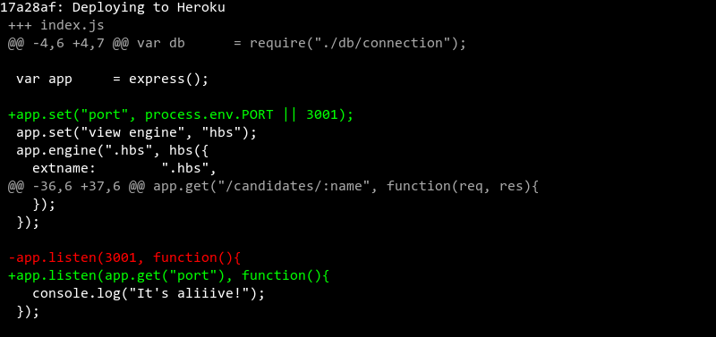
 