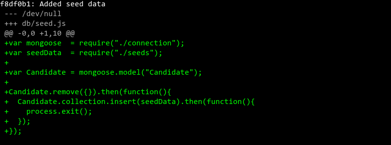
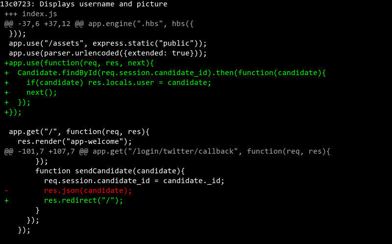
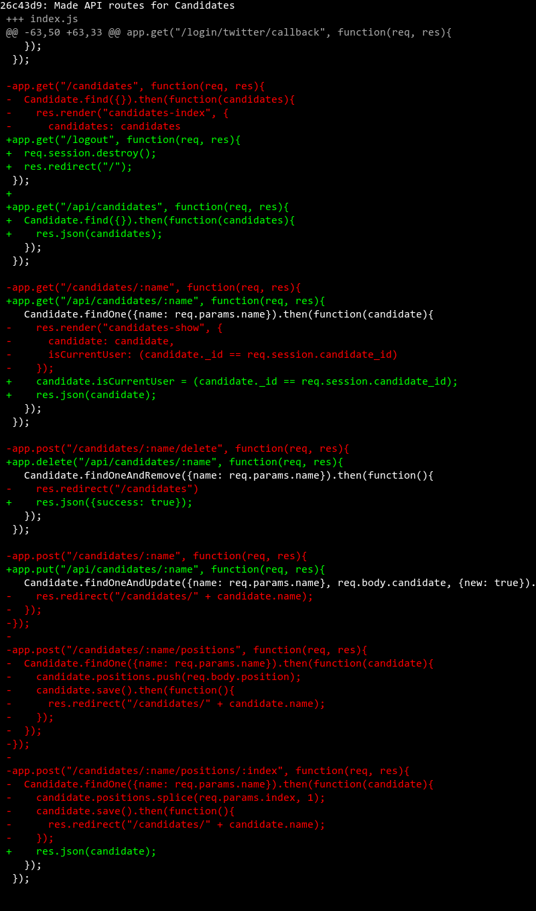

# https://www.github.com/ga-wdi-exercises/whenpresident 
> This commit history created using [Diffshot](https://github.com/RobertAKARobin/diffshot) 

# Added readme

> [3ca85bf](https://www.github.com/ga-wdi-exercises/whenpresident/commit/3ca85bf)

### [Added readme: `readme.md`](https://www.github.com/ga-wdi-exercises/whenpresident/blob/3ca85bf/readme.md)

# npm init && npm install --save express

> [cfa8443](https://www.github.com/ga-wdi-exercises/whenpresident/commit/cfa8443)

### [npm init && npm install --save express: `.gitignore`](https://www.github.com/ga-wdi-exercises/whenpresident/blob/cfa8443/.gitignore)

### [npm init && npm install --save express: `package.json`](https://www.github.com/ga-wdi-exercises/whenpresident/blob/cfa8443/package.json)

# Added index.js

> [c39c5a7](https://www.github.com/ga-wdi-exercises/whenpresident/commit/c39c5a7)

### [Added index.js: `index.js`](https://www.github.com/ga-wdi-exercises/whenpresident/blob/c39c5a7/index.js)

# npm install --save express-handlebars

> [a69ec2c](https://www.github.com/ga-wdi-exercises/whenpresident/commit/a69ec2c)

### [npm install --save express-handlebars: `index.js`](https://www.github.com/ga-wdi-exercises/whenpresident/blob/a69ec2c/index.js)

### [npm install --save express-handlebars: `package.json`](https://www.github.com/ga-wdi-exercises/whenpresident/blob/a69ec2c/package.json)

# Added views

> [e13f24f](https://www.github.com/ga-wdi-exercises/whenpresident/commit/e13f24f)

### [Added views: `views/app-welcome.hbs`](https://www.github.com/ga-wdi-exercises/whenpresident/blob/e13f24f/views/app-welcome.hbs)

### [Added views: `views/layout-main.hbs`](https://www.github.com/ga-wdi-exercises/whenpresident/blob/e13f24f/views/layout-main.hbs)

# Configured handlebars

> [83a9879](https://www.github.com/ga-wdi-exercises/whenpresident/commit/83a9879)

### [Configured handlebars: `index.js`](https://www.github.com/ga-wdi-exercises/whenpresident/blob/83a9879/index.js)

# Added express.static and CSS

> [6fb87cf](https://www.github.com/ga-wdi-exercises/whenpresident/commit/6fb87cf)

### [Added express.static and CSS: `index.js`](https://www.github.com/ga-wdi-exercises/whenpresident/blob/6fb87cf/index.js)

### [Added express.static and CSS: `public/css/styles.css`](https://www.github.com/ga-wdi-exercises/whenpresident/blob/6fb87cf/public/css/styles.css)

### [Added express.static and CSS: `views/layout-main.hbs`](https://www.github.com/ga-wdi-exercises/whenpresident/blob/6fb87cf/views/layout-main.hbs)

# Added front-end Javascript

> [8f061d3](https://www.github.com/ga-wdi-exercises/whenpresident/commit/8f061d3)

### [Added front-end Javascript: `public/js/app.js`](https://www.github.com/ga-wdi-exercises/whenpresident/blob/8f061d3/public/js/app.js)

### [Added front-end Javascript: `views/layout-main.hbs`](https://www.github.com/ga-wdi-exercises/whenpresident/blob/8f061d3/views/layout-main.hbs)

# Added candidates#index route

> [3da2c67](https://www.github.com/ga-wdi-exercises/whenpresident/commit/3da2c67)

### [Added candidates#index route: `index.js`](https://www.github.com/ga-wdi-exercises/whenpresident/blob/3da2c67/index.js)

### [Added candidates#index route: `views/candidates-index.hbs`](https://www.github.com/ga-wdi-exercises/whenpresident/blob/3da2c67/views/candidates-index.hbs)

# Added fake data

> [0e2c37d](https://www.github.com/ga-wdi-exercises/whenpresident/commit/0e2c37d)

### [Added fake data: `db/connection.js`](https://www.github.com/ga-wdi-exercises/whenpresident/blob/0e2c37d/db/connection.js)

### [Added fake data: `db/seeds.json`](https://www.github.com/ga-wdi-exercises/whenpresident/blob/0e2c37d/db/seeds.json)

### [Added fake data: `index.js`](https://www.github.com/ga-wdi-exercises/whenpresident/blob/0e2c37d/index.js)

### [Added fake data: `views/candidates-index.hbs`](https://www.github.com/ga-wdi-exercises/whenpresident/blob/0e2c37d/views/candidates-index.hbs)

# Added #each in index

> [6f3ebaf](https://www.github.com/ga-wdi-exercises/whenpresident/commit/6f3ebaf)

### [Added #each in index: `views/candidates-index.hbs`](https://www.github.com/ga-wdi-exercises/whenpresident/blob/6f3ebaf/views/candidates-index.hbs)

# Added candidates#show route

> [7bbe33d](https://www.github.com/ga-wdi-exercises/whenpresident/commit/7bbe33d)

### [Added candidates#show route: `index.js`](https://www.github.com/ga-wdi-exercises/whenpresident/blob/7bbe33d/index.js)

### [Added candidates#show route: `views/candidates-show.hbs`](https://www.github.com/ga-wdi-exercises/whenpresident/blob/7bbe33d/views/candidates-show.hbs)

# Included data in candidates#show

> [c7dc775](https://www.github.com/ga-wdi-exercises/whenpresident/commit/c7dc775)

### [Included data in candidates#show: `index.js`](https://www.github.com/ga-wdi-exercises/whenpresident/blob/c7dc775/index.js)

# Added #if in candidates#show

> [ea5eeaf](https://www.github.com/ga-wdi-exercises/whenpresident/commit/ea5eeaf)

### [Added #if in candidates#show: `views/candidates-show.hbs`](https://www.github.com/ga-wdi-exercises/whenpresident/blob/ea5eeaf/views/candidates-show.hbs)

# Deploying to Heroku

> [17a28af](https://www.github.com/ga-wdi-exercises/whenpresident/commit/17a28af)

### [Deploying to Heroku: `Procfile`](https://www.github.com/ga-wdi-exercises/whenpresident/blob/17a28af/Procfile)

### [Deploying to Heroku: `index.js`](https://www.github.com/ga-wdi-exercises/whenpresident/blob/17a28af/index.js)

# npm install --save mongoose

> [e3ac57c](https://www.github.com/ga-wdi-exercises/whenpresident/commit/e3ac57c)

### [npm install --save mongoose: `package.json`](https://www.github.com/ga-wdi-exercises/whenpresident/blob/e3ac57c/package.json)

# Connected to Mongoose

> [1b8ff4f](https://www.github.com/ga-wdi-exercises/whenpresident/commit/1b8ff4f)

### [Connected to Mongoose: `db/connection.js`](https://www.github.com/ga-wdi-exercises/whenpresident/blob/1b8ff4f/db/connection.js)

# Added seed data

> [f8df0b1](https://www.github.com/ga-wdi-exercises/whenpresident/commit/f8df0b1)

### [Added seed data: `db/connection.js`](https://www.github.com/ga-wdi-exercises/whenpresident/blob/f8df0b1/db/connection.js)

### [Added seed data: `db/seed.js`](https://www.github.com/ga-wdi-exercises/whenpresident/blob/f8df0b1/db/seed.js)

# Shows db candidates in candidates#index

> [a849846](https://www.github.com/ga-wdi-exercises/whenpresident/commit/a849846)

### [Shows db candidates in candidates#index: `index.js`](https://www.github.com/ga-wdi-exercises/whenpresident/blob/a849846/index.js)

# Shows db candidate in candidates#show

> [05715e4](https://www.github.com/ga-wdi-exercises/whenpresident/commit/05715e4)

### [Shows db candidate in candidates#show: `index.js`](https://www.github.com/ga-wdi-exercises/whenpresident/blob/05715e4/index.js)

# npm install --save body-parser

> [53ec895](https://www.github.com/ga-wdi-exercises/whenpresident/commit/53ec895)

### [npm install --save body-parser: `index.js`](https://www.github.com/ga-wdi-exercises/whenpresident/blob/53ec895/index.js)

### [npm install --save body-parser: `package.json`](https://www.github.com/ga-wdi-exercises/whenpresident/blob/53ec895/package.json)

# Added nonfunctional post route

> [d596426](https://www.github.com/ga-wdi-exercises/whenpresident/commit/d596426)

### [Added nonfunctional post route: `index.js`](https://www.github.com/ga-wdi-exercises/whenpresident/blob/d596426/index.js)

### [Added nonfunctional post route: `views/candidates-index.hbs`](https://www.github.com/ga-wdi-exercises/whenpresident/blob/d596426/views/candidates-index.hbs)

# Saves new candidate to database

> [49498dd](https://www.github.com/ga-wdi-exercises/whenpresident/commit/49498dd)

### [Saves new candidate to database: `index.js`](https://www.github.com/ga-wdi-exercises/whenpresident/blob/49498dd/index.js)

# Updates a candidate in the database

> [d29bac6](https://www.github.com/ga-wdi-exercises/whenpresident/commit/d29bac6)

### [Updates a candidate in the database: `index.js`](https://www.github.com/ga-wdi-exercises/whenpresident/blob/d29bac6/index.js)

### [Updates a candidate in the database: `views/candidates-show.hbs`](https://www.github.com/ga-wdi-exercises/whenpresident/blob/d29bac6/views/candidates-show.hbs)

# Deletes candidate from database

> [cd45919](https://www.github.com/ga-wdi-exercises/whenpresident/commit/cd45919)

### [Deletes candidate from database: `index.js`](https://www.github.com/ga-wdi-exercises/whenpresident/blob/cd45919/index.js)

### [Deletes candidate from database: `views/candidates-show.hbs`](https://www.github.com/ga-wdi-exercises/whenpresident/blob/cd45919/views/candidates-show.hbs)

# Added procfile and Mongolab URL for deployment

> [02181c9](https://www.github.com/ga-wdi-exercises/whenpresident/commit/02181c9)

### [Added procfile and Mongolab URL for deployment: `db/connection.js`](https://www.github.com/ga-wdi-exercises/whenpresident/blob/02181c9/db/connection.js)

# Added positions to candidates

> [d4f4d9e](https://www.github.com/ga-wdi-exercises/whenpresident/commit/d4f4d9e)

### [Added positions to candidates: `db/connection.js`](https://www.github.com/ga-wdi-exercises/whenpresident/blob/d4f4d9e/db/connection.js)

### [Added positions to candidates: `db/seeds.json`](https://www.github.com/ga-wdi-exercises/whenpresident/blob/d4f4d9e/db/seeds.json)

# Can add a position

> [07e562e](https://www.github.com/ga-wdi-exercises/whenpresident/commit/07e562e)

### [Can add a position: `index.js`](https://www.github.com/ga-wdi-exercises/whenpresident/blob/07e562e/index.js)

### [Can add a position: `views/candidates-show.hbs`](https://www.github.com/ga-wdi-exercises/whenpresident/blob/07e562e/views/candidates-show.hbs)

# Can delete a position

> [88a8de4](https://www.github.com/ga-wdi-exercises/whenpresident/commit/88a8de4)

### [Can delete a position: `index.js`](https://www.github.com/ga-wdi-exercises/whenpresident/blob/88a8de4/index.js)

### [Can delete a position: `views/candidates-show.hbs`](https://www.github.com/ga-wdi-exercises/whenpresident/blob/88a8de4/views/candidates-show.hbs)

# Added sessions

> [f606763](https://www.github.com/ga-wdi-exercises/whenpresident/commit/f606763)

### [Added sessions: `index.js`](https://www.github.com/ga-wdi-exercises/whenpresident/blob/f606763/index.js)

### [Added sessions: `package.json`](https://www.github.com/ga-wdi-exercises/whenpresident/blob/f606763/package.json)

# Added environment variables

> [3b046cb](https://www.github.com/ga-wdi-exercises/whenpresident/commit/3b046cb)

### [Added environment variables: `.gitignore`](https://www.github.com/ga-wdi-exercises/whenpresident/blob/3b046cb/.gitignore)

### [Added environment variables: `index.js`](https://www.github.com/ga-wdi-exercises/whenpresident/blob/3b046cb/index.js)

### [Added environment variables: `sample.env.json`](https://www.github.com/ga-wdi-exercises/whenpresident/blob/3b046cb/sample.env.json)

# Added Twitter environment variables

> [82e455d](https://www.github.com/ga-wdi-exercises/whenpresident/commit/82e455d)

### [Added Twitter environment variables: `index.js`](https://www.github.com/ga-wdi-exercises/whenpresident/blob/82e455d/index.js)

### [Added Twitter environment variables: `sample.env.json`](https://www.github.com/ga-wdi-exercises/whenpresident/blob/82e455d/sample.env.json)

# Redirects to Twitter sign-in page

> [9ba8544](https://www.github.com/ga-wdi-exercises/whenpresident/commit/9ba8544)

### [Redirects to Twitter sign-in page: `index.js`](https://www.github.com/ga-wdi-exercises/whenpresident/blob/9ba8544/index.js)

### [Redirects to Twitter sign-in page: `package.json`](https://www.github.com/ga-wdi-exercises/whenpresident/blob/9ba8544/package.json)

# Completes Twitter authentication process

> [c4135a9](https://www.github.com/ga-wdi-exercises/whenpresident/commit/c4135a9)

### [Completes Twitter authentication process: `index.js`](https://www.github.com/ga-wdi-exercises/whenpresident/blob/c4135a9/index.js)

# Fetches user data from API

> [b0ee869](https://www.github.com/ga-wdi-exercises/whenpresident/commit/b0ee869)

### [Fetches user data from API: `index.js`](https://www.github.com/ga-wdi-exercises/whenpresident/blob/b0ee869/index.js)

# Added Twitter API test route

> [b539c26](https://www.github.com/ga-wdi-exercises/whenpresident/commit/b539c26)

### [Added Twitter API test route: `index.js`](https://www.github.com/ga-wdi-exercises/whenpresident/blob/b539c26/index.js)

# Removed candidate create form

> [39934dc](https://www.github.com/ga-wdi-exercises/whenpresident/commit/39934dc)

### [Removed candidate create form: `index.js`](https://www.github.com/ga-wdi-exercises/whenpresident/blob/39934dc/index.js)

### [Removed candidate create form: `views/candidates-index.hbs`](https://www.github.com/ga-wdi-exercises/whenpresident/blob/39934dc/views/candidates-index.hbs)

# Saves candidate to database

> [c10622e](https://www.github.com/ga-wdi-exercises/whenpresident/commit/c10622e)

### [Saves candidate to database: `db/connection.js`](https://www.github.com/ga-wdi-exercises/whenpresident/blob/c10622e/db/connection.js)

### [Saves candidate to database: `index.js`](https://www.github.com/ga-wdi-exercises/whenpresident/blob/c10622e/index.js)

# Displays username and picture

> [13c0723](https://www.github.com/ga-wdi-exercises/whenpresident/commit/13c0723)

### [Displays username and picture: `index.js`](https://www.github.com/ga-wdi-exercises/whenpresident/blob/13c0723/index.js)

### [Displays username and picture: `views/layout-main.hbs`](https://www.github.com/ga-wdi-exercises/whenpresident/blob/13c0723/views/layout-main.hbs)

# Added nav bar and signout

> [ee09231](https://www.github.com/ga-wdi-exercises/whenpresident/commit/ee09231)

### [Added nav bar and signout: `index.js`](https://www.github.com/ga-wdi-exercises/whenpresident/blob/ee09231/index.js)

### [Added nav bar and signout: `views/layout-main.hbs`](https://www.github.com/ga-wdi-exercises/whenpresident/blob/ee09231/views/layout-main.hbs)

# Moved Twitter stuff to separate file

> [b25c9ad](https://www.github.com/ga-wdi-exercises/whenpresident/commit/b25c9ad)

### [Moved Twitter stuff to separate file: `index.js`](https://www.github.com/ga-wdi-exercises/whenpresident/blob/b25c9ad/index.js)

### [Moved Twitter stuff to separate file: `lib/twitter_auth.js`](https://www.github.com/ga-wdi-exercises/whenpresident/blob/b25c9ad/lib/twitter_auth.js)

# Can edit/delete only if current user

> [d409c0a](https://www.github.com/ga-wdi-exercises/whenpresident/commit/d409c0a)

### [Can edit/delete only if current user: `index.js`](https://www.github.com/ga-wdi-exercises/whenpresident/blob/d409c0a/index.js)

### [Can edit/delete only if current user: `views/candidates-show.hbs`](https://www.github.com/ga-wdi-exercises/whenpresident/blob/d409c0a/views/candidates-show.hbs)

# Only require env.json in development environment

> [3fefaeb](https://www.github.com/ga-wdi-exercises/whenpresident/commit/3fefaeb)

### [Only require env.json in development environment: `index.js`](https://www.github.com/ga-wdi-exercises/whenpresident/blob/3fefaeb/index.js)

# Added Angular dependencies

> [03bba1e](https://www.github.com/ga-wdi-exercises/whenpresident/commit/03bba1e)

### [Added Angular dependencies: `index.js`](https://www.github.com/ga-wdi-exercises/whenpresident/blob/03bba1e/index.js)

### [Added Angular dependencies: `public/js/app.js`](https://www.github.com/ga-wdi-exercises/whenpresident/blob/03bba1e/public/js/app.js)

### [Added Angular dependencies: `views/candidates.hbs`](https://www.github.com/ga-wdi-exercises/whenpresident/blob/03bba1e/views/candidates.hbs)

### [Added Angular dependencies: `views/layout-main.hbs`](https://www.github.com/ga-wdi-exercises/whenpresident/blob/03bba1e/views/layout-main.hbs)

# Added welcome page

> [a920c10](https://www.github.com/ga-wdi-exercises/whenpresident/commit/a920c10)

### [Added welcome page: `public/html/candidates-welcome.html`](https://www.github.com/ga-wdi-exercises/whenpresident/blob/a920c10/public/html/candidates-welcome.html)

### [Added welcome page: `public/js/app.js`](https://www.github.com/ga-wdi-exercises/whenpresident/blob/a920c10/public/js/app.js)

# Added Bower for offline work

> [4ce020e](https://www.github.com/ga-wdi-exercises/whenpresident/commit/4ce020e)

### [Added Bower for offline work: `bower.json`](https://www.github.com/ga-wdi-exercises/whenpresident/blob/4ce020e/bower.json)

### [Added Bower for offline work: `index.js`](https://www.github.com/ga-wdi-exercises/whenpresident/blob/4ce020e/index.js)

### [Added Bower for offline work: `views/candidates.hbs`](https://www.github.com/ga-wdi-exercises/whenpresident/blob/4ce020e/views/candidates.hbs)

# Added a rudimentary index route

> [21ece26](https://www.github.com/ga-wdi-exercises/whenpresident/commit/21ece26)

### [Added a rudimentary index route: `public/html/candidates-welcome.html`](https://www.github.com/ga-wdi-exercises/whenpresident/blob/21ece26/public/html/candidates-welcome.html)

### [Added a rudimentary index route: `public/js/app.js`](https://www.github.com/ga-wdi-exercises/whenpresident/blob/21ece26/public/js/app.js)

# Made API routes for Candidates

> [26c43d9](https://www.github.com/ga-wdi-exercises/whenpresident/commit/26c43d9)

### [Made API routes for Candidates: `index.js`](https://www.github.com/ga-wdi-exercises/whenpresident/blob/26c43d9/index.js)

# Added Candidate factory and connected index controller to DB

> [7a15559](https://www.github.com/ga-wdi-exercises/whenpresident/commit/7a15559)

### [Added Candidate factory and connected index controller to DB: `public/html/candidates-index.html`](https://www.github.com/ga-wdi-exercises/whenpresident/blob/7a15559/public/html/candidates-index.html)

### [Added Candidate factory and connected index controller to DB: `public/js/app.js`](https://www.github.com/ga-wdi-exercises/whenpresident/blob/7a15559/public/js/app.js)

# Added HTML5 mode

> [fee8317](https://www.github.com/ga-wdi-exercises/whenpresident/commit/fee8317)

### [Added HTML5 mode: `index.js`](https://www.github.com/ga-wdi-exercises/whenpresident/blob/fee8317/index.js)

### [Added HTML5 mode: `public/js/app.js`](https://www.github.com/ga-wdi-exercises/whenpresident/blob/fee8317/public/js/app.js)

### [Added HTML5 mode: `views/layout-main.hbs`](https://www.github.com/ga-wdi-exercises/whenpresident/blob/fee8317/views/layout-main.hbs)

# Added redirect to root route

> [d9b2cb1](https://www.github.com/ga-wdi-exercises/whenpresident/commit/d9b2cb1)

### [Added redirect to root route: `public/js/app.js`](https://www.github.com/ga-wdi-exercises/whenpresident/blob/d9b2cb1/public/js/app.js)

# Added show route

> [83262fd](https://www.github.com/ga-wdi-exercises/whenpresident/commit/83262fd)

### [Added show route: `index.js`](https://www.github.com/ga-wdi-exercises/whenpresident/blob/83262fd/index.js)

### [Added show route: `public/html/candidates-show.html`](https://www.github.com/ga-wdi-exercises/whenpresident/blob/83262fd/public/html/candidates-show.html)

### [Added show route: `public/js/app.js`](https://www.github.com/ga-wdi-exercises/whenpresident/blob/83262fd/public/js/app.js)

# Added update

> [a790169](https://www.github.com/ga-wdi-exercises/whenpresident/commit/a790169)

### [Added update: `index.js`](https://www.github.com/ga-wdi-exercises/whenpresident/blob/a790169/index.js)

### [Added update: `public/html/candidates-show.html`](https://www.github.com/ga-wdi-exercises/whenpresident/blob/a790169/public/html/candidates-show.html)

### [Added update: `public/js/app.js`](https://www.github.com/ga-wdi-exercises/whenpresident/blob/a790169/public/js/app.js)

# Added candidate delete

> [8abe316](https://www.github.com/ga-wdi-exercises/whenpresident/commit/8abe316)

### [Added candidate delete: `public/html/candidates-show.html`](https://www.github.com/ga-wdi-exercises/whenpresident/blob/8abe316/public/html/candidates-show.html)

### [Added candidate delete: `public/js/app.js`](https://www.github.com/ga-wdi-exercises/whenpresident/blob/8abe316/public/js/app.js)

# Can add a new position

> [047b74e](https://www.github.com/ga-wdi-exercises/whenpresident/commit/047b74e)

### [Can add a new position: `public/html/candidates-show.html`](https://www.github.com/ga-wdi-exercises/whenpresident/blob/047b74e/public/html/candidates-show.html)

### [Can add a new position: `public/js/app.js`](https://www.github.com/ga-wdi-exercises/whenpresident/blob/047b74e/public/js/app.js)

# Can delete positions

> [cd94b4a](https://www.github.com/ga-wdi-exercises/whenpresident/commit/cd94b4a)

### [Can delete positions: `public/html/candidates-show.html`](https://www.github.com/ga-wdi-exercises/whenpresident/blob/cd94b4a/public/html/candidates-show.html)

# Added endorsement schema

> [ccc5c03](https://www.github.com/ga-wdi-exercises/whenpresident/commit/ccc5c03)

### [Added endorsement schema: `db/connection.js`](https://www.github.com/ga-wdi-exercises/whenpresident/blob/ccc5c03/db/connection.js)

# Added endorsements

> [785fb56](https://www.github.com/ga-wdi-exercises/whenpresident/commit/785fb56)

### [Added endorsements: `index.js`](https://www.github.com/ga-wdi-exercises/whenpresident/blob/785fb56/index.js)

### [Added endorsements: `public/html/candidates-show.html`](https://www.github.com/ga-wdi-exercises/whenpresident/blob/785fb56/public/html/candidates-show.html)

### [Added endorsements: `public/js/app.js`](https://www.github.com/ga-wdi-exercises/whenpresident/blob/785fb56/public/js/app.js)

# Can endorse a candidate only once

> [48736f3](https://www.github.com/ga-wdi-exercises/whenpresident/commit/48736f3)

### [Can endorse a candidate only once: `index.js`](https://www.github.com/ga-wdi-exercises/whenpresident/blob/48736f3/index.js)

# Added some CSS

> [c67d201](https://www.github.com/ga-wdi-exercises/whenpresident/commit/c67d201)

### [Added some CSS: `public/css/styles.css`](https://www.github.com/ga-wdi-exercises/whenpresident/blob/c67d201/public/css/styles.css)

