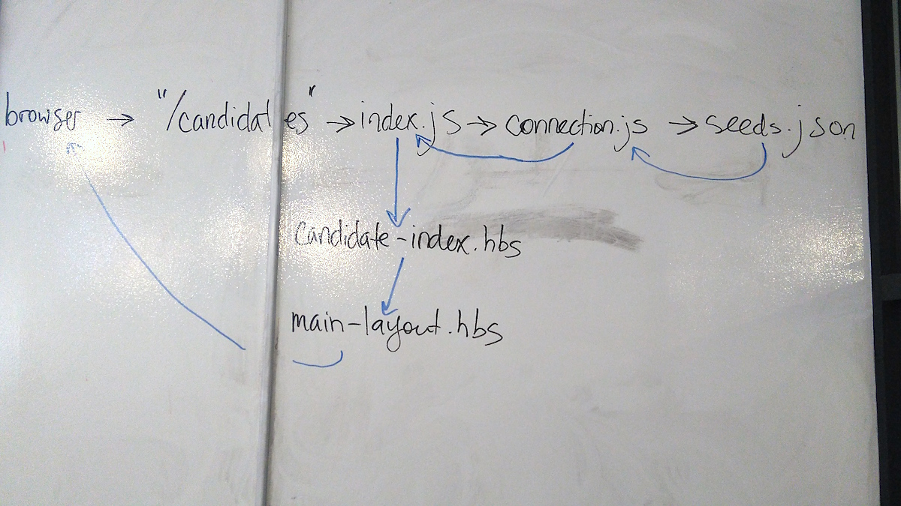

# ME(A)N Intro

## Learning Objectives

- Create, deploy, and modify a simple Express app with views, embedded code, and data persistence
- List three similarities between an MEAN app and a Rails app
- Describe the purpose of `npm` and `package.json`, and how they're related
- Explain the difference between `npm install` and `npm install --save`
- Explain the difference between a static file and a dynamic file
- Define "middleware", and explain where the "middle" comes from
- Explain how `require` and `module.exports` are related
- List two handlebars helpers

## Framing

Express is an MVC framework written in Javascript. It runs on top of Node.

Node itself is very simple. It's basically just a way of being able to read and write files, which front-end Javascript can't do. Express focuses and extends that capability to turn Node into a full-fledged webserver.

- Why does Express exist? Why not just use Rails or Sinatra or whatever?

### The goal of this class

We're going to go through the entire process of setting up a MEN app -- that is, a MEAN app without the "A" of Angular.

You're not expected to "get" everything. We do expect this class to give you a general understanding of the different pieces of an Express app and how they fit together. You'll be having other classes focusing on specific portions of what we cover here.

### Keep in mind

This is Javascript, so it's very picky about punctuation. **An error probably just means you forgot a comma**, *not* that you have fundamental flaws in your grasp of programming. Breathe!

**If you fall behind**, tilt your screen down, don't worry about your code, and just take notes and write down questions.



## Walkthroughs

We'll be using [WhenPresident](https://github.com/ga-wdi-exercises/whenpresident/commits/master), a MEAN app that lets you tell the world what you'll do "when President". [Test it out here!](https://whenpresident.herokuapp.com/)

> It has 3 whole lines of CSS. Bonus points if you make a pull request that makes it look pretty!

To start:

```
$ git clone git@github.com:ga-wdi-exercises/whenpresident.git
$ cd whenpresident
$ git checkout efab85b
$ git checkout -b starter-code
```

[1. Creating an Express app](1-creating-an-express-app.md)

[2. Connecting Mongo](2-connecting-mongo.md)

## Resources

- [The Big List of Mongoose methods](http://mongoosejs.com/docs/api.html)
- [An earlier Express lesson plan](https://github.com/ga-wdi-lessons/express-intro)
- Screencasts
  - WDI8
    - Take 1
      - [Part 1](https://youtu.be/i7gF0jIKYV0)
      - [Part 2](https://youtu.be/2_oWtEwR9ls)
      - [Part 3](https://youtu.be/huGXxXLo3Tc)
      - [Part 4](https://youtu.be/tWNbczMsnug)
      - [Part 5](https://youtu.be/RaRr1n8K2yU)
      - [Part 6](https://youtu.be/ddHtx5dbBD0)
    - Take 2
      - [Part 1](https://youtu.be/cH0gfO3W9Pc)
      - [Part 2](https://youtu.be/fzD_0AzYQEQ)
      - [Part 3](https://youtu.be/1Myb4VFF0D0)
      - [Part 4](https://youtu.be/jjyJuIjWO84)
      - [Part 5](https://youtu.be/cMudVdKCajY)
    - [Adding Mongoose](https://youtu.be/DpAz2EnAj2E)
