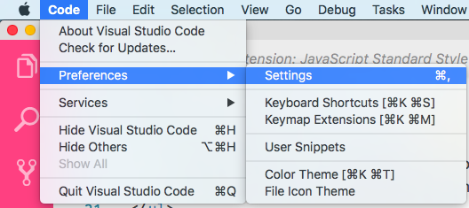

# Production Ready React

## Learning Objectives - Ali
* Implement React best practices in an application.
* Return to old code and notice what should be improved.
* Deploy a React application.

## Framing (5 minutes) - Ali
So far in this class we've seen a couple different React applications. In some cases, we simplified the code or used non-optimal practices in order to get through the material efficiently.

Code is pretty much never perfect, and there are constantly new technologies coming out that you may want to integrate into your project. In this class, we will revisit an application we built earlier in this class and refactor it to fit best practices in React and implement cutting edge features.

## Code Review (10 minutes / 5 minutes review) - James

With the person next to you, go though the code in the [Flashcards](https://git.generalassemb.ly/ga-wdi-exercises/flashcards/tree/solution) application. Discuss what about it could be improved upon to meet the best practices we've learned in class. Also discuss which best practices the code already follows.

<details>
<summary>Solution</summary>
<br>
<b>Best Practices in Place</b>
<ul>
    <li>Functional components for stateless components</li>
    <li>URLs in a constants file</li>
</ul>

<b>Where to improve</b>
<ul>
    <li>Move more to constants!</li>
    <li>Add prop types and default props</li>
    <li>Use consistent linting throughout</li>
</ul>
</details>

## Linting (5 minutes) - Ali

We've talked about linters a few times throughout this class, but let's first make sure that our code is properly linted. I use [Standard JS](https://standardjs.com/) to lint my code because I like the way that it makes my code look. I also have format on save enabled, so it lints my code automatically.

`CMD + Shift + P` -> `Extensions: Install Extensions`

Navigate to your VSCode Settings file:


Then, in your settings change the following:
`"standard.autoFixOnSave": true`

If you are using Atom, follow [these](https://atom.io/packages/standard-formatter) instructions instead.

Let's go through and save each file to make sure that all of the formatting is consistent.

## The new Class syntax and Arrow Functions (10 minutes) - James

Create React App uses a JavaScript compiler called Babel. This allows us to use the next generation features of JavaScript before they are released in the browser. **Note: The following syntax only works if you are using Babel**. 

The new syntax that Babel allows looks like the following:

```js
  class Bork {
    //Property initializer syntax
    instanceProperty = "bork";
    boundFunction = () => {
      return this.instanceProperty;
    }

    //Static class properties
    static staticProperty = "babelIsCool";
    static staticFunction = function() {
      return Bork.staticProperty;
    }
  }

  let myBork = new Bork;
```
From the [Babel Docs](https://babeljs.io/docs/plugins/transform-class-properties/)

Instead of creating a constructor, we can declare variables within the class directly. We can also use arrow functions instead of traditional methods, so we no longer have to bind this to them. We can also, if needed, use static properties and methods which are called on the class instead of an instance of the class.

Let's implement this new syntax together on the `FlashcardDetail` component.

```js
class FlashcardDetail extends Component {

  state = {
    currentTimeout: null,
    timer: 10,
    show: false
  }

  decrementTimer = () => {
    if (this.state.timer === 0) {
      this.props.onTimerEnd()
    } else {
      clearTimeout(this.state.currentTimeout)
      this.setState(prevState => ({
        timer: prevState.timer - 1,
        currentTimeout: window.setTimeout(this.decrementTimer, 1000)
      }))
    }
  }

  toggleShow = () => {
    this.setState(prevState => ({
      show: !prevState.show
    }))
  }

  componentDidMount () {
    this.setState({ currentTimeout: window.setTimeout(this.decrementTimer, 1000) })
  }

  componentWillReceiveProps () {
    clearTimeout(this.state.currentTimeout)
    this.setState({
      timer: 10,
      currentTimeout: window.setTimeout(this.decrementTimer, 1000)
    })
  }

  render () {
    let flashcard = this.props.card
    return (
      <div>
        <h3>{this.state.timer}</h3>
        <h1>{flashcard.word}</h1>
        { this.state.show && flashcard.definitions.map(
          (def, idx) => <Definition def={def} key={def._id} idx={idx} />)}
        <button
          onClick={this.toggleShow}
          className='waves-effect waves-light btn'>
          { this.state.show ? 'Hide Definition' : 'Show Definition' }
        </button>
      </div>
    )
  }
}
```

### You Do: (5 minutes) - Ali

Implement this new class syntax in the `FlashcardContainer` component.

<details>
    <summary>Solution</summary>

    ```js
    class FlashcardContainer extends Component {
        state = {
            flashcards: [],
            currentIndex: 0
        }

        next = () => {
            let nextIndex = (this.state.currentIndex + 1) !== this.state.flashcards.length
            ? this.state.currentIndex + 1
            : this.state.currentIndex

            this.setState({ currentIndex: nextIndex })
        }

        prev = () => {
            let prevIndex = (this.state.currentIndex - 1) < 0
            ? 0
            : (this.state.currentIndex - 1)
            this.setState({ currentIndex: prevIndex })
        }

        handleKeyUp = (event) => {
            if (event.keyCode === 39) this.next()
            if (event.keyCode === 37) this.prev()
        }

        componentDidMount () {
            window.addEventListener('keyup', this.handleKeyUp)

            axios
            .get(`${CLIENT_URL}/api/words`)
            .then(response => this.setState({ flashcards: response.data }))
            .catch(err => console.log(err))
        }

        componentWillUnmount () {
            window.removeEventListener('keyup', this.handleKeyUp)
        }

        render () {
            let flashcard = this.state.flashcards[this.state.currentIndex]
            return (
            <div>
                <main>
                <div className='container'>
                    {flashcard &&
                    <FlashcardDetail card={flashcard} onTimerEnd={this.next} />}
                </div>
                </main>
            </div>
            )
        }
    }
    ```

</details>

## Proptypes (10 minutes) - James

Let's go back to the React Reusable components lesson for a minute and revisit proptypes in React. 

* What are proptypes? What do we use them for?
* How do they make our code more stable?

<details><summary>Solution</summary>
    <ul>
        <li>Proptypes loosely enforce type checking in React components</li>
        <li>They make our code more stable because we know the data types of our props!</li>
    </ul>

</details>


Let's get them installed in our application.

First, let's install the package:
`$ npm install prop-types`

### We Do: Adding PropTypes to `FlashcardDetails` - Ali

Let's first require the proptypes in our file

`import { func } from 'prop-types'`

Then, within the class, let's add a static property:
```js
  static propTypes = {
    onTimerEnd: func.isRequired
  }
```

### You Do: Adding PropTypes to `Definition` - James

Add on proptypes to the `Definition` functional component. In this case, the proptypes will look a little bit different. [Hint](https://git.generalassemb.ly/ga-wdi-lessons/react-reusable-components#proptypes)

<details>

    ```js
    import { object, number } from 'prop-types'

    Definition.propTypes = {
        def: object,
        idx: number
    }
    ```

</details>

## Default Props - Ali

While we are at it, let's add in the `defaultProps` just in case our parent component doesn't pass us the needed props.

In the `Definition` component, let's add the following:
```js
Definition.defaultProps = {
  def: { definitions: [] },
  idx: 0
}
```

We shouldn't need one for the function in `FlashcardDetail` -- if we don't get the needed function our app should throw an error!

## Destructuring Props - James

While we are working with on improving our props, let's also destructure them so that they are easier to work with in our app.

We can change the function declaration in the `Definition` component to:
```js
const Definition = ({ def, idx }) => {
```
Then we can delete the two lines after the declaration. This process uses es6 syntax to reduce and DRY up code.

## Moving the API communication - Ali

We've talked a lot about keeping our code DRY and separating concerns in our applications -- we will see how to do that with state later this week with Redux, but we can also do so with our API calls using our existing knowledge.

Let's make a requests.js file next to our constants.js file.

`$ touch requests.js`

In that file add the following:
```js
import axios from 'axios'
import { CLIENT_URL } from './constants'

export default axios
    .get(`${CLIENT_URL}/api/words`)
    .catch(err => console.log(err))
```

Now, in the `FlashcardContainer`, let's change the axios request to:
```js
getRequest.then(response => this.setState({ flashcards: response.data }))
```
We also need to require that request file instead of `axios` and the `CLIENT_URL`:

```js
import getRequest from '../requests'
```

## Expanding setState - Ali

This has already been implemented in this app, but you may have seen elsewhere that we called `setState` with an object instead of a function, like so:

```js
this.setState({
    show: !state.show
})
```
While in most cases this will work, the `setState` method is asynchronous. So this can lead to unintended consequences. Instead, call `setState` with a function so that the previous state is preserved.

```js
this.setState(prevState => ({
    show: !prevState.show
}))
```

Also, if you want to call a function after the state is updated, do so with a callback instead of just calling the function after calling the `setState` method, like so:

```js
this.setState(prevState => ({
    show: !prevState.show
}), () => console.log('hello world'))
```

# Deployment

## Quick References - James

- [Deploying a Node-Express-Mongoose App/API with Heroku & MLab](https://git.generalassemb.ly/ga-wdi-lessons/express-mongoose-mlab-deploy)

## Multi-Server Approach

In this class, we are going to be using a multi-server or "micro-service" based deployment strategy for our MERN applications. This means that we will have a separate front-end and API running on two different servers. You will follow the mongoose and mlab instructions for creating your API. Make sure you send `res.json()` responses and include `cors`! Our front and back ends will not be physically attached via code, rather they will communicate through AJAX requests. We've already seen this throughout the current lesson and the React Translator one! The Express code for the Flashcard app is [here](https://github.com/aspittel/flashcard-app/tree/master/server).

Our React applications will be deployed using GitHub pages, since the code is static. Luckily, Create React App has some tools which will help us on our way. There is an NPM package that runs our build scripts and structures our application in a way that GitHub pages can understand -- such as including an `index.html` in the root of the project.

### Implementation - Ali

One of the things that will happen behind the scenes is that a build script will run. This will minify our code and transpile it so that is more efficient and browser compliant.

`$ npm install --save gh-pages`

In `package.json` add the following attribute:
`"homepage": "https://myusername.github.io/my-app",`

Also add the following to your "scripts" object:
```diff
  "scripts": {
+   "predeploy": "npm run build",
+   "deploy": "gh-pages -d build",
    "start": "react-scripts start",
    "build": "react-scripts build",
```

Back in the terminal, run the following script:
`$ npm run deploy`

Your app should now be deployed on GitHub pages!

## You Do: Refactor React Translator - James

For the rest of the class period, work on implementing the optimizations we learned about today to refactor the code for [React Translator](https://github.com/ga-wdi-exercises/react-translator/).

## Extra Resources

* [Create React App GH Pages Deployment](https://github.com/facebookincubator/create-react-app/blob/master/packages/react-scripts/template/README.md#github-pages)
* [Our Best Practices for Writing React Components](https://engineering.musefind.com/our-best-practices-for-writing-react-components-dec3eb5c3fc8)
* [Building A MERN App](https://git.generalassemb.ly/ga-wdi-lessons/building-a-mern-app/blob/master/readme.md)
