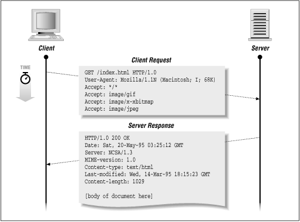

# Intro to Server Applications, HTTP, NodeJS, and npm

## Learning Objectives

  - Describe the role of the server
  - Describe the request/response paradigm
  - Identify high-level differences between server-side and client-side Javascript
  - Export and import NodeJS modules
  - Use npm to install and manage dependencies in projects and globally, on the local machine 
  - Build a basic server application from scratch

## Framing (5 min, 10:05)

Today we're going to embark on the next leg of our journey in learning fullstack web development. So far we've just learned to write client-side JavaScript that is loaded into our browsers via an HTML file.

If we're not writing JavaScript *for* our browsers to run, then what exactly are we writing it for? You may have heard that Node JavaScript is server-side JavaScript, but why and how are we concerned with servers as web developers? 

## Turn & Talk (5 min, 10:10)

With a person next to you, spend 2-3 minutes talking about what a server does, or what things you associate with the server. Please feel free to search on the web. Post your thoughts in an issue on this repo.

Afterwards, we'll share and discuss how this relates to full stack web development.

## The Role of the Server (5 min, 10:15)

Server-side JavaScript (**NodeJS**) is simply a type of JavaScript that runs independently of the browser and can code the behavior of a server. The server's job can be boiled down to this, "Ask, and you shall receive! (If nothing goes wrong 😊)" 

Ultimately, the job of a *server* is to **respond** to *client* **requests**. If a server application receives a request it can't fulfill, it still provides a response. If a server doesn't respond with anything, we'll assume that it is down or that something has gone wrong with our connection.

When we try to access a page that doesn't exist, we usually see a familiar error code...


The server still gives us feedback instead of no feedback at all.

There is a 'contract' between servers and clients where a *client makes requests to a server* and the *server responds to the request*. This is a paradigm known as [request-response](https://en.wikipedia.org/wiki/Request%E2%80%93response). The rules laid down by this paradigm enforce a standard baseline for a reliable internet we've all come to rely on.

With **NodeJS**, we can write a server, and decide how the server should respond to different kinds of requests.

## HTTP (10 min, 10:25)

HTTP is the fundamental way that we receive and transmit data to and from websites. When we visit a website, the URLs we type into our browsers' navigation bars start with `http` or `https`. Even if we don't type `http` in, our browsers will fill this in for us. HTTP stands for **hypertext transfer protocol**.

This protocol implements the contract between clients and servers. A server must provide some type of **response** to a **request** from a client. A client is typically a user connecting with a browser to some website. For instance, we're all clients interacting with the server at `git.generalassemb.ly`, which *responded* with this markdown file `README.md`.

HTTP 1.1 (what we are used to) is a stateless protocol which means that its connection doesn't keep track of its status. The connections simply open and close. A connection is established between the user's browser (the client) and the server when the user makes a request to the server. After the request is received, a server responds to the request with a webpage, an error page, some data, a file, etc, and then the connection is closed.

A stateful protocol, like a websocket connection, maintains an open connection in a socket that listens for messages that are transmitted or 'pushed' to the socket. Think about notifications on your phone. A server 'pushes' these updates to your phone-- you don't have to request them. A socket connection is also used in a lot of chat applications and many `.io` games. HTTP 2.0 has a request-push model which is a stateful connection protocol.

### Additional Reading on TCP

<details>
  <summary>HTTP over TCP</summary>
  <p> HTTP operates over TCP. When we navigate to a website, a TCP connection is established at a specific port, which is almost always going to be port <code>80</code> for <code>http</code> or <code>443</code> with <code>https</code>. </p>
  <ul>
    <li>https://www.diffen.com/difference/TCP_vs_UDP</li>
    <li>https://www.quora.com/Why-does-Netflix-use-TCP-and-not-UDP-for-its-streaming-video</li>
  </ul>
</details>

### Requests (5 min, 10:30)

### Request Types

Requests are actual entities in HTTP. They have a location or **URL**, like `google.com/` for example, and also have a **type**, which we refer to as a request **verb**. 

Whenever we navigate to a website, we make a `GET` request. When we navigate to google we are making a `GET` request to `https:/www.google.com/`. Most of the time we are using the web we are using `GET` requests. 

### Request Structure

A request also has a specific structure, containing a header and body. Like an HTML file, there is a distinction between content and metadata. Metadata would typically go in the request header, and could include information like credentials required for authentication, caching information, information about the browser you are using, and [much more](https://developer.mozilla.org/en-US/docs/Web/HTTP/Headers).

[This is a fairly comprehensive list of the HTTP request verbs](https://en.wikipedia.org/wiki/Hypertext_Transfer_Protocol#Request_methods)

#### CRUD (10 min, 10:40)

CRUD is an acronym for operations involving data: ***Create, Read, Update, and Destroy***. These CRUD actions involve the server application interacting with the database to retrieve and/or change data.

CRUD is simply the set of features of an application that involve seeing and changing data. It is often how developers conceptualize reading and writing data in web applications, especially ones that involve a server persisting data in a database. We will be repeatedly implementing CRUD functionality in our apps during this course.

|CRUD   |  Verb   |URL Path examples|Database Action|
|-------|---------|-----------------|--------------|
|READ   |GET      |  `/tacos`       | Retrieve data|
|CREATE |POST     |  `/tacos`       | Create new data|
|UPDATE |PUT/PATCH|  `/tacos/6`     | Update existing data|
|DESTROY|DELETE   |  `/tacos/7`     | Delete existing data|

> Assume /tacos/6 refers to one variety of taco (e.g. carne asada) and /tacos/7 refers to another variety of taco (e.g. grilled cactus)

#### Request & Response Headers & Bodies (5 min, 10:45)

[This is a fairly comprehensive list of the HTTP header fields](https://en.wikipedia.org/wiki/List_of_HTTP_header_fields)

The header will contain meta-data, type of content the request body contains, authentication data related to logins, cookies, the status code (like `200`, `404` `500`, `418`) and many other things.

The request body will contain the 'payload' or the information to be transmitted, such as information from a form. Responses have headers and bodies as well and could contain the page or data requested, an error display page, etc.



Now that we've taken a closer look at the concerns of a web server application, let's talk about NodeJS, which will help us run server-side code.

## What is Node? (5 min, 10:50)

Server-side JavaScript was implemented years ago in 1995 as Netscape's 'LiveWire' but it was a flop. Until recently, the concept of server-side JavaScript had been abandoned.

Since 2009, NodeJS has allowed us to run our code independently of the browser. Node is an application runtime environment that uses the V8 JavaScript engine, just as Chrome does. However, Node is specialized to handle functions that are unique to servers. Just as the browser environment provides developers with an interface for programmatically handling user interface interactions, Node provides an environment useful for servers.

Node JavaScript is server-side JavaScript. Node software is running in a system environment, providing our JavaScript an environment to run independent of the browser. When we write server-side JavaScript, we're writing the logic of the server side aspect for our web applications. Speaking broadly, a server manages connections, stores data and static assets, and responds to user requests by serving webpages, data, files, etc.

Node JavaScript is packaged up into modules. Let's create our first node project.

## Break (10min, 11:00)

## You Do: Your First Node Project (10min, 11:10)

### Directions

1. Navigate to your `sandbox` or another directory of your choosing.
2. Create a new directory called `hello-node` and `cd` into it.
3. Run `npm init` and answer each of the questions.
4. Type `ls`. What has changed? Remember you can use the `cat` command to print files to the CLI.
5. Create a file called `index.js` and edit it in your text editor.
6. Console-log hello world.
7. Finally, switch back to the command line and enter the command `node index.js`.

### Review

1. What did `npm init` do?
2. What file(s) appeared? What were the contents?
3. How did the `node` command work?

## We Do: Modules and Dependencies (15 min, 11:25)

1. On the command line, in our node project directory run...

```sh
 $ npm install lodash
```

2. In `index.js`...
```js
const variousBrownBears = [
  "Atlas bear",
  "Bergman's bear",
  "Blue bear",
  "Eurasian brown bear",
  "European brown bear",
  "Gobi bear",
  "Grizzly bear",
  "Himalayan brown bear",
  "Ussuri brown bear",
  "Kamchatka brown bear",
  "Kodiak bear",
  "Marsican brown bear (critically endangered)",
  "Mexican grizzly bear",
  "East Siberian brown bear",
  "Syrian brown bear"
]

const _ = require('lodash')
const randomBear = _.sample(variousBrownBears)

console.log(randomBear)
```

3. Next, let's create a new file called `bears.js` and add the array of brown bears, removing from `index.js`.

Add the following to bears.js...

```js
module.exports = variousBrownBears
```

4. Then, in `index.js` add...

```js
const variousBrownBears = require('./bears')
```

5. Run `node index.js` from the command-line.

## We Do: Build Your Own Node Package (45 min, 12:10) 
[NPM Resume](https://git.generalassemb.ly/ga-wdi-exercises/npm-resume)

## Closing (Rest of Class)

## Bonus Material

[Node Server from Scratch](https://git.generalassemb.ly/ga-wdi-exercises/node-server-from-scratch)
