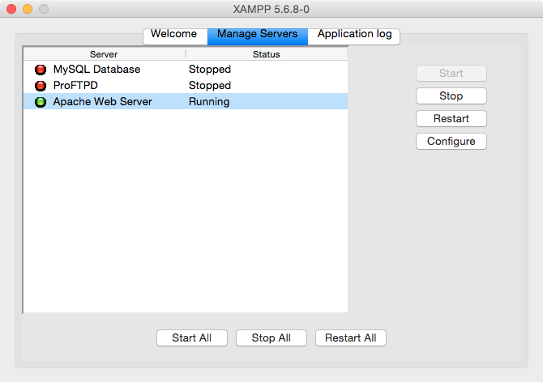

# PHP Intro

## Learning Objectives

- Start Apache running locally on your computer.
- Write a PHP function that contains variables.

## Before we begin

Please start downloading XAMPP, since it's kind-of big:

https://www.apachefriends.org/index.html

**You only need to download it**. Don't open what you downloaded just yet.

## What is PHP, and why does everyone "hate" it?

PHP originally stood for Personal Home Page... because it was created by some guy to use just on his personal home page. He had no intention of creating a programming language.

However, nothing like it really existed, so other people caught wind of what he was using and started adding their own functionalities to it.

Thus, PHP evolved organically. And as a result, it's kind of a mess.

PHP is very procedural. It doesn't really have objects*. Instead of giving you an Array object that has methods attached to it, it just gives you 53 functions with "array" in the name. There are 9500 total built-in functions, all in the global namespace. - http://php.net/manual/en/function.array.php

Compare the two snippets below. Both print out `apple and a banana and a carrot and a durian`. Which is easier to read?

```php
<?php
$fruits = "  APPLE,bAnAnA,CArroT,durian  ";
$fruits = implode(" and a ", explode(",", trim(strtolower($fruits))));
echo($fruits);
?>

<script>
var fruits = "  APPLE,bAnAnA,CArroT,durian  ";
fruits = fruits.trim().toLowerCase().split(",").join(" and a ");
document.write(fruits);
</script>
```

> It does have objects now, actually. But instead of doing something like `artist.name` it's `$artist->name`, which is 2 characters too many.


### At the same time...

There are several reasons to like PHP:

- It's super-easy to pick up. It looks a lot like Javascript, and because you're dealing with functions instead of objects, it's easier to write, and usually not difficult to read.
- It's *everywhere*. It had a massive head start.
- It's easy to embed in HTML.
- It makes a lot of back-end concepts easy to understand.

### I use PHP...

...for rapid prototyping. When I want to quickly make a script that involves reading/writing files, PHP is my go-to.

For example, my [PHP Computer Navigator](https://github.com/RobertAKARobin/PHP-Computer-Navigator) is extremely useful to me. I use it to navigate around all my various repos and code projects.


## Install PHP with XAMPP

> Note: I personally don't use XAMPP to run Apache. I used to for years, but now I do it through the command line. We're not doing it via the CLI as a class because the configuration varies from computer to computer.

XAMPP is basically like the Blue Elephant for Postgres, except it runs a server called Apache. (It can also do MySQL and some other stuff.)

### Before you open what you downloaded...

It's going to install some stuff. In the process, it'll try to get you to go to a site called BitNami. This is not necessary.

You'll be done when you get this window:


### Now open it

Open what you downloaded, and follow the steps to install it.

When you've arrived at the window above, click the "Manage Servers" tab, and start Apache:



### Set it up in the CLI

We're looking for a folder called `htdocs`, which is the **root directory for all PHP files** accessed via XAMPP.

**For Macs:**

```
$ cd /Applications/XAMPP/xamppfiles
$ sudo chmod -R 777 htdocs
$ cd htdocs
```

**For Linux:**

```
$ cd /opt/lampp
$ sudo chmod -R 777 htdocs
$ cd htdocs
```

> Note: Don't go running `chmod` any old place. It's fine on `htdocs`, but I wouldn't do it elsewhere unless you know what you're doing.

## Your first PHP file

Now, in that `htdocs` folder, create a new file called `hello.php`. Inside, write this:


Then, go to `localhost/hello.php`.

> Note that PHP is **extremely** picky about semicolons. You *must* use them, unlike in Javascript.

<details>
  <summary> </summary>
  <pre>
```
<?php

function quiznosToaster($tray){
  echo("I'm giving off heat... ");
  return("$tray is now toasty!");
}

$sandwich = "BLT";
echo(quiznosToaster($sandwich));

?>
```
  </pre>
</details>

## Big differences between PHP and Javascript

- To add strings together you use `.`, not `+`, but you still use `+` to add numbers.
- There's no `var`. Instead, variables all begin with `$`. So instead of `var artist = ` you have `$artist =`.
- PHP has classes. Instead of referencing a property or method with `.` (`artist.name`) you use `->` (`$artist->name`).
- Every PHP snippet begins with `<?php` and ends with `?>`.

## Try this:


<details>
  <summary> </summary>
  <pre>
```PHP
<!DOCTYPE html>
<html>
  <head>
    <title>Hello</title>
  </head>
  <body>

  <?php
    $adjectives = array("attractive", "terrible", "sad", "lugubrious");
    $randomIndex= array_rand($adjectives, 1);
    $adjective = $adjectives[$randomIndex];
  ?>
    <h1><?php echo("My, you're looking $adjective today!"); ?></h1>

  </body>
</html>
```
  </pre>
</details>

# You Do: [FizzBuzz in PHP](https://github.com/ga-wdi-exercises/php-fizzbuzz)

## Congrats! You now know how to:

- Write functions
- Define variables
- Save to a file
- Read a file
- Loop
- Turn JSON into an array / object, and vice-versa
- Respond to HTTP requests

## Hungry for more PHP?

- http://www.phptherightway.com/
- http://www.slimframework.com/
- https://laravel.com/
- http://php.net/manual/en/internals2.php
