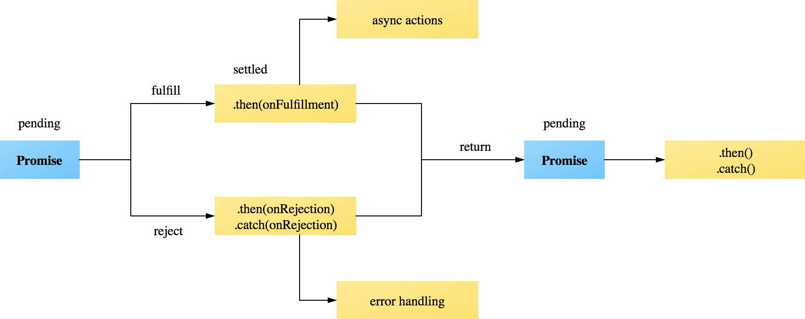

# Promises

## Lesson Objectives

- breakdown mongoose and express code to demonstrate promises
<!-- - Use Promises to handle AJAX requests -->
- Discuss JavaSript, an asynchronous and single threaded language
- Use callbacks to define Promise behavior

## Promises Overview

- Now native in javascript

Promises are special objects in ES6/ES2015 JavaScript that capture **eventual** values. In a sense, a Promise is a placeholder for a value that hasn't arrived yet. When the value finally arrives, the Promise is *fulfilled* and returns the received value. The Promise may also fail, and would indicate this failure in its output.

### Promise Examples

Lets review a few code snippets from the mongoose/express lesson to demonstrate promises in action.

We used promises when seeding our whenpresident database with Mongoose

```js
// seeds.js
const Candidate = require('./schema')
const seedData = require('./seeds.json')

// removes all candidates from the database
Candidate.remove({})
  // then inserts seed data from ./seeds.json
  .then( function () {
    return Candidate.collection.insert(seedData)
  })
  // then close the mongoose connection
  .then( function () {
    process.exit()
  })
```

- What could happen if we ran the same methods without promises?

```js
Candidate.remove({})
Candidate.collection.insert(seedData)
process.exit()
```

We also use promises to handle routes with Express

```js
// controllers/candidates.js

// handles user get request to '/'
router.get('/', (req, res) => {
  // retrieves all candidates from the db
  Candidate.find({})
    // then renders the 'candidates-index' view with retrieved candidates
    .then( function (candidates) {
      res.render('candidates-index', {
        candidates: candidates
      })
    })
    // or logs an error to the console
    .catch( function (err) {
      console.log(err)
    })
})
```

- What could happen without promises?
- What is `.catch()`'s purpose?

 Promises can exist in one of three states:

- pending - the promise has not yet received a value or error
- fulfilled - the promise received a value
- rejected - the promise received an error

A promise is considered *resolved* when it is either fulfilled with a value or rejected with an error.

`.then()` executes a callback or function reference in the case of a fulfilled promise and `.catch()` handles rejected promises in the same way. `.catch()` is useful for handling and logging errors!



Both `.then()` and `.catch()` return a new promise which allows us to chain multiple promises one after another.

### What is `mongoose.Promise = Promise` ?

Lets review our connection.js file.

```js
// db/connection.js

// imports the mongoose library
const mongoose = require('mongoose')

// connects our app with our mongoDB server
mongoose.connect('mongodb://localhost/whenpresident', { useMongoClient: true })

// replaces mongooses promise library with JS's promise library
mongoose.Promise = Promise

// exports mongoose library for use in other files
module.exports = mongoose
```

<!-- JavaScript code that makes an AJAX request to an endpoint will not halt the rest of the code's execution. The AJAX request will be fulfilled in the background. Under the hood, Promises make use of callbacks to handle the asynchronous behavior.  -->

## Promises in Action

Recall that callbacks are *function references* that are passed in as arguments to another function. This usage of callbacks allows JavaScript code to run asynchronously, or for some operations to run in the 'background' while the code continues to be executed. JavaScript is not multi-threaded, however. It is single threaded but has a concurrency functionality based on the event loop, which listens for events and then **enqueues** the callback functions associated with the event.

Promises takes a callback function, ***the executor***, as an argument. The ***executor*** function itself takes two arguments, `function(succeed, fail)`. These arguments, `succeed` and `fail`, actually represent other functions (callback-ception)! These functions passed into the ***executor***, `succeed` and `fail`, are called depending on the operation's success. If the promise succeeds, the `succeed` function will be invoked, but if the promise fails `fail`, will be called instead.

> Note: In the MDN documentation on Promise usage, `success` is referred to as `resolve`, and `failure` as `reject`.

## We Do: Promise

```js
// Example of Promise

var a = 3
var b = 7

var equals10 = new Promise( function (succeed, fail) {
  var sum = a + b
    // setTimeout (() => {
      if (sum === 10) {
          succeed(`${a} + ${b} = 10`)
      } else {
          fail(`ERROR: ${a} + ${b} = ${sum} not 10`)
      }
    // }, 5000)
})

console.log(equals10)

equals10
  .then(response => console.log(response))
  .catch(error => console.error(error))
```

<!-- ```js
// Example of Promise wrapping jQuery JSON fetch
const dataFetch = url => {  
  return new Promise((succeed, fail) => {
    $.getJSON(url)
      .done((json) => succeed(json))
      .fail((xhr, status, err) => fail(status + err.message))
  })
}

``` -->

<!-- Promises can also be chained.

### Fetch

```js
const url = "http://www.example.com"
fetch(url)
  .then(readableStream => readableStream.json())
  .then(data => console.log(data))
``` -->


## Additional Reading

  - [Intro to Promises](https://developers.google.com/web/fundamentals/primers/promises)
  - [Using ES2015 Promises](https://developer.mozilla.org/en-US/docs/Web/JavaScript/Guide/Using_promises)
  - [ES2015 Promises Reference](https://developer.mozilla.org/en-US/docs/Web/JavaScript/Reference/Global_Objects/Promise)
  - [Using Fetch](https://developer.mozilla.org/en-US/docs/Web/API/Fetch_API/Using_Fetch)
  - [ES2015 Promises with Mongoose Queries](http://erikaybar.name/using-es6-promises-with-mongoosejs-queries/)
  - [General Reference for Promises in Mongoose](http://mongoosejs.com/docs/promises.html)
  - [Promises in ***wicked*** detail](http://www.mattgreer.org/articles/promises-in-wicked-detail/)
