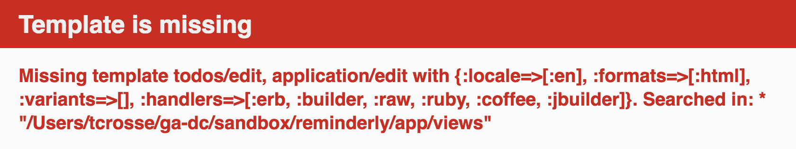

# Rails Edit, Update and Partials

## Learning Objectives

- Implement edit & update features for a model in rails
- Use application layout to structure rendered views
- DRY up rails code by converting edit & new forms to partials
- Convert show/index to render partials for atom
- Utilize Rails strong parameters to address the mass assignment vulnerability

## Framing

We've learned to do a lot so far: we've created simple apps that are able to interact with a database. We can create, read and destroy entries in our database but we can't yet update them.

On top of that, the UI of our pages varies a lot between views. We can add redundant pieces to multiple views to get a consistent UI but there are better, more DRY ways to achieve the same end.

## Feature: Update

Create, read, and destroy are all you need if nothing ever changes and your users never make mistakes. That, however, isn't always the case...

### Add Routes (10 minutes / 0:10)

Our first objective is to create a view for the user so that they can update an existing todo. This will be located at the path `/todos/:id/edit`, where `:id` is replaced with the id of the todo in question. So, if we go to `/todos/2/edit` now, we get the following error...


We can check our current URL paths and matching controller actions by running the following in the terminal...

<!-- AM: Have they run this yet? -->

```
$ rake routes
```

To fix this error we need to add a route for `edit`. While we're there, we'll go ahead and add one for `update`.

- *Edit* will respond to the GET request with the view for the edit form.
- *Update* will respond to the PATCH request sent by changing the appropriate entries in the database.

```rb
Rails.application.routes.draw do
  resources :todos, only: [:index, :show, :new, :create, :destroy, :edit, :update]
end
```
This will also change what we see if we run `rake routes` again.

### Remove `only:`

Now that we have all 7 actions listed for resources, we no longer need to say `only:`

```rb
Rails.application.routes.draw do
  resources :todos
end
```

If we run `rake routes` one more time we'll notice nothing changed.

<details>
  <summary>
    <strong>Q. What does <code>resources</code> do? Why did we need to say <code>:only</code> to begin with?</strong>
  </summary>

  <code>resources</code> sets up all the restful routes for a given model.

  We don't want to implement routes that we don't support. Listing a route but not supporting it results in a 500 `Internal Server Error`, where as not having a route results in a 404 `Not Found` error. The latter indicates that the user did not make a valid request.

  <br>
</details>

### Add Edit to Controller (5 minutes / 0:15)

If we refresh the page we get a new error...


<details>
  <summary><strong>Q: What can we do to fix this?</strong></summary>

  Let's add a controller action...

  ```rb
  def edit
    @todo = Todo.find(params[:id])
  end
  ```

  <br>
</details>

### Build Edit Form View

When we refresh the page, we get another error...



<details>

  <br>

  <summary><strong>Q: What can we do to fix this?</strong></summary>

  Create a new file `app/views/todos/edit.html.erb` and copy the existing `new` form into here. Then add a title to both to help distinguish the two apart.

  ```html
  <h2>Edit</h2>
  ```

  <br>
</details>

### Add Form To Edit View

<details>
  <summary><strong>Q: What Rails "helper" have you already used to generate a form?</strong></summary>

  > `form_for`. We use it to build a form for a particular model.

  <br>

</details>

Now let's add a form to our new edit view...

```erb
<%= form_for @todo do |f| %>
  <%= f.label :body %>
  <%= f.text_field :body %>
  <%= f.label :author %>
  <%= f.text_field :author %>
  <%= f.submit %>
<% end %>
```

<details>
  <summary><strong>Q: Why does this form look familiar?</strong></summary>

  > Because it's the exact same one we used in `new.html.erb`! Yes, there will be an opportunity to make this a bit more DRY later on in this lesson...

</details>

### Add Update to Controller (5 minutes / 0:20)

If we try submitting the form now we'll again get the `Unknown action` error, this time for `update`. To fix it, we need to add the appropriate controller action.

First, we need to tell our controller action which todo action we want to update.

<details>

  <summary><strong>Q: How can we do that?</strong></summary>

  ```rb
  def update
    @todo = Todo.find(params[:id])
  end
  ```

  > Even though this isn't a GET request (i.e., no URL), the correct todo's id is being pass through params.

</details>

<br>

Next, we need to update that todo with its new values.

<details>

  <summary><strong>Q: How can we do that?</strong></summary>

  ```rb
  def update
    @todo = Todo.find(params[:id])
    @todo.update(todo_params)
  end
  ```

  > The private method `todo_params` we created is called '[Strong Params](http://edgeguides.rubyonrails.org/action_controller_overview.html#strong-parameters)' and it prevents [mass assignment attacks](https://en.wikipedia.org/wiki/Mass_assignment_vulnerability)

</details>

<br>

Now what happens when we try to update a todo?


<details>

  <summary><strong>Q: What should be our next move?</strong></summary>

  We don't need an update view. We should, however, redirect the user back to somewhere in else in our application. How about the show page?

  ```rb
  def update
    @todo = Todo.find(params[:id])
    @todo.update(todo_params)
    redirect_to todo_path(@todo)
  end
  ```

</details>

<br>


### Add Links to Show (5 minutes / 0:25)

We should now be able to edit/update our todos. It's awkward to manually have to add `/edit` in the URL bar. A link on a show page to `/edit` would be much better. Let's do that with a `link_to` helper...

```erb
<h2><%= link_to "Edit", edit_todo_path(@todo) %></h2>
```

### Edit Data, Explore in Index/Show

## You Do: Add Edit/Update to Tunr (25 minutes / 0:50)

> 20 minutes exercise. 5 minutes review.

1. Clone [this tunr repo](https://github.com/andrewsunglaekim/tunr_features/tree/new-create-delete).
  - `cd` into it
  - `checkout` the solution from yesterday
  - ...then create a new branch and switch to it `checkout -b <branchname>`

  > ```
  $ git checkout new-create-delete
  $ git checkout -b add-edit-feature
  ```

2. Add the appropriate route for edit.
3. Add controller actions for routes.
4. Create an `edit.html.erb` view and copy in the new form, and modify it for edit.
5. Add links from an existing page to the edit page.
6. Test editing data.
7. Commit progress!

## Break (10 minutes / 1:00)

# Application Layout

Notice that the views we have been creating are not complete HTML pages. They are actually partial pages. By default Rails uses the file `app/views/layous/application.html.erb` to wrap all of these partial pages with the appropriate missing bits of HTML. Rails finds the proper layout and combines it with the view corresponding to the appropriate controller action and renders the two as a single HTML file.

### Yield (5 minutes / 1:05)

If you take a look at that file you'll see...

```erb
<%= yield %>
```
> Within the context of a layout, yield identifies a section where content from the view should be inserted. The simplest way to use this is to have a single yield, into which the entire contents of the view currently being rendered is inserted

In other words yield is where the partial pages get inserted.

### Content in Layout (5 minutes / 1:10)

If we wanted some content to remain the same across pages we could include it directly in the layout. Nav bars and footers are great candidates for things you might want to remain constant.

```html
<nav>
  <h3><a href="/todos">Todos</a></h3>
  <h3><a href="javascript:history.back()">Back</a></h3>
</nav>

<%= yield %>

<footer>
  <p>(c) Maseda Industries 2016</p>
</footer>
```

### Additional Layouts

There may be times when you need to use multiple layouts in an application. Rails will first look for a file in `app/views/layouts` with the same base name as the controller. If there is no such controller-specfic layout, Rails uses `app/views/layouts/application.html.erb`.

Instead of using the ones Rails looks for, you can explicitly tell it to use the layout of your choosing with the `render` method in a controller action. Or by using the `layout` method to override the layout conventions for an entire controller.

[Render also does a whole bunch more...](http://guides.rubyonrails.org/layouts_and_rendering.html#using-render)

# Form Partials

The two files `new.html.erb` and `edit.html.erb` right now are identical. That's not very DRY. Fortunately Rails has something called *partials* that allow us to clean up our code.

### You Do: Doc Dive - Partials (10 minutes / 1:20)

Read  [partials](http://guides.rubyonrails.org/layouts_and_rendering.html#using-partials) from 3.4 _Using Partials_ to 3.4.7 _Spacer Templates_

Try to write down answers to the following questions:
- <strong>How do you add a partial to a page?</strong>
- <strong>When are partials useful?</strong>
- <strong>What can be included in a partial?</strong>

### Convert Edit & New Forms to Partials (5 minutes / 1:25)

Only two steps required here...
- Create a new file in views called `_form.html.erb`
- Copy and paste the contents of either `new.html.erb` or `edit.html.erb`

> The underscore in the partial file name is convention.

### Render Form Partials

- Replace the current form with...

```erb
<%= render 'form' %>
```

### You Do: Convert Forms to Partials (15 minutes / 1:40)

> 10 minutes exercise. 5 minutes review.

Continue working on Tunr...

1. Create an appropriate `_form.html.erb`
2. Replace the existing new form with a render of the partial
3. Test creating data
4. Replace the existing edit form with a render of the partial
5. Test updating data
6. Commit progress!

## Break (10 minutes / 1:50)

## Other Partials

### Convert Index to Render Partial Collections (5 minutes / 1:55)

- Create a `_todo.html.erb` file.
- Copy the code for displaying the collection data into the `_todo` partial.
- Replace the existing code with a render method...

```erb
# _todo.html.erb

<p>
  <%= link_to todo.body, todo_path(todo) %> |
  <%= link_to "Delete this todo", todo_path(todo),
     method: :delete %> |
  <%= link_to "Edit", edit_todo_path(todo) %>
</p>
```

> The code above is what we originally had inside of the `.each` statement in `index.html.erb`, now inside `_todo.html.erb`.

```erb
# index.html.erb
<%= render partial: "todo", collection: @todos %>
# or
<%= render @todos %>
```

```erb
# show.html.erb
<%= render partial: "todo", collection: @todos %>
# or
<%= render @todo %>
```

### You Do: Use Partials in Tunr (15 minutes / 2:10)

> 10 minutes exercise. 5 minutes review.

Create a partial for artists and render it in the artists index

## Closing/Questions (10 minutes / 2:20)

* What Rails helper do we use to create a form?
* What is strong params and why do we use it to create/update?
* What is a partial? Why is it helpful?
* What is the file naming convention for a partial?
* How do we indicate that we are using a partial in a view?

## Additional Resources

- [RailsGuides: partials](http://guides.rubyonrails.org/layouts_and_rendering.html#using-partials)
- [RailsGuides: form helpers](http://guides.rubyonrails.org/form_helpers.html)
- [RailsGuides: action controller](http://guides.rubyonrails.org/action_controller_overview.html)
