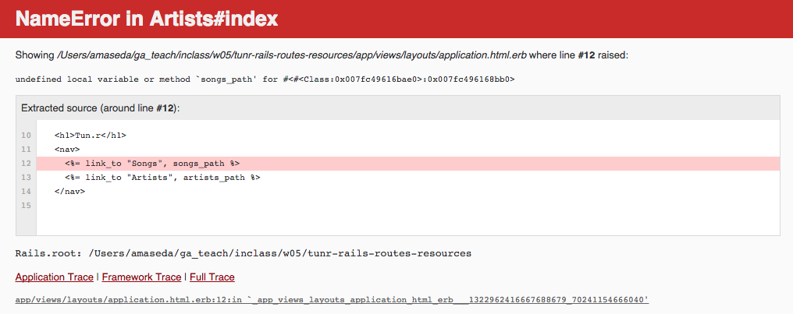

# Rails Routing and Resources

## Learning Objectives

- Review the relationship between HTTP requests and Controller actions
- Identify the role a router (`routes.rb`) plays in the Rails rMVC model
- Use `resources` to define routes for a RESTful controller
- Use `rails routes` to display RESTful routes
- Use Rails path helpers to reference routes
- Implement nested routes in a Rails application
- Describe how path helpers work for nested routes
- Implement `form_for` to build a form for a nested resource

## The Router (5 minutes / 0:05)

It's our good friend the Rails rMVC diagram!


<details>
  <summary><strong>Q: Who can walk us through the rMVC pattern, highlighting where the router is and what it does?</strong></summary>

> - The router matches an HTTP request to a controller and action.
> - The gateway to the rMVC (router / model / view / controller).
> - So something like this `get "/artists/2"` is directed to the `artists`
>   controller `show` action.
> - Returns an error if the HTTP request is unrecognizable and/or does not
>   match a controller action.

</details>

## Routes (5 minutes / 0:10)

Clone the [tunr_rails_routes_resources repo](https://github.com/ga-wdi-exercises/tunr_rails_routes_resources) and
follow the below setup instructions.

```bash
git clone git@github.com:ga-wdi-exercises/tunr_rails_routes_resources.git
cd tunr_rails_routes_resources
bundle install
rails db:drop db:create db:migrate db:seed
rails s
```

> The `master` branch contains starter code. The `solution` branch contains the
> code we will have written by the end of this lesson.

In the Intro to MVC lesson we explored the role of `config/routes.rb` in a Rails
application. In this file we define all the known routes of our application and
then map them to their appropriate controller actions.

<details>
  <summary><strong>Q. What does the individual route to the `index` page for `artists` look like?</strong></summary>

```rb
# index
get "/artists", to: "artists#index"
```

> - `get` = HTTP method
> - `"/artists"` = path
> - `to: "artists#index"` = controller action

</details>

<details>
  <summary><strong>Q. And the `show` page for an `artist`?</strong></summary>

```rb
# show
get "/artists/:id", to: "artists#show"
```

> - `get` = HTTP method
> - `"/artists/:id"` = path
> - `to: "artists#show"` = controller action

</details>

<details>
  <summary><strong>Q. At a high level, what happens when we visit `http://localhost:3000/`? Why?</strong></summary>

> We see a listing of Artists.
>
> Why? A "root" route is defined.  When we visit http://localhost:3000/, we
> trigger the index action in the ArtistsController.

```rb
root to: "artists#index"
```

</details>

## Looking Up Routes (5 minutes / 0:15)

There a couple of ways in which we can lookup the routes that a Rails app
currently supports.

### Browser

To get a complete list of the available routes in your application, visit
http://localhost:3000/rails/info/routes in your browser while your server is
running in the development environment.

### Command Line

We can also get a list of currently-supported routes by entering the following
into the command line while in the same folder as our Rails application...

```bash
rails routes
```

The resulting output should look something like this...


## Named Path Helpers

Looking at the output, we see the first column is "Prefix". These are **named
path helpers** Rails provides so that we can easily reference these paths in
code. This column provides information about the naming convention for these
helpers.

### You Do: Path Helpers Documentation Dive (10 minutes / 0:25)

> 5 minutes exercise. 5 minutes review.

Spend five minutes reading through Sections 2.1 - 2.5 of the [Rails
documentation for Rails
routing](http://guides.rubyonrails.org/routing.html#path-and-url-helpers).

#### Review

<details>
  <summary><strong>What are "helpers" in Rails?</strong></summary>

  > **Helpers** codify Rails conventions. They write code for us using Rails.

</details>

<details>
  <summary><strong>How do path helpers fit into that category?</strong></summary>

  > **Path helpers** are methods which provide the paths to a resource. We build
  > them using the prefixes from `rails routes`.

</details>

<details>
  <summary><strong>What do path helpers look like?</strong></summary>

```sh
prefix + "_path" = Path Helper
```

</details>

Consider this output from `rails routes`...


<details>
  <summary><strong>What named path helper will return the path to list all artists?</strong></summary>

> `artists_path`

</details>

<details>
  <summary><strong>What named path helper will return the path to show an individual artist?</strong></summary>

> `artist_path(@artist)`

> To indicate which artist we should show, we need to pass a **reference** to
> an `artist`. In this example, that is `@artist`.

</details>

<details>
  <summary><strong>Where do we utilize path helpers in Rails?</strong></summary>

> We use path helpers in views and controllers.

</details>

<details>
  <summary><strong>Why not in models?</strong></summary>

> Models do not know their place in the request/response cycle. Their primary
> concerns are business logic and interaction with the database.

</details>

## RESTful Routes (5 minutes / 0:30)

REST attempts to view everything on the web as a resource. RESTful resources are
expected to be managed via specific routes.  Rails makes it easy to generate
RESTful routes using the `resources` keyword.

```rb
resources :artists
resources :songs
```

What exactly does `resources` do?

- Tells Rails we will be using RESTful routes
- Generates path helpers
- Creates routes using a combination of REST and Rails conventions. This process
  assumes properly-named controllers (e.g.,`artists_controller.rb` and
  `songs_controller.rb`) and actions (e.g., `index`, `show`).

Let's review the output of `rails routes`.

## Nested Resources (15 minutes / 0:45)

The way our app is currently routed works just fine. If we want to retrieve
information about an individual artist or song, we can visit the following urls,
respectfully...

```sh
http://www.tu.nr/artists/3/
http://www.tu.nr/songs/12/
```

> The path for an artist has nothing to do with a song, and vice-versa.

But consider the following URL...

```sh
http://www.tu.nr/artists/3/songs/12
```

<details>
  <summary><strong>What would it mean to have a URL like that? Why do we do it this way?</strong></summary>

> It concisely reflects our data structure: all `songs` are dependent on an
> `artist`. We can also use the URL parameters to retrieve information about a
> particular artist **and** song.

</details>

For this app we will be structuring our routes so that all songs exist only
within the context of an artist.

The reasons for this might not be so apparent for routes like `show`, `edit`,
`update` and `destroy` because we have access to a `song` ID in the url anyway.
But by using nested resources, it's easier to create a song because we have the
`artist_id` in the url. Or maybe we want the songs index route to be namespaced
under an `artist` so that we can **ensure** that a song is associated with a
specific artist.

> **Aside:** Ultimately your domain model is just that, yours. It's up to you to
> decide what the right fit is. Which tables make the most sense for the
> problems that you face in your application? Which associations should you use
> to best facilitate querying the database. Which resources should you have and
> under which namespaces? These are the questions developers ask themselves each
> and every time a new application is being created. We're just here to teach
> you some tools to answer these questions for yourself.

So we want our song `index` and `show` routes will look something like this...

```rb
get "/artists/:id/songs", to: "songs#index"
get "/artists/:id/songs/:id", to: "songs#show"
```

<details>
  <summary><strong>Given the route <code>artists/7/songs/14</code>, what information you think would be in the <code>params</code> hash for this route?</strong></summary>

> Artist and song ids.

</details>

<details>
  <summary><strong><code>`:id`</code> is used twice. How do we know which is which?</strong></summary>

> We need to be able to reference the artist and song id's in two distinct
> ways. Our routes need to look something more like this...

```rb
get "/artists/:artist_id/songs/:id"
```

</details>

Fortunately, Rails will set this up for us if we simple alter how we use
`resources` in `routes.rb`:

```rb
resources :artists do
  resources :songs
end
```

## Break (10 minutes / 0:55)

## Implementing Nested Resources in Tunr

Okay, so our `routes.rb` file is updated with nested resources. Let's see them
in action and fire up our Tunr app!



That's okay. You're going to spend the next hour fixing it!

### Think-Pair-Share: What Do We Need to Change? (5 minutes / 1:00)

> 3 minutes exercise. 2 minutes review.

Look through your application and think about what we need to change in order to
accommodate our new routing system. Don't worry about solving the problem
immediately. Start by identifying files we need to change.

### Let's look at `rails routes` again...


<details>
  <summary><strong>What has changed in the output of <code>rails routes</code>?</strong></summary>

  > - HTTP requests (URI Pattern) match the individual nested routes we just
  >   talked about (e.g., `:artist_id`)
  > - Song path helpers are now prefixed with artist (e.g., `artist_songs`,
  >   `new_artist_song`)
  > - Controller actions, however, are the same

</details>

<details>
  <summary><strong>Based on this, what do we need to change in our app?</strong></summary>

> - Link helpers
> - Form helpers
> - Songs controller actions

</details>

## We Do: Fix The App! (60 minutes / 2:00)

For the rest of the class we'll be working to fix the app. Feel free to follow
along, or go at your own pace.

### Bonuses

If you find yourself moving along quickly, try implementing the following...

- A third `Genre` model that has a `belongs_to` relationship with `Artist`
- Read about and implement some of the advanced topics included in "Additional
  Reading" at the bottom of the lesson plan

### Let's take another look at that error


<details>
  <summary><strong>How do we fix this?</strong></summary>

> **Delete it.**
> - The original link took us to a list of all the songs in our application.
>   While getting rid of it may be a bad move from a usability standpoint, by
>   implementing nested resources we made the decision that songs will never
>   exist independent from an artist.

</details>

### Let's click on an artist

Another error! What went wrong this time?


Our app does not like the `new_song_path` we used in a link helper in our
`artists/show.html.erb` file.


<details>
  <summary><strong>What do we need to replace this path helper with? (Hint: Look at `rails routes`)</strong></summary>

  

  > By nesting resources, `new_song_path` became `new_artist_song_path` since
  > every `song` we create is now created in the context of an `artist`.

</details>

But our app is still giving us an error. Why?


You'll notice that we're getting a different error this time that ends with:
`missing required keys: [:artist_id]`

<details>
  <summary><strong>What else do we have to do to our link helper to fix this?</strong></summary>


> We need to feed our `new_artist_song_path` helper an `artist` as a
> **variable**. Now our app knows which `artist` it is rendering a new `song`
> form for.  

</details>

And that'll do it. Let's refresh our page...


So now what? The link helper for an individual song inside of our `.each`
enumerator isn't working.


Some thoughts...

- The error is telling us that it doesn't know what `song_path` is. This is
  because, as a shortcut, if we just put `song` in the link helper AND the path
  name matches the entity name, it will automatically read it as
  `song_path(song)`.
- So which path helper do we need to use instead?
- Do we need to feed it a variable? If so, how many?


From an artist `show` page, click on a link to a song. You should get an error.

- Try fixing the `songs/show.html.erb` file
- **Hint #1:** remember, our `song` routes don't look the same as they did
  before!
- **Hint #2:** How many parameters will your new path need?

### Form Helpers

Something else we'll need to change are forms. Let's try making a new song.

- From an artist `show` page, click on the "(+)" next to "Songs".

It's not working quite yet. Let's try creating a song.


Looks like our form is trying to access a `/songs` route.

- Our application does not support that particular route
- Let's take a look at `songs/new.html.erb` and `songs_controller.rb` and see
  how we can fix this...


We need to associate each new song with an artist. To do that, we need to
provide our `form_for` helpers with both an artist and song as arguments.

- That means we first need to define the artist in question in our controller
  action. Then we can modify our form.


Now let's modify our form.

- When feeding multiple arguments to `form_for`, we have to place them inside of
  an array
- In this case, we're not only giving it a new song (via `@song`) but also the
  artist we'll be adding it to (via `@artist`)
- We can also take out the field for `artist_id` since we should be
  auto-populating that with our associations


That takes care of the form. Now we need to fix the `create` controller action
in `songs_controller.rb` so that we can add songs to artists.

- We need an artist to add a song to. How do we set that up?
- How should we modify `@song` so that it's saved to the proper artist?
- Where would it make most sense to redirect to? Let's try the artist `show`
  page -- what path should we use?


Now you do the rest! Debug the following pages/forms so that they don't generate
any errors upon loading/submission.

- `/views/artists`
  - `edit.html.erb`
  - `index.html.erb`
  - `new.html.erb`
- `/views/songs`
  - `edit.html.erb`
  - `index.html.erb`
  - `show.html.erb`

It seems pretty daunting, but you won't have to change anything beyond link
helpers, form helpers and controller actions.

- If you feel lost, follow the error
- Don't worry if you don't get to all of them
- Work with each other on this
- The instructors are also here to help.

## Break (10 minutes / 2:10)

Spend the remaining class-time either working on your homework or ask us
questions on anything you've learned this week.

## Conclusion

### Sample Quiz Questions

- How can we see the routes our app supports?
- What is the purpose of `resources`?
- What are path helpers and why would we use them?
- How and why would we nest resource routes?

## Additional Reading

- [Rails Routing From The Outside In](http://guides.rubyonrails.org/routing.html)
- [The Lowdown On Routes](https://blog.engineyard.com/2010/the-lowdown-on-routes-in-rails-3)
- [Scoping Rails Routes](http://notahat.com/2014/02/05/scoping-rails-routes.html)
