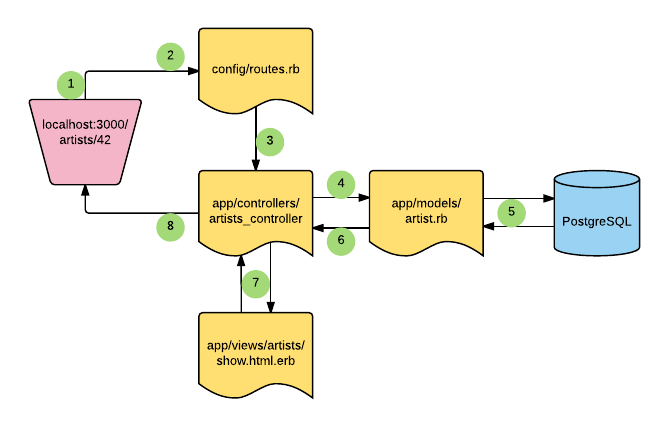
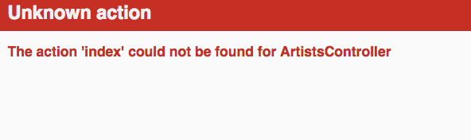
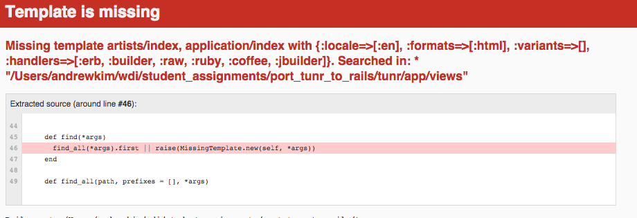
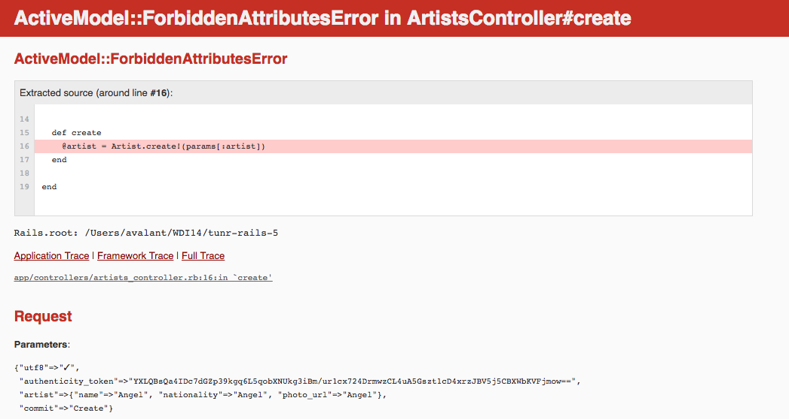

# Rails Views and Controllers

## Learning Objectives
- Describe the role of controllers in a Rails application
- Describe the role of views in a Rails application
- Explain how the router directs requests to a specific controller and action
- Explain how controller actions map to specific views
- Describe the role of instance variables in sharing information between an action and its view

## Framing
(5 min)

In our Introduction to Rails, we got an overview of how Rails' MVC architecture works, utilizing HTTP and REST to properly handle requests and send responses to drive application behavior. Then, in our Models and Migrations lesson, we dove deep in to how to manage data inside of a Rails application - using migrations to control the structure of our database and models to interact with our data.

Today, we're going to dive deeper into the remaining two components of the rMVC architecture:

- **Controllers** to handle business logic, preparing data to hand off to a view.
- **Views** to manage how data is presented to the user.

### rMVC: Revisited
(5 min)

The design pattern that rails is built around is rMVC - Router, Model, View and Controller. Lets walk through each component together:



## Controllers
(10 min)

A request coming in to our Rails application first hits our Router. The Router then determines which Controller to pass the request off to. Our Controller receives the request and is then responsible for handling that request by finding or saving data to our model, rendering a view and sending it back to the client.

In Rails, our controllers will be defined as Ruby classes that inherit from the `ApplicationController` class. Like any Ruby class, we'll then fill it with methods. When a request comes in to our application, our Router will create a new instance of this Controller class and run the appropriate method.

```ruby
# routes.rb
`Rails.application.routes.draw do
  get    '/'                => 'books#index'
  get    '/books'           => 'books#index'
  get    '/books/:id'       => 'books#show', as: "book"
  get    '/books/new'       => 'books#new', as: "new_book"
  post   '/books'           => 'books#create'
  get    '/books/:id/edit'  => 'books#edit', as: "edit_book"
  put    '/books/:id'       => 'books#update'
  delete '/books/:id'       => 'books#destroy'
end
```

```ruby
# books_controller.rb
class BooksController < ApplicationController
  def index
  end
end
```

When a user navigates to `/books`, our Router will create a new instance of our `BooksController` and call the `index` method on it.

## Rails Views
(10 min)

By default, our application would render the view at `views/books/index.html.erb` in the above `BooksController`, because that is the convention and we're not telling it to do otherwise.

If a user navigates to `/books/1`, we would have to define a show method:

```ruby
class BooksController < ApplicationController
  def index
  end

  def show
    @book = Books.find(params[:id])
    render :show
  end
end
```

In our `show` method, we're creating an instance variable for a book that will be available in our `show.html.erb` template. We're also explicitly asking rails to render our `show.html.erb` template.

Let's dive into an example, and see MVC in action by writing some Rails code.

## Set Up
(5 min)

The starter code for this lesson is where we left off after the Models and Migrations class for our Tunr application. We should all start fresh from a working solution. To begin, clone down the below repo and run the necessary setup.

**Note**: If you have trouble setting up, please slack the supporting instructor.

```bash
git clone git@git.generalassemb.ly:ga-wdi-exercises/tunr-rails-5.git
cd tunr-rails-5
git checkout models-migrations-solution
```

After you start working on a new branch, from the terminal run...

```bash
 $ bundle install && bundle update
 $ rails db:drop db:create db:migrate db:seed
```

> Make sure Postgres is running. (Do you see the elephant?)

Here, we are just installing our app's dependencies, and running the set up for our app's database locally.

To test that it works, try starting the server...

```bash
 $ rails s
```

Then in your browser, navigate to the `http://localhost:3000` to visit your app in its default development environment. You should be greeted by Ruby on Rails welcome page!

## Route-Controller-Action Relationship
(10 min)

A good place to begin reviewing our code base is our application's routes. Make sure you are in the applications directory and in your terminal run...

```bash
$ rails routes
```

You should should see some output like this...

```
Prefix      Verb   URI Pattern                 Controller#Action
    artists GET    /artists(.:format)          artists#index
artists_new GET    /artists/new(.:format)      artists#new
            POST   /artists(.:format)          artists#create
            GET    /artists/:id(.:format)      artists#show
            GET    /artists/:id/edit(.:format) artists#edit
            PUT    /artists/:id(.:format)      artists#update
            DELETE /artists/:id(.:format)      artists#destroy
```

The command `rails routes` will list all of the routes of our application and the controller action they are mapped to.

Lets walk through the life-cycle of our index route.

<details>
  <summary>What happens when a user navigates to `http://localhost:3000/artists`?</summary>

  1. The request first goes to the router, which will map the request type (`GET`) and URI pattern to a controller and controller action, in this case `artists#index` (where `artists` is the controller and `#index` is the action).

  2. The router then creates an instance of our `ArtistsController` and called the `index` method (i.e. `ArtistsController.new.index`)

  3. Inside our `index` method, we'll define an instance variable `@artists` and use Active Record to retrieve all our artists: `@artists = Artist.all`

  4. We can then define a view that we want to render or rely on Rails' default, which would be `views/artists/index.html.erb`

  5. Our view is rendered by our controller in to HTML that our users' browser can render. The controller sends this HTML as a response.
</details>

## We Do: Define an Index Action and View
(15 min)

We need to first create a controller for our artists. In your terminal...

```bash
 $ touch app/controllers/artists_controller.rb
```

> **Note**: The convention for controller filenames: pluralized resource name, snake_case.

In that file, let's define our controller...

```ruby
# in app/controllers/artists_controller.rb
class ArtistsController < ApplicationController
  # actions will go here
end
```

> **Note**: The convention for controller class names: pluralized resource name, CamelCase.

Great, now that we have a new controller for artists, let's go over what we want to include in our controller.

Recalling from our routes, there are 7 RESTful calls that the router has mapped to our `ArtistsController` actions.

Right now we know our controller is blank, but let's fire up our server...

```bash
$ rails s # short for rails server
```

Then visit `http://localhost:3000/artists` in your browser.

What do we see?



When we go to `http://localhost:3000/artists` our router says it knows where to send it. It's sending it to the artists controller and expects it to do the index action. Unfortunately, we haven't defined it yet, so it's unknown. Let's go ahead and define that action now.

In `app/controllers/artists_controller.rb`...

```ruby
class ArtistsController < ApplicationController
  def index

  end
end
```

> Rails methods defined in our controllers are known as `actions`

Next, let's reload...



Another error! We'll get more into this later. But, this error is telling us we do not have a view (template) yet. Specifically, the `index` view is missing. So let's create that view. Let's first make a directory and file in the terminal...

```bash
$ mkdir app/views/artists
$ touch app/views/artists/index.html.erb
```

> Note the conventions here. We needed to make an `artists` folder to put the `index.html.erb` in it. This is important because when we define an `action` in our controller, rails knows to render the view corresponding to the controller and action. In this example, because were calling the `index` action in the `ArtistsController`, it'll look for the `index` view in the `artists` folder.

Inside `app/views/artist/index.html.erb`...

```html+erb
<h1>All Artists</h1>
```

Now let's refresh the page. There shouldn't be any more errors so we know everything has been wired up correctly!

## Controllers
(10 min)

Lets finish defining controller actions. We've defined our `index` action, that means we have these remaining actions to define:

* `show`
* `new`
* `create`
* `edit`
* `update`
* `destroy`

Where do we define these actions? Will they all render a view?

> The following are meant as a guide. We will be working through these together:

<details>
  <summary>How do we define a `show` action?</summary>

```ruby
def show
  @artist = Artist.find(params[:id])
end
```

</details>

<details>
  <summary>How do we define a `new` action?</summary>

```ruby
def new
  @artist = Artist.new
end
```

</details>

<details>
  <summary>How do we define a `create` action?</summary>

```ruby
def create
  @artist = Artist.create!(name: params[:artist][:name], nationality: params[:artist][:nationality], photo_url: params[:artist][:photo_url])
  redirect_to "/artists"
end
```
> Note: Having a bang means it will raise an exception if the record is invalid. The non-bang versions don't; create just returns the object regardless. ([more info](http://edgeguides.rubyonrails.org/active_record_validations.html#when-does-validation-happen-questionmark))

</details>

<details>
  <summary>How do we define a `edit` action?</summary>

```ruby
def edit
  @artist = Artist.find(params[:id])
end
```

</details>

<details>
  <summary>How do we define a `update` action?</summary>

```ruby
def update
  @artist = Artist.find(params[:id])
  @artist[:nationality] = params[:artist][:nationality]
  @artist[:name] = params[:artist][:name]
  @artist[:photo_url] = params[:artist][:photo_url]
  @artist.save
  redirect_to "/artists/#{@artist.id}"
end
```

</details>

<details>
  <summary>How do we define a `destroy` action?</summary>

```ruby
def destroy
  @artist = Artist.find(params[:id])
  @artist.destroy
  redirect_to "/artists"
end
```

</details>

## Break
(10 min)

## Views
(10 min)

Which controller methods from the list above need views? If you run `rails routes`, you'll notice it shows the HTTP verb with the path/url and controller and action. We need to render a view for every route that responds to a `GET` request. That means these three (in addition to `index` already made):

* `show`
* `new`
* `edit`

Rails makes a lot of assumptions about how your views are structured, assumptions that are closely tied to how it expects your controller will work. By default, Rails is expecting a `views/<resource>/index.html.erb` template for the `index` action of any controller (as we discussed above). Similarly, Rails is expecting a `show.html.erb`, `new.html.erb`, and `edit.html.erb` in that same directory. If we follow this convention, we don't need to explicitly tell Rails where our views are.

> The following are meant as a guide, we will be working through these together in the next section:

<details>
  <summary>What will the `show.html.erb` view look like?</summary>

```html+erb
<h2><%= @artist.name %> <a href="/artists/<%= @artist.id %>/edit">(edit)</a></h2>
<h4><%= @artist.nationality %></h4>

">

<h3>Songs</h3>
<ul>
  <% @artist.songs.each do |song| %>
    <li>
      <a href="/songs/<%= song.id %>">
        <%= song.title %> (<%= song.album %>)
      </a>
    </li>
  <% end %>
</ul>
```

</details>

<details>
  <summary>What will the `new.html.erb` view look like?</summary>

```html+erb
<h2>New Artist</h2>

<%= form_for @artist do |f| %>
  <%= f.label :name %>
  <%= f.text_field :name %>

  <%= f.label :nationality %>
  <%= f.text_field :nationality %>

  <%= f.label :photo_url %>
  <%= f.text_field :photo_url %>

  <%= f.submit "Create" %>
<% end %>
```

</details>

<details>
  <summary>What will the `edit.html.erb` view look like?</summary>

```html+erb
<h2>Edit <%= @artist.name %></h2>

<%= form_for @artist, url: "/artists/#{@artist.id}", method: :put do |f| %>
  <%= f.label :name %>
  <%= f.text_field :name %>

  <%= f.label :nationality %>
  <%= f.text_field :nationality %>

  <%= f.label :photo_url %>
  <%= f.text_field :photo_url %>

  <%= f.submit "Edit" %>
<% end %>

<%= form_for @artist, url: "/artists/#{@artist.id}", method: :delete do |f| %>
  <% f.submit "Delete", class: "btn-delete" %>
<% end %>
```

</details>

## Finishing Up our Index action

We left off with our index method defined and simply rendering an erb template with a single `<h1>`. It's very rare that we'll use our controller to just render some erb into html; more likely, we want to compose some data with our views. We do that with Instance Variables.

### Instance Variables
(10 min)

Reviewing what we learned in our Intro to Rails class, controllers are responsible for fetching the correct data from our models. But, now we need a way to pass this data to be displayed in our views.

The way Rails solves this problem is by extending the functionality of Ruby's **instance variables**. The **controller** makes some data available to the **view** as an **instance variable**. Our controller code will deal with storing relevant data in instance variables...

```ruby
def index
  @artists = Artist.all
end
```

**Question:** Quick review, what was special about instance variables in the context of Ruby classes?

> A:  Every instance of a class has a different set of instance variables which are accessible throughout a class definition.

In Rails, we use instance variables in our **controller actions**, so we can have **programmatic access to these variables inside of our views**.

Let's use Active Record to query (with class method `.all`) our database for all artists and save that to an instance variable.

In the index action...
```ruby
def index
  @artists = Artist.all
end
```

Now, in our index view, we have programmatic access to the variable `@artists`!

> You should note that we are not limited to querying for only artists in the artists controller. Additionally, we can write any valid ruby we want inside our controller methods.

Let's write some code in our view to display our Artists data:

In `app/views/artists/index.html.erb`...

```html+erb
<h1>Artists <a href="/artists/new">(+)</a></h1>

<ul>
  <% @artists.each do |artist| %>
    <li>
      <a href="/artists/<%= artist.id %>">
        <%= artist.name %>
      </a>
    </li>
  <% end %>
</ul>
```

Now when we visit `/artists` in the browser, we see a list (index) of all artists. We have included links to the new page, and for the show page, but we haven't created those yet so..

#### Params

There are three places we can get `params` values:
1. The query string of a `GET` request,
2. Form data in a `POST` request, and
3. The path of a URL

In order to access those values from Rails `params`, we just have to treat it like any other hash we want data from.

> [More about Rails' Params](http://stackoverflow.com/questions/6885990/rails-params-explained)

We'll talk more about params when we get to forms, and adding a new artist. For now, its important to see the connection between what values the user dynamically enters, and how we can have programmatic access to those values.

### We Do: Show Actions
(10 min)

- Lets define a `show` controller action for `artists`

```ruby
  def show
    @artist = Artist.find(params[:id])
  end
```
- Create a `show` view for `artists`
- When you visit the `show` page, they should see all the relevant information about the artist.

```html+erb
<h2><%= @artist.name %> <a href="/artists/<%= @artist.id %>/edit">(edit)</a></h2>
<h4><%= @artist.nationality %></h4>

" alt='artist photo'>

<h3>Songs</h3>
<ul>
  <% @artist.songs.each do |song| %>
    <li>
      <a href="/songs/<%= song.id %>">
        <%= song.title %> (<%= song.album %>)
      </a>
    </li>
  <% end %>
</ul>
```

### You Do: New Actions
(15 min)

- Define a `new` controller action for `artists`
- Create a `new` view for `artists`
- When you visit the `new` page, you should see a header with `New Artist` as text for your html

If you finish early...
  - Research the Rails `form_for` [helper methods](http://guides.rubyonrails.org/form_helpers.html#dealing-with-model-objects).
  - Consider how you would utilize a form to get the necessary user input to create a new artist instance and have it persist.
    - What happens within Rails when we hit submit on the form?
    - What routes does the request-response cycle take?

## We Do: Artists Create Action
(20 min)

So at this point we have a way to see all artists and view information about a specific artist. Let's continue on by adding a form for the user to add their own artists to our application.

In Rails, we have access to a variety of helper methods to erase the pain of having to writing repetitive boilerplate HTML code.

This seems like a great time to utilize Rails' `form_for` [helper method](http://guides.rubyonrails.org/form_helpers.html#dealing-with-model-objects)...

```html+erb
<%= form_for @artist do |f| %>
  <%= f.label :name %>
  <%= f.text_field :name %>

  <%= f.label :nationality %>
  <%= f.text_field :nationality %>

  <%= f.label :photo_url %>
  <%= f.text_field :photo_url %>

  <%= f.submit "Create" %>
<% end %>
```

Here, we are saying we want a form that will result in the creation of a new instance, in this case `@artist`. In the form body, we have to make sure that our fields match the attributes of the model and we should be good to go.

This helper with compile down to html, and Rails will fill in the appropriate information particular to our app.

Great, but what happens when we try to submit this form?

If we were looking in our browser, we would get our old friend `unknown action` error saying, `The action 'create' could not be found for ArtistsController`

Let's write the create action for our controller and try to get this form to work.

In `app/controllers/artists_controller.rb`...

```ruby
# Artists#Create
def create
  @artist = Artist.create!(name: params[:artist][:name], nationality: params[:artist][:nationality], photo_url: params[:artist][:photo_url])
  redirect_to "/artists/#{@artist.id}"
end
```

With this action, we want to create an instance using the params the user entered into the form.

**Note:** When the request completes, we now need to worry about where to direct the user after adding a new artist.

### Render vs Redirect
(5 min)

Rails has a variety of ways to map our application's logic navigating a user's request to a response they care about.

The one way you will use the most often is a `redirect`. Using Rails `redirect_to` helper method, we can take a request from a client, and then without sending a response back right away, we can make a new request back to the browser, which will trigger the response we want.

In the example of our `create` action, we are mapping a `POST` request to this action, so all we should do is care about how to process the accompanying data, but we then need to hand off to another action to decide which response to send.

Another way to control what the response will be for a particular request is to utilize Rails `render` helper method.

The `render` is responsible for deciding the format of the view, and which template to serve the browser.

For an example, let's take a closer look at the `index` action of our Artists Controller...

```ruby
def index
  @artists = Artist.all
end
```

<details>
  <summary>
      <strong>How are we able to see the artists `index` view page, when we went to our index route?</strong>
  </summary>
  <p>
    You'll notice that we're not explicitly telling the controller which view file to render. Rails is configured to 'know' if the `artists` controller action is called `index`, then it will look for the `index` view in `views/artists`.
  </p>
</details>

If you didn't want the controller method implicit rendering a view that matches its name, you can explicitly render...

```ruby
def index
  @artists = Artist.all
  render :some_other_view
end
```

<details>
  <summary>
    <strong> What is the main difference between redirecting and rendering? </strong>
  </summary>
  <p>
    A redirect will trigger a new request-response cycle.
  </p>
</details>

## Break
(10 min)

## (I Do) Sanitization/Strong Params
(10 min)

Looking at the code for the `artists#create` method, we find this line...

```ruby
  @artist = Artist.create!(name: params[:artist][:name], nationality: params[:artist][:nationality], photo_url: params[:artist][:photo_url])
```

We're only submitting 3 fields so that's not so bad, but if we were submitting 50 fields that would mean we have to write a long line.

If only there was some way to not have to do that!

Instead of one argument for each field in a record, `.create` can actually take one argument in total that is a hash of all the fields that should be updated. For instance...

```ruby
@artist = Artist.create!({
  name: "John",
  nationality: "German",
  photo_url: "http://image.com/john.jpg"
})
```

But instead of hard-coding these values, we need to get them from the `post` request triggered by the form submission.

Where might we get an object of our properties for our new Artist? Is there one we can reuse?

Lets take a closer look at `params` in our terminal. In your `.create` method, add `puts params`.

If you submit the form now, and check your terminal for the value of `params`, you should see a hash that looks something like...

```
{
    "authenticity_token"=>"I04y1td+X5CIiVdZ50ABEGAy6f0LCJReSDa5eq5/GvXICDkUpeu2peCt/BlPHmU1VSadWvzXUy/9uyNixjrP+A==",
    "artist"=>{
        "name"=>"John",
        "photo_url"=>"http://images.google.com/john.jpg",
        "nationality"=>"German"
    }
}
```

That's all the data that was submitted with the form. Notice all of the artist's data is now inside its own hash **inside** the params hash.

Update the controller to receive that param...

```ruby
def create
  @artist = Artist.create!(params[:artist])
end
```

However, in the browser, you get...



What?! Why can't we create an `artist` using the hash available in params? This is a security feature of Rails: `params` could include extra fields that have been maliciously added to the form. This extra data could be harmful, therefore Rails requires us to whitelist fields that are allowed through form submissions.

### Strong Params

Whitelisting is done using **strong parameters** configuration!

This is a security feature of Rails: params could include extra fields that have been maliciously added to the form. This extra data could be harmful, therefore Rails requires us to whitelist fields that are allowed through form submissions.

Now we should update our Artists controller a bit.

First let's create a private method that will allow us to pull information from the form.

in `app/controllers/artists_controller.rb`...
```ruby
private
def artist_params
  params.require(:artist).permit(:name, :photo_url, :nationality)
end
```

> The `require` method ensures that a specific parameter is present. It will throw an error if the `require`d parameter is missing. The `permit` method returns a copy of the parameters object, returning only the permitted keys and values.

> **Note** that we encapsulate the `artist_params` in a private method because we only want this available to this particular class and it shouldn't work outside the scope of the controller

The only thing we have left to do is update our controller actions that use params to create or update an artist.

in `app/controllers/artists_controller.rb`...

```ruby
#### before
def create
  @artist = Artist.create!(params[:artist]) # this line will change
  redirect_to "/artists/#{@artist.id}"
end

#### after
def create
  @artist = Artist.create!(artist_params) # strong params!
  redirect_to "/artists/#{@artist.id}"
end
```

Great, now we're protected against CSRF attacks!

## You Do:
(15 min)

- Define `edit`, `update` and `destroy` controller actions.
- Create an `edit` view file.
- When you visit the `edit` page, the relevant form should be displayed
- Upon submitting the form, artist info updates accordingly.
- Create a way to destroy an artist

## Bonus: Songs

- Define 7 RESTful routes and map to appropriate songs controller actions
- Create a songs controller
- Create appropriate view files

## Closing
(5 min)

- What is the role of the controller?
- How do strong params protect us from malicious input?
- What is the difference between render and redirect?
- How is a view able to access data?

## Homework: [Scribble](http://git.generalassemb.ly/ga-wdi-exercises/scribble) 
In this assignment, you're going to get a lot of practice with Rails by building a full CRUD app - your own blog!

## Resources
- [Rails Guides: Controllers](http://guides.rubyonrails.org/action_controller_overview.html)
- [Rails Guides: Views and Templates](http://guides.rubyonrails.org/layouts_and_rendering.html)
- [Michael Hartl's Rails Tutorial](https://www.railstutorial.org/book)
