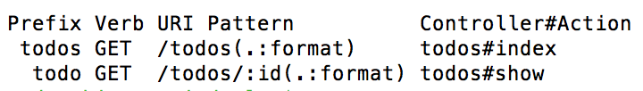

# Rails Index/Show Features

## The Index Feature: I do - Reminder.ly

`"Hello World"` is nice, but really we want to see all of our `todos`. The first thing we need to do is query for `todos` in our controller. In `app/controllers/todos_controller.rb`:

```ruby
class TodosController < ApplicationController
  def index
    @todos = Todo.all
  end
end
```

When our router(`config/routes.rb`) is configured this way:

```ruby
get 'todos' => 'todos#index'
```

It recognizes requests at `todos` and points those requests to execute the index method(action) in the `TodosController`. Once there, it will query for all the `todo`'s in our database. If nothing is explicitly rendered, it will **implicitly render** a corresponding `index` view. That view will be located in a folder with the **same name** as the controller.

Now all that's left is to update the view. In `app/views/todos/index.html.erb`:

```html
<ul>
  <% @todos.each do |todo| %>
    <li>
      <p><%= todo.body %></p>
    </li>
  <% end %>
</ul>
```

## The Index Feature: You do - Tunr

Create the index route for artists.

## The Show Feature: I do - Reminder.ly

Similarly to the `index` feature, we need to set up our routes so that the app can listen for the `show` feature. In `config/routes.rb`:

```ruby
get 'todos' => 'todos#index'
get 'todos/:id' => 'todos#show'
```

We're going to have to write this at least 5 more times for this model looks like. That seems not dry. Turns out, Rails has a short hand way of writing this:

```ruby
resources :todos, only: [:index, :show]
```

Because Rails developers were consistently writing out routes for the 7 RESTful routes, they decided to make a short cut for it, `resources`. The argument for `resources` should always be snake case and plural.

We can inspect all of the routes in the terminal by running the command `$ rake routes`



Take note of the prefix column. We're going to leverage the prefix to create paths that we can link to using the ...

### `link_to` method

There's a great helper method Rails gives us, to link to things in our Rails views, `link_to`. The `link_to` method takes two or more arguments. The first argument is what text you want the link to show up as. The second argument is where it will go. You can also checkout other options you can pass in [here](http://api.rubyonrails.org/classes/ActionView/Helpers/UrlHelper.html#method-i-link_to). Check out the way we wrote this in Sinatra:

```html
<ul>
  <% @todos.each do |todo| %>
    <li>
      <p><a href="todos/<%= todo.id %>"><%= todo.body %></a></p>
    </li>
  <% end %>
</ul>
```

We can write this in Rails like this:

```html
<ul>
  <% @todos.each do |todo| %>
    <li>
      <p><%= link_to todo.body, todo_path(todo) %></p>
    </li>
  <% end %>
</ul>
```

In the latter snippet we're using the `todo` prefix with `_path` to link to the show route.

These two snippets are functionally equivalent. The latter is the Rails way. In fact, Rails is so smart that if we pass in the model itself to `link_to`, it'll work as well:

```html
<%= link_to todo.body, todo %>
```

If we actually click one of these links, we'll see a familiar error, `unknown action`. Let's add the action now, along with the query to the database that we'll need. In `app/controllers/todos_controller.rb`:

```ruby
def show
  @todo = Todo.find(params[:id])
end
```

Just like in Sinatra, Rails passes data from requests through `params`.

Refresh and ... the same template error! Let fix that by creating the view for this action.

```bash
$ touch app/views/todos/show.html.erb
```

Let's update the show view to link back to the index and show both the body and author of the `todo`. In `app/views/todos/show.html.erb`:

```html
<h2><%= link_to "Todos", todos_path %></h2>
<p><%= @todo.body %></p>
<p><%= @todo.author %></p>
```

You'll notice here, we're using the `todos` prefix for the index route in the `link_to`. It's very important we're very exact when we write the path in a `link_to` helper. One 's' can change the route completely.

Awesome! We now have a fully fledged index and show feature for our application.

## The Show Feature: You do - Tunr

- Create a show feature for each artist.
- Make sure the show feature links to the index of artists.
- Change existing routes to leverage `resources`.

[Solution Here](https://github.com/andrewsunglaekim/tunr_features/tree/index-show-solution)

On to [New Create and Destroy](new_create_destroy.md)
