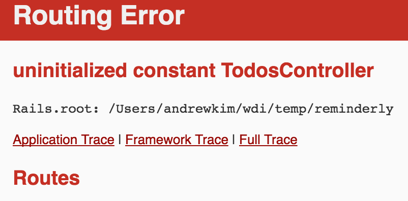
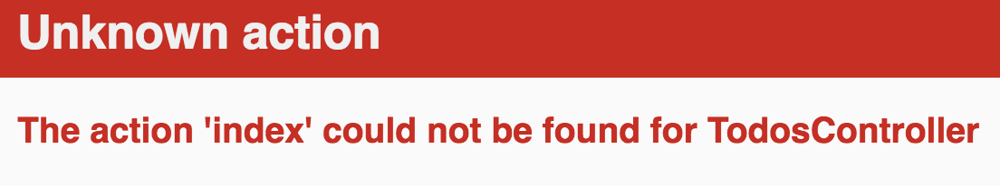
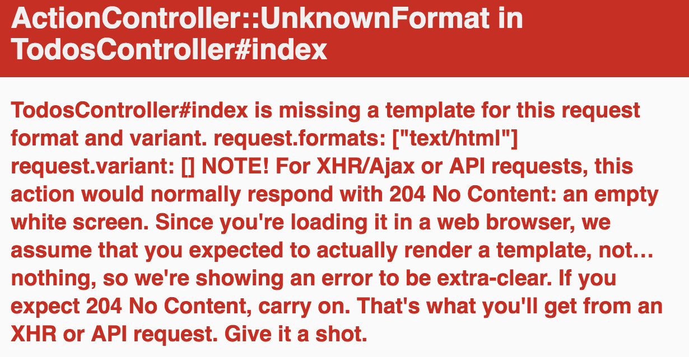

# Rails Features

## Learning Objectives (2:30 - 2:35, 5 min)
- Create a new Rails application with postgres as the default.
- Use rake to create, edit, and update, and seed the db.
- Use Rails generators to create and add attributes to models.
- Use Rails console to inspect and manipulate models.
- Describe the full life cycle of a request/response in Rails
- Implement the index feature for a model in Rails
- Implement the show feature for a model in Rails
- Implement the create feature for a model in Rails
- Implement the delete feature for a model in Rails

## Framing && Revisit MVC pattern (2:35 - 2:45, 10 min)


Over the next few lessons we'll be learning about the "Rails way" to do things. We'll be going through a significant amount of conventions throughout the lesson and they're all really important! There's also an [appendix](conventions.md) for this in the repo.

The general format for today will be a code mirror code along, where the instructor (**I-DO**) will build an app called `Reminder.ly`, while the students(**You-Do**) will build `Tunr`.  Why `Tunr`? Because...

- You are already familiar with this domain model
- Many web apps or features of web apps are based around this simple domain model.

> this will be the first todo app we'll be seeing, but it's the quintessential app for learning a new framework because its the perfect contrived example of a **single model CRUD application**.


**Note**: If at any point in your code, you have the words `todos` or `reminderly` in your application, you're probably doing something incorrectly.

## SETUP: I do - Reminder.ly (2:45 - 2:50 min, 5 min)

The first thing that we should do is determine our domain model -- items on a to-do list.

### ERD

```
|   TODOS   |
|------|----|
| body |text|
|author|text|
```

Starting a new Rails app:

```bash
$ rails new reminderly -d postgresql
$ cd reminderly
$ rails server
```

> This command will create a new Rails app. The `-d postgresql` tells Rails to create a new app using postgresql instead of sqlite3 by default.

In order to talk about `todos`, we need to define them in the context of our Rails app. We do this like we did with Active Record, by creating **model** files. We can create these files using generators.

### Generators: Models & Migrations (2:50 - 3:10, 20 min)

In Rails, there are terminal commands (rails generators) that generate massive amounts of code for you. If you find yourself using these commands, you should know what each file being created does, then use them at your discretion. That said, we're going to learn some basic ones today.

### Models

Run this terminal command in your Rails directory to create models:

`$ rails generate model todo`

> We're telling the terminal to run a Rails command that generates a model called todo. Notice the convention for model name being singular and snake case.

> If this command 'hangs' and your terminal is unresponsive, open a new tab and type `spring stop` and retry the above command

You can see that it created some files. Don't worry about those testing files for now, they won't influence our app today. The two files that are important:

1) a model located here: `app/models/todo.rb`:

```ruby
class Todo < ApplicationRecord
end
```

> Note: ApplicationRecord inherits from ActiveRecord::Base, and is a a place where we can write helper methods for ActiveRecord. It is new in Rails 5.

2) a migration located here: `db/migrate/<sometimestamp>_create_todos.rb`:

```ruby
class CreateTodos < ActiveRecord::Migration
  def change
    create_table :todos do |t|

      t.timestamps null: false
    end
  end
end
```

### Migrations

Migrations are a convenient way to alter your database schema over time in a consistent and easy way. They use a Ruby DSL so that you don't have to write SQL by hand, allowing your schema and changes to be database independent.

You can think of each migration as being a new 'version' of the database. A schema starts off with nothing in it, and each migration modifies it to add or remove tables, columns, or entries. Active Record knows how to update your schema along this timeline, bringing it from whatever point it is in the history to the latest version. Active Record will also update your `db/schema.rb` file to match the up-to-date structure of your database.

> ### No more writing `schema.sql` files! or running `psql` commands to load databases!

### Update Migration
We need to update the migration to reflect our domain model. In `db/migrate/<timestamp>_create_todos.rb`:

```ruby
class CreateTodos < ActiveRecord::Migration
  def change
    create_table :todos do |t|
      t.string :body
      t.string :author
      t.timestamps null: false
    end
  end
end

```

In order to actually run the migrations you'll need to first create the database then run the migrations. In the terminal:

```bash
$ rake db:create
$ rake db:migrate
```

### Adding columns/properties with migrations

After the initial migration, sometimes we want to make changes to our models. We can create additional migrations using `rails generate migration`. If we don't pass any other arguments to this set of commands, we get some output explaining the use of the command.

Let's say that with this next migration, we want to add a column to our Todos table (*add a property to our Todo model*) that reflects whether or the Todo (task) has been completed. To accomplish this, let's run the following in the command line:

```bash
rails generate migration add_completed_to_todos completed:boolean
rake db:migrate
```

### Seeding Todos

After creating the database and running the initial migration to generate the schema, we can then seed our database. First, I'll add the following code to `db/seeds.rb`:

```rb
Todo.destroy_all
Todo.create([
  {body: "finish WDI", author: "author1", completed: false},
  {body: "Get a job", author: "author2", completed: false},
  {body: "learn rails", author: "author3", completed: true},
  {body: "learn jQuery", author: "author4", completed: true}
])
```

### Rails Console (3:10 - 3:15, 5 min)
If you ever need a sand box in your web app's development environment:

```bash
Rails c
```

This will allow you to enter a REPL with all your model definitions and connections to the database. Very powerful tool for testing out different things you're curious about for your application.

## SETUP: You do - Tunr - Model & Migration (3:15 - 3:30, 15 min)

- Create models and migrations for `Tunr`. (Don't forget [your associations in your model definitions](https://github.com/ga-wdi-exercises/tunr_rails/blob/solution/db/migrate/20150724165157_create_songs.rb)! Hint: follow this link and take a look at line 7)

**Note**: You did this correctly if you can create an `artist` and a `song` in the Rails console.

## Break (3:30-3:40, 10 min)

## SETUP: You do - Tunr - Seed (3:40 - 3:45, 5 min)

Visit [tunr_repo](https://github.com/ga-wdi-exercises/tunr_rails/tree/solution/db)

At this site you'll see 3 files: `artist_data.rb`, `song_data.rb` and `seeds.rb`. Make sure you have the same 3 files in your `db` directory. Then run the following command in the terminal:

```bash
$ rake db:seed
```

> **Note**: You know you this did this right if you run the Rails console and enter `Artist.all.length` and get back `5`

## Error Driven Development (EDD) revisted: I do - Reminder.ly (3:45 - 3:55, 10 min)

The index feature is generally one that wants to display a collection of items. Before we define the feature, we need to first code a path to listen for. In `config/routes.rb`:

```ruby
Rails.application.routes.draw do
  get 'todos' => 'todos#index'
end
```

If we start our server and go to the path `http://localhost:3000/todos`, we'll immediately see an error.  



Let's fix that error:

```bash
$ touch app/controllers/todos_controller.rb
```

In `app/controllers/todos_controller.rb`:

```ruby
class TodosController < ApplicationController
end
```

A new error?!



Let's fix that by creating the action it could not find. In `app/controllers/todos_controller.rb`:

```ruby
class TodosController < ApplicationController
  def index
  end
end
```

Yet another error ...



Lets dissect this error message. Here's the relevant part:

> `TodosController#index is missing a template for this request format and variant request.formats: ["text/html"] request.variant: []`

We have no view corresponding to an index for Todos. Within `app/views`, we need to create a folder called `todos`, and a file called `index.html.erb` in that folder.

 Let's do that now:

```bash
$ mkdir app/views/todos
$ touch app/views/todos/index.html.erb
```

In `app/views/todos/index.html.erb` we'll simply put the word `hello world`. Finally we can see our page rendered.

## EDD re-revisited: You do - Tunr (3:55 - 4:05, 10 min)

- Get "Hello World" to show up in the `index` view for the `Tunr` application.

On to [Index and Show](index_show.md)
