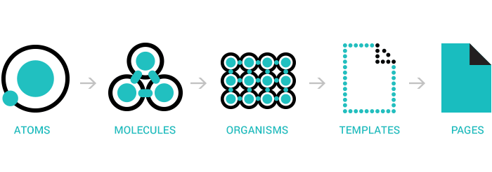
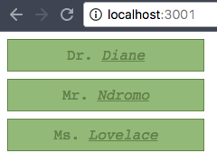

# Advanced Component Design in React: Reusability

## Learning Objectives (James)

  - Emphasize the distinction between HTML primitives and React components
  - Customize the appearance and functionality of "vanilla" HTML elements (HTML primitives) by wrapping them in components
  - Create reusable component building-blocks for React applications
  - Use `PropTypes` for type-checking in `React`
  - Create Granular interactive UI
  - Understand the thinking and design behind component libraries through the philosophy of reusable component design
  - Encapsulate styles with React inline styles
  - Build a form with reusable components

## Why Reusable? (James)

Today, we'll build on our budding familiarity with React to deepen our understanding of component design. To that end, we're going to explore the philosophy of building **reusable** components.

The philosophy or thinking behind building reusable components will feel familiar since it follows the FIRST principles (focused, independent, reusable, small, testable).

Reusable components are good at:

1. Enforcing an aesthetic or design philosophy by encapsulated styles
2. Extending the functionality of basic html elements by wrapping them in React components with custom functionality
3. Creating sturdy building blocks to build stable, more complex components
4. Allowing an application to scale well with reliable reusable components (Facebook has 40,000!)
5. Saving time developing medium to large-scale applications, or recurring smaller projects
6. Stable overall performance, especially through type management (`PropTypes` for instance) and testing (though we won't cover test coverage today)

## Philosophy (Ali)

Learning to build reusable components is learning how to build your own building blocks.

Reusability really follows from the other principles of FIRST. *Focused*, *Independent*, *Small*, and *Testable* components are well suited to creating larger complex components and are **Reusable**.

We break parts of a user interface down into the smallest possible units, creating building-block components that we can use to build robust and complex components. Often, we're building lots of lower level components that get reused over and over again, more frequently than more complex components.

## Systems of Components (Ali)

When we are building components in React or any other component-based framework, we are essentially building user interfaces out of systems of components.

When we break down components to a very small, atomic level, it can easily feel excessive in a small application. We can make decisions as front-end developers to decide how small we want our components to be.

We might not have a true need for wrapping an 'HTML primitive element' like `<label></label>` tag in a `Label` component in a small application, and instead we might opt to bundle a `<label></label>` with an `<input type="text">` in a `TextInput` component.  We can apply styles selectively to components built in this way to have potentially ***more predictable CSS***, namely by *writing it in JavaScript*.

There are however advantages to breaking down an application into very, very small components. It can bring stability to large scale applications, which in turn allows it to scale with far fewer problems.

Reusable components in React also are significant for React Native development as well, ensuring consistent cross-platform operation. Reusability is at the heart of the idea of React Native (or Hybrid) as well.

## React Materialize Scavenger Hunt (Ali)

Let's head over to the [GitHub repo for Materialize](https://github.com/react-materialize/react-materialize/tree/master/src). Spend 5 minutes looking through the source directory. Pay special attention to components that build off of and incorporate other components.


## Atoms, Molecules & Organisms (James)



[Brad Frost's notion of atomic design](http://bradfrost.com/blog/post/atomic-web-design/) is the essentially idea that a user interface can be broken down into building blocks of **atoms**, which get grouped together and go on to form **molecules**. Collections of **molecules** then become **organisms**.

An example of an **organism** could be something like a header that includes a form, a company logo, a series of social media links. The form would be considered a **molecule** that is made up of **atoms** such as text inputs, labels, and a submission button.

An **organism** might contain a mixture of **molecules** and **atoms**. The logo for example, would be considered an **atom**.

### Atoms

Atoms are the smallest building blocks of an application. Atoms can be things like text inputs, labels (for inputs), buttons, progress indicators, links, and so on.

Atoms can be as small as a single **HTML primitive** wrapped in a React component, but could be slightly more complex. Wrapping every single HTML primitive might be overkill, but it allows us to take full advantage of the powerful encapsulation paradigm of components. We can bundle behavior or styles with these small, atomic components.

When writing components, we often want to take a a basic HTML element and add some functionality to it, such as making a label for a text input (such as for an email address) turn red if that text input is left blank.  

An example of an atomic component could be something like this...

```js
const NamePlate = ({ title, name }) => {
  const nameStyle = {
    textDecoration: 'underline',
    fontStyle: 'italic'
  }
  const paraStyle = {
    fontFamily: 'courier',
    textAlign: 'center',
    padding: '.5em',
    margin: '.5em',
    background: 'rgb(157, 193, 131)',
    color: 'rgb(107, 143, 81)',
    width: '200px',
    border: '1px solid rgb(107, 143, 81)'
  }
  return (
    <p style={paraStyle}>
      {title}. <span style={nameStyle}> {name} </span>
    </p>
  )
}

class WaitingRoomWall extends Component {
  render() {
    return (
      <div>
        <NamePlate title={"Dr"} name={"Diane"} />
        <NamePlate title={"Mr"} name={"Ndromo"} />
        <NamePlate title={"Ms"} name={"Lovelace"} />
      </div>
    )
  }
}
```



We'll build a couple of atomic components for our form, a `<Label />` and `<ProgressBar />`.

### Molecules

We can create our own versions of HTML elements suited to our individual needs with added functionality and styling. With atomic components, we can combine these customized atoms into molecules and layer functionality on top.

We'll use a `<Label />` component to build a `<TextInput />`, and then use that to build a `<PasswordInput />`.

### Organisms

An organism is a collection of molecules that  function together to make a complete piece of user interface work. Today, the 'organism' we'll be building is a form, out of our molecular components `<TextInput />` and `<PasswordInput />`. We'll aso add a submit button that we won't wrap in its own component.

---

## Building a Reusable Form (Ali & James)

[Head over here for our starter project.](https://git.generalassemb.ly/ga-wdi-exercises/react-reusable-form-components)

To see what a finished version of this project looks like, check out the deployed version on [Surge](http://react-reusable-form.surge.sh/).

### Atomic Component: Label (Ali)

Create a new file inside of `src/components` called `Label.js`.

```js
import React from 'react'

const Label = ({labelName, required}) => {
  let requiredStyle = {color: 'rgb(255, 0, 0)'}
  const fieldRequired = <span style={requiredStyle}>{"*"}</span>

  return (
    <label>
      {labelName} {required && fieldRequired}
    </label>
  )
}

export default Label
```
> Note that `<Label />` is a presentational component; it does not have state and instead of inheriting from React's `Component` class, it is simply a function. We're going to build one other presentational component when build our first molecule, `<TextInput />`.

#### PropTypes

`PropTypes` a loose system for managing types of `props` in React. They are part of a tool set for controlling for bugs that can occur more frequently in larger applications. Since such applications tend to have many complex components composed out of many more smaller components, checking the types of `props` becomes important. PropTypes are a way of ensuring the data flowing received by the component as `props` is the *right kind or **type*** of data.

With React 16, we have to install a separate dependency to use `PropTypes`. Previously, in React 15 and prior, `PropTypes` were bundled with the `React` object, available under `React.PropTypes`. This is no longer the case with 16, we have to install the npm package `prop-types` and import `PropTypes` from it in our component.

```sh
 $ npm install --save prop-types
```

Note if you are running npm v5 or above, saving to package.json now happens by default; you no longer have to use `--save`. [Link to npm blog entry here](http://blog.npmjs.org/post/161081169345/v500).

```sh
 $ npm install prop-types
```

Let's add some PropTypes checks to our component so far. First, we'll import `PropTypes`...

```js
import PropTypes from 'prop-types'
```

At the bottom of `Label.js`, add the code below...

```js
Label.propTypes = {
  labelName:    PropTypes.string.isRequired,
  required: PropTypes.bool
}
```

Next, we'll build another atomic component that applies different style rules based on the props that it receives.

### Atomic Component: Progress Bar (James)

Inside `src/components`, create a new file called `ProgressBar.js`.

```js
import React, { Component } from 'react'
import PropTypes from 'prop-types'

const ProgressBar = ({ percent, width, height}) => {

  const progressColor = () => {
    if (percent < 33)    return 'rgb(211, 0, 0)'
    if (percent < 66)    return 'rgb(242, 242, 0)'
    if (percent < 99)    return 'rgb(127, 211, 0)'
    if (percent === 100) return 'rgb(0, 255, 0)'
  }

  const progressBarWidth = () => {
    return Math.floor((percent / 100) * width)
  }

  const barBorderStyle = {
    margin: '5px',
    border: '1px solid rgb(0,0,0)',
    width: width
  }

  const colorBarStyle = {
    height: height,
    backgroundColor: progressColor(percent),
    width: progressBarWidth()
  }

  return (
    <div style={barBorderStyle}>
      <div style={colorBarStyle} />
    </div>
  )
}

ProgressBar.propTypes = {
  percent: PropTypes.number.isRequired,
  width:   PropTypes.number,
  height:  PropTypes.number,
}

ProgressBar.defaultProps = {
  height: 8,
  width:  150
}


export default ProgressBar
```
> Notice that we can also declare default values for props in the event that they are not passed in when the component is composed.

Our `ProgressBar` will render a certain length of the bar filled in, in a certain color, depending on the `percent` prop it receives. These calculations are done in methods on this components.

The prop-dependent styling is accomplished by dynamically evaluating the `percent` prop and building a style out of it with the component's methods. The style is ultimately described in an object literal, which is passed as an inline style to the `<div>`s in `render`. Notice that the style objects' keys are **camelCased** versions of their **css-kabob-cased** counterparts.


#### Aside: Static Props

If we had written out `ProgressBar` is a class component while using Babel to transpile our code, we could also write out these as `static` properties of the class itself (as opposed to instances of the class). We need Babel for the syntax below since static properties are not yet a language-standard feature.

```jsx
export default class ProgressBar extends Component {

  static propTypes = {
    percent: PropTypes.number.isRequired,
    width: PropTypes.number,
    height: PropTypes.number,
  }

  static defaultProps = {
    height: 8,
    width: 150
  }

  //... rest of component
```

### Molecular Component: TextInput (Ali)

Let's build new components by reusing components we've built! First, we'll build a `<TextInput />`, and then use that along with `<ProgressBar />` to build a `<PasswordInput />`.

In `src/components` create a new file called `TextInput.js`.

```js
import React from 'react'
import PropTypes from 'prop-types'
import Label from './Label.js'

const TextInput = ({
  labelName,
  name,
  type,
  required,
  placeholder,
  value,
  error,
  children,
  onChange,
  ...props
}) => {

  let errorStyle = { color: 'rgb(255, 0, 0)' }
  let errorBorderStyle = { border: 'solid 1px red' }
  let inputStyle = { margin: 5 }

  let errorMessageDiv = <div style={errorStyle}>{error}</div>

  return (
    <div style={inputStyle}>
      <Label
        labelName={labelName}
        required={required}
      />
      <input
        type={type}
        name={name}
        placeholder={placeholder}
        value={value}
        onChange={onChange}
        style={error && errorBorderStyle}
        {...props}
      />
      {children}
      {error && errorMessageDiv}
    </div>
  )
}

TextInput.propTypes = {
  labelName: PropTypes.string.isRequired,
  name: PropTypes.string.isRequired,
  type: PropTypes.oneOf(['text', 'number', 'password']),
  required: PropTypes.bool,
  placeholder: PropTypes.string,
  value: PropTypes.any,
  error: PropTypes.string,
  children: PropTypes.node,
  onChange: PropTypes.func.isRequired
}

TextInput.defaultProps = {
  type: 'text',
  required: false
}

export default TextInput
```

>`TextInput` is another presentational component. In the parameters of the TextInput function, we are using destructuring assignments, extracting property-values from `props`, and for the **rest parameter**, `...props`, where we are 'dumping' all the remaining `props`-properties that we aren't extracting into separate references. Any leftover `props` that we haven't pulled out in the destructuring assignment will be in `props`.


> We're also going to be receiving a function to handle changes from TextInput's parent or manager. The component managing `<TextInput />` is going to hand off a function to `<TextInput />` that modifies its own state, since `<TextInput/>` can't change its managing component's state. This is a consequence of the idea of unidirectional dataflow and component independence.


> The `error && errorMessageDiv` expression is for the conditional rendering of the JSX element contained in the `errorMessageDiv` reference. JavaScript's `&&` operator will return whatever is on the right-hand side of the operator only if the left-hand side evaluates to being "truthy".


> The `children` prop will refer to any React Nodes (or Elements) contained by the component. This will become clearer when we make our next component, `<PasswordInput />`. Note that `children` is a special, reserved `prop` in React.


> Notice also that our `TextInput` has a nice feature: it can be used to select a number, to enter in visible text, or to enter in obscured text for a password. This makes our `TextInput` more reusable and generalized.


> When designing components, it is wiser to only add the functionality you need, and only generalize their functionality when it is truly necessary.

### Molecular Component: PasswordInput (James)

```js
import React, { Component } from 'react'
import PropTypes from 'prop-types'
import ProgressBar from './ProgressBar'
import TextInput from './TextInput'

class PasswordInput extends Component {

  constructor (props) {
    super(props)
    this.state = { showPassword: false }
    this.toggleShowPassword = this.toggleShowPassword.bind(this)
  }

  toggleShowPassword () {
    this.setState({ showPassword: !this.state.showPassword })
  }

  render () {
    const {
      labelName,
      value,
      name,
      placeholder,
      maxLength,
      strengthPercentage,
      error,
      onChange,
      ...props
    } = this.props

    const inputType = this.state.showPassword ? 'text' : 'password'

    const toggleShowStyle = {
      marginLeft: 5,
      textDecoration: 'none',
      display: 'inline'
    }

    return (
      <TextInput
        type={inputType}
        labelName={labelName}
        name={name}
        placeholder={placeholder}
        value={value}
        maxLength={maxLength}
        error={error}
        required
        onChange={onChange}
        {...props}
      >
        <p onClick={this.toggleShowPassword} style={toggleShowStyle}>
          Show Password
        </p>

        {
          value.length > 0
          && strengthPercentage
          && <ProgressBar percent={strengthPercentage} width={100}/>
        }
      </TextInput>
    )
  }
}

PasswordInput.propTypes = {
  name: PropTypes.string.isRequired,
  labelName: PropTypes.string,
  value: PropTypes.any,
  placeholder: PropTypes.string,
  onChange: PropTypes.func.isRequired,
  maxLength: PropTypes.number,
  strengthPercentage: PropTypes.number,
  error: PropTypes.string
}

PasswordInput.defaultProps = {
  maxLength: 24,
  showVisibilityToggle: false,
  labelName: 'Password'
}

export default PasswordInput
```

### Organism: SignUpForm (Ali)

```js
import React from 'react'
import PropTypes from 'prop-types'
import TextInput from './TextInput'
import PasswordInput from './PasswordInput'

class SignUpForm extends React.Component {

  constructor(props) {
    super(props)
    this.state = {
      user: {
        email: '',
        password: ''
      },
      errors: {},
      submitted: false,
    }
    this.onChange = this.onChange.bind(this)
    this.onSubmit = this.onSubmit.bind(this)
  }

  onChange (event) {
    const user = this.state.user
    user[event.target.name] = event.target.value
    this.setState({ user })
  }

  passwordStrength (password) {
    if (!password) return null
    if (password.length >= this.props.minPasswordLength) return 100
    const percentOfMinLength = parseInt(password.length / this.props.minPasswordLength * 100, 10)
    return percentOfMinLength
  }

  validate ({ email, password }) {
    const errors = {}
    const { minPasswordLength } = this.props
    const emailRegex = /^[a-zA-Z0-9.!#$%&’*+/=?^_`{|}~-]+@[a-zA-Z0-9-]+(?:\.[a-zA-Z0-9-]+)*$/

    if (!email)
      errors.email = 'Email required.'
    if (!emailRegex.test(email))
      errors.email = 'Email must be valid.'
    if (password.length < minPasswordLength)
      errors.password = `Password must be at least ${minPasswordLength} characters.`

    this.setState({ errors })
    const formIsValid = Object.getOwnPropertyNames(errors).length === 0
    return formIsValid
  }

  onSubmit (event) {
    event.preventDefault()
    const formIsValid = this.validate(this.state.user)
    if (formIsValid) {
      this.props.onSubmit(this.state.user)
      this.setState({ submitted: true })
    }
  }

  render() {
    const { errors, submitted } = this.state
    const { email, password } = this.state.user
    const formStyle = {
      background: 'rgb(222, 222, 222)',
      border: 'rgb(0, 0, 0)',
      width: '400px',
      padding: '1em'
    }
    return (
      submitted
      ? <h2>{this.props.confirmationMessage}</h2>
      : <div style={formStyle}>
          <TextInput
            htmlId="signup-form-email"
            labelName="Email"
            name="email"
            value={email}
            required
            error={errors.email}
            onChange={this.onChange}
          />
          <PasswordInput
            htmlId="signup-form-password"
            name="password"
            value={password}
            strengthPercentage={this.passwordStrength(password)}
            showVisibilityToggle
            maxLength={24}
            error={errors.password}
            onChange={this.onChange}
          />
          <input type="submit" value="Sign Up" onClick={this.onSubmit} />
        </div>
    )
  }
}

SignUpForm.propTypes = {
  confirmationMessage: PropTypes.string,
  onSubmit: PropTypes.func.isRequired,
  minPasswordLength: PropTypes.number
}

SignUpForm.defaultProps = {
  confirmationMessage: "Thanks for signing up! You should receive an email confirmation shortly.",
  minPasswordLength: 8
}

export default SignUpForm
```

## You Do: Password Validator with Reusable Components (Ali)

Revisit your Password Validator Lab and try to break components down in to Atomic, Molecular, Organism, and Template components.

## Closing / Summary (Ali)
