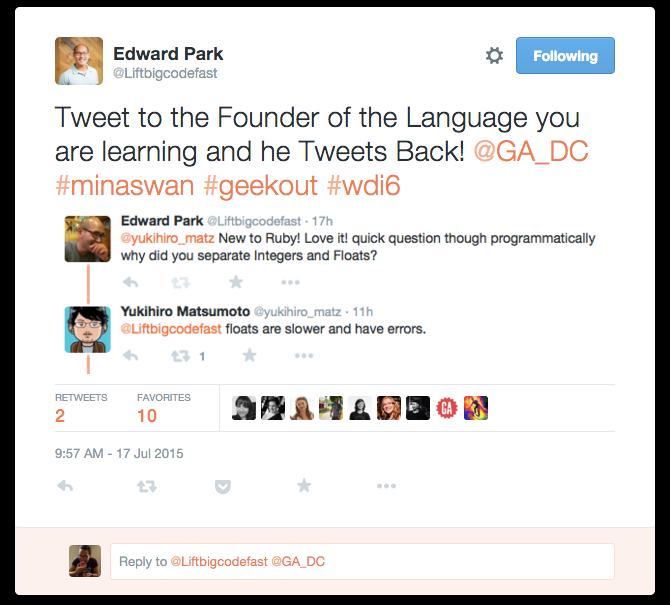

# Ruby Basics

## Learning Objectives

* Review the history and background of the Ruby programming language
* Compare/contrast Ruby and Javascript
* Learn how to run Ruby code by file and in a REPL
* Review various parts of the Ruby Language, including:
  * Syntax
  * Variables
  * Fundamental Data Types
  * Collections
  * Conditionals
  * Methods (Functions)

## Framing (10 minutes / 0:10)

### What is Ruby

We are now masters of JavaScript - a dynamic programming language of the C
family of languages. As we learned earlier, JavaScript draws inspiration from
Java and C for it's syntax and Scheme for it's functional nature. Today, we're
going to start picking up our second programming language, Ruby.

What is Ruby? Ruby is a dynamic language, like JavaScript, but the syntax is
very different - it's more natural and high level (closer to native language).

What can we use it for? Just about anything we used JavaScript for. We're going
to use it to build full-stack applications and solve over **server-side**
programming challenges. We will be writing Ruby code that _serves_ webpages.

### The Ruby Philosophy

#### M.I.N.A.S.W.A.N.

* Yukihiro Matsumoto ("Matz") created Ruby in the mid-90s
* He wanted to build a language that was easy and fun to use and to increase
  developer happiness
* "Matz Is Nice And So We Are Nice"
* Mentality not only applies to how you should treat your fellow developers, but
  also the philosophy behind Ruby itself

> "Programmers often feel joy when they can concentrate on the creative side of
> programming, so Ruby is designed to make programmers happy." — Yukihiro "Matz"
> Matsumoto



#### A **Natural** Language

While it isn't exactly simple, a lot of its features are going to feel intuitive

> "Ruby is simple in appearance, but is very complex inside, just like our human
> body." — Yukihiro "Matz" Matsumoto

## Compare and Contrast, Part 1 ( 10 minutes / 0:20 )

Think back to the [Try Ruby homework you just
completed](https://github.com/ga-wdi-exercises/try-ruby).

Break out in to groups of 3-4 by counting 1 through 4. Remember your number,
because we're going to do this again at the end of class!

With your group, compare and contrast what you learned about Ruby with what you
know about JavaScript on the whiteboard. You can do this with a table, a mind
map or however you think is best.

## Interacting with Ruby (5 minutes / 0:25)

There are 3 ways that we can interact with Ruby. Before we get in to them, we
need to make sure we have Ruby set up on our computers.

### Setting Up Ruby

Check to make sure you have Ruby installed by running this in the Terminal:
`ruby -v`

* You should get back something like: `ruby 2.4.0p0 (2016-12-24 revision 57164)
  [x86_64-darwin16]`
* If nothing shows up, run the following: `rbenv install 2.4.p0` or check the
  [installation
  page](https://www.ruby-lang.org/en/documentation/installation/#rbenv)

### Running Ruby

#### By File

The first way that we can interact with Ruby is by running a Ruby file. Ruby
files have the extension `.rb` and can be run through the command line:

```bash
touch app.rb  # Create a Ruby file
ruby app.rb   # Run that ruby file
```

#### By REPL

The second way that we can interact with Ruby code is with a tools like Pry and
IRB. Both Pry and IRB are Ruby REPLs.

1. Install: `gem install pry`
2. Run REPL: `pry`
3. Quit from REPL: `exit`
4. Alternative: `irb`

> A `gem` is a tool or application written in Ruby. We install them by entering
> `gem install gem_name` in the Terminal. You can explore available Ruby gems at
> [rubygems.org](https://rubygems.org/) if you're interested in learning more.
> They're a lot like `node_modules`!

#### Using Repl.it

Just like with JavaScript, we can use [repl.it](https://repl.it/languages/ruby)
to interact with Ruby through an online REPL.

## Fundamental Data Types

### Variables (5 minutes / 0:30)

Variables in Ruby are assigned by using a single equals sign ( `=` ):

```rb
my_favorite_animal = "flying squirrel"
# => "flying squirrel"
```

Notice a few other things about the above block of code:

* We no longer need to precede new variables with `var`, `let`, or `const`. Just use the name of
  the variable!
* Variables are instantiated as they are used
* Variables are also written in `snake_case`. That means all lower case with
  words separated by underscores.
* Variable names should still be semantic

Although we don't use `var`, there is still syntax to designate whether a
variable is local or global.

* `$` makes a variable global (e.g., `$my_number`)
* Undesignated implies a `local` variable (e.g., `my_number`)
* All-caps will make a variable a constant (That is, Ruby will give you warnings
  if you try to change the value (e.g., `PI = 3.14`))

### No Semicolons

While your code will work if you close a line with `;`, common practice is not
to use them. Yay! 🎉

### Parentheses Optional

Since we're currently in a Javascript state of mind, it might feel natural to
keep using them. That's okay! Ruby, however, does not require we use them when
defining functions, conditional statements, etc.

```rb
number = 3
# => 3

if( number == 3 ) # with parens
  puts( "It's a 3!" )
end
# It's a 3!
# => nil

if number == 3 # without parens
  puts "It's a 3!"
end
# It's a 3!
# => nil
```

## You Do: Data Types (15 minutes / 0:45)

Spend 15 minutes reading through everything up until the **Data Types
Exercises** section below this one.

> **Why do we have to read all this ourselves?**
>
>While we could re-teach you what numbers, strings, conditionals, etc. are like
>in Ruby, you know enough about programming languages from your experience with
>Javascript to pick up on this information yourself pretty quickly.
>
>Because of this, the peculiarities of Ruby will be apparent. These are the
>things you need to be aware of in the next few classes.

### Everything Is An Object!

Everything in Ruby is an **Object**.

* By "Object" we mean that everything has its own set of properties and methods
* Not a new concept - some data types in Javascript had their own properties and
  methods (e.g., `string.length`)
* You will learn more about this when you dive into Ruby OOP

### Numbers

Ruby uses same arithmetic operators as Javascript

* `+`, `-`, `*`, `/`, `%`
* Same order of operations too: P.E.M.D.A.S.

```rb
1 + 2 # Addition
# => 3

6 - 5 # Subtraction
# => 1

5 * 2 # Multiplication
# => 10

30 / 5 # Division
# => 6

31 / 5 # Note: integer division
# => 6

30 % 5 # Modulo (remainder)
# => 0

31 % 5
# => 1

3 ** 2 # Exponentiation
# => 9
```

> Notice the use of `**` to perform exponential operations in Ruby. We don't
> have this shortcut widely available [in Javascript](https://developer.mozilla.org/en-US/docs/Web/JavaScript/Reference/Global_Objects/Math/pow)
> yet.

### Strings

Words, just like in Javascript.

* Surrounded by single or double-quotes
* Ruby uses similar escape characters
  * [Here is a list of
    them](http://www.java2s.com/Code/Ruby/String/EscapeCharacterslist.htm)
  * Must instantiate string with double-quotes for escape characters to work

```rb
name = "John"
# => "John"

full_name = "John\nDoe"
# => "John\nDoe"

puts full_name
# John
# Doe
# => nil
```

Not only can you concatenate strings, now you can multiply them too! Remember we
couldn't do that in Javascript?

```rb
# Concatenation
"Hello " + "there!"
# => "Hello there!"

# Multiplication
"Hello there! " * 3
# => "Hello there! Hello there! Hello there! "
```

#### String Interpolation

Sometimes you will want to print out a string that incorporates a variable. For
example...

```rb
my_name = "Namey Lee Namington"
# => "Namey Lee Namington"

puts "Hi my name is: " + my_name
# Hi my name is: Namey Lee Namington
# => nil
```

This works fine. Things aren't so simple when that variable is of a different
data type. Like a number...

```rb
class_number = 984
# => 984

puts "I am teaching WDI " + class_number
# TypeError: no implicit conversion of Fixnum into String from (pry):26:in `+'
```

In cases like the above, you either need to convert the variable to a string
using `.to_string` (shortend to `.to_s`) or use something called "string
interpolation" (which will call `.to_s` implicitly).

* Surround the non-string variable with a hashtag and curly brackets:
  `#{variable}`. If you choose this option, *you must use double quotes* otherwise
  the interpolation will not work.
* This works just like [Template
  Literals](https://developer.mozilla.org/en-US/docs/Web/JavaScript/Reference/Template_literals)
  in JavaScript.

```rb
class_number = 984
# => 984

puts "I am teaching WDI #{class_number}"
# I am teaching WDI 984
# => nil
```

### Booleans

Still `true` and `false`.

* We'll be using them in conditionals and comparisons just like in Javascript

Comparison operators in Ruby are nearly identical to Javascript. However, the
check for equality is always for both value and data type.

* `<`, `>`, `<=`, `>=`, `==`, `!=`

> Don't worry about `===` in Ruby for now. It [does
> not](http://mauricio.github.io/2011/05/30/ruby-basics-equality-operators-ruby.html)
> have the same application as in Javascript.

Logical operators are also similar.

* `!`, `&&`, `||`

"Truthiness" and "Falsiness" are a lot less complicated in Ruby.

* The only falsey values in Ruby are `nil` and `false`

### Nil

Ruby's "nothing" value.

* The equivalent of Javascript's `null`
* You will usually see it when something does not have a return value (e.g., a
  `puts` statement)
* Like in Javascript, `nil` is falsey

Need to check if something is `nil`? Use `.nil?`

> **NOTE:** Any method that ends with a `?` means it will return a boolean
> value.

```rb
something = "A thing"
# => "A thing"

something.nil?
# => false

something = nil
# => nil

something.nil?
# => true
```

### The Bang Symbol (`!`)

All of the Ruby data types we have discussed so far are mutable.

* We can not only change what variables are pointing to in memory, but we can
  directly modify those values stored in memory as well.

Methods with an `!` attached to the end of them usually mean that they will
modify the value in memory they are being called on.

* Things can get tricky when you have multiple variables pointing at the same
  value. For example...

```rb
a = "cheeseburger"
# => "cheeseburger"

b = a
# => "cheeseburger"

b.upcase!
# => "CHEESEBURGER"

a
# => "CHEESEBURGER"
```

### Symbols

Symbols are immutable values. That means they contain the same value through the
entirety of a program and cannot be changed.

* Kind of like a string that never changes
* Syntax: `variable_name = :symbol_name`
* Similar to symbols in
  [JavaScript](http://www.2ality.com/2014/12/es6-symbols.html)

```rb
favorite_animal = :dog
# => :dog

favorite_animal.upcase!
# NoMethodError: undefined method `upcase!' for :dog:Symbol
# Did you mean?  upcase
```

When/why would you use symbols?

* Most common use is as keys in hashes, the Ruby equivalent of objects (more on
  that later)
* Make sure values that need to be constant stay constant
* Enhance performance (because they use less memory)

### Conditionals

Pretty similar to Javascript, with some differences.

* No parentheses or curly brackets required
* Begin blocks using `if`, `elsif` **(no second "e"!)** and `else`
* We close the whole loop using `end`
  * This will be used throughout Ruby when dealing with code blocks (e.g.,
    method/function)

Here's an example where we check for height at a roller coaster...

```rb
# In app.rb

puts "Welcome to the Iron Rattler! How tall are you (in feet)?"
height = gets.chomp.to_i

if height < 4
  puts "Sorry, you'll fly out of your seat if we let you on."
elsif height < 7
  puts "All aboard!"
else
  puts "If you value your head, you should not get on this ride."
end
```

## You Do: Data Types Exercises (15 minutes / 1:00)

Complete the first set of exercises (Exercise I: Data Types) in [this
repo](https://git.generalassemb.ly/ga-wdi-exercises/ruby-basics-exercises).

If you finish this section early, feel free to try out one of the [Additional
Exercises](https://git.generalassemb.ly/ga-wdi-lessons/ruby-intro#additional-practice)
located at the bottom of the lesson.

### Break (10 minutes / 1:10)

## We Do: Ruby Bouncer (5 minutes / 1:15)

Back during our first few lessons on JavaScript, you used conditionals and
variables to create a Bouncer. Walk me through how to do the same, but now with
Ruby!

### `puts` and `gets`

To print out to the console, like `console.log()` does in JavaScript, we use the
`puts` method:

```rb
puts "Hello, Ruby!"
# Hello, Ruby!
# => nil
```

Ruby also makes it easy for us to accept user input from the command line using
`gets`:

```rb
user_input = gets
# => "My input\n" (Note that this line was typed by the user in the terminal)

user_input
# => "My input\n"
```

Some notes about `gets`:

* Usually `gets` is followed by `.chomp`, which removes the new line generated
  by the user hitting return
* If you need to convert your value to a number, add `.to_i` to the end of the
  method

## You Do: Data Collections (10 minutes / 1:25)

Read everything up until the **Data Collections Exercises** section below this
one.

### Arrays

An ordered collection of related values. Same syntax as Javascript arrays.

* Square brackets
* Values separated by commas
* Zero-indexed

```rb
numbers = [1, 2, 3]
# => [1, 2, 3]

animals = ["dog", "cat", "horse"]
# => ["dog", "cat", "horse"]

animals[0]
# => "dog"

animals[1] = "elephant"
# => "elephant"

animals
# => ["dog", "elephant", "horse"]
```

Another super cool Ruby feature is that you can perform arithmetic operations on
arrays!

```rb
numbers = [1, 2, 3]
# => [1, 2, 3]

more_numbers = [4, 5, 6]
# => [4, 5, 6]

lots_of_numbers = numbers + more_numbers
# => [1, 2, 3, 4, 5, 6]

lots_of_numbers - [4, 5, 6]
# => [1, 2, 3]

numbers * 3
# => [1, 2, 3, 1, 2, 3, 1, 2, 3]
```

#### Array Methods

Ruby is very nice. It provides us with an extensive library of array methods we
can use to traverse and manipulate arrays.

* The Ruby [documentation](http://ruby-doc.org/core-.0/Array.html) for `Array`
  is a great resource for learning more about these methods
* Can't go over them all, but chances are if you could do it in Javascript then
  you can do it in Ruby.

**IMPORTANT:** You DO NOT need to memorize these. The following is just a sample
of array methods available to you. You'll come to be more familiar with these as
you need them and look them up in documentation.

> **tl;dr:** The more you Google them, the better you'll remember them.

##### Push/Pop

These Javascript methods also exist in Ruby and are used the same way.

```rb
numbers = [1, 2, 3, 4, 5]
# => [1, 2, 3, 4, 5]

numbers.push(6)
# => [1, 2, 3, 4, 5, 6]

numbers.push(7, 8, 9)
# => [1, 2, 3, 4, 5, 6, 7, 8, 9]

numbers.pop
# => 9

numbers
# => [1, 2, 3, 4, 5, 6, 7, 8]
```

##### Sort

Organizes array values from lowest to highest. Numbers and strings.

```rb
numbers = [3, 1, 5, 2, 4]
# => [3, 1, 5, 2, 4]

numbers.sort
# => [1, 2, 3, 4, 5]
```

##### Delete

* Removes an argument from an array
* If there are multiple instances of that argument, it will delete them all
* Look up: `.delete_at()`, `.slice()`

```rb
numbers = [3, 1, 2, 2, 4]
# => [3, 1, 2, 2, 4]

numbers.delete(2)
# => 2

numbers
# => [3, 1, 4]
```

### Hashes

A Ruby hash is an unordered, dictionary-like collection organized by key-value
pairs. A hash is very similar to a Javascript object.

```rb
wdi_class = {
  teacher: "John",
  students: ["Yacko", "Wacko", "Dot"],
  classroom: 2,
  in_session: true,
  schedule: {
    morning: "Ruby Basics",
    afternoon: "Enumerables"
  }
}
# => {:teacher=>"John", :students=>["Yacko", "Wacko", "Dot"], :classroom=>2, :in_session=>true, :schedule=>{:morning=>"Ruby Basics", :afternoon=>"Enumerables"}}
```

Accessing hash values:

```rb
wdi_class[:teacher]
# => "John"
```

Modifying hash values:

```rb
wdi_class[:teacher] = "Jack"
# => "Jack"
```

You can also use strings as hash keys:

```rb
wdi_class = {
  "teacher" => "John",
  "students" => ["Yacko", "Wacko", "Dot"],
  "classroom" => 2,
  "in_session" => true,
  "schedule" => {
    "morning" => "Ruby Basics",
    "afternoon" => "Enumerables"
  }
}
```

Then can access in this way:

```rb
wdi_class["teacher"] = "John"
# => "John"
```

And modify:

```rb
wdi_class["teacher"] = "Jack"
# => "Jack"
```

> Note the use of `=>` (or "hash rockets") instead of `:` when using strings as
> keys.

#### Hash Methods

Like arrays, Ruby also provides us with a library of hash methods.

* [Again, the Ruby documentation is a great
  resource](http://ruby-doc.org/core-2.4.0/Hash.html)

> As mentioned with arrays, do not worry about memorizing these methods. Just
> know how to look them up should the need arise.

##### Keys

Returns an array with all the keys in a hash.

```rb
wdi_class.keys
# => [:teacher, :students, :classroom, :in_session, :schedule]
```

##### Merge

Combines two hashes. If both of your hashes have the same key, the one in the
hash you set as the argument in the parameters will take precedence.

```rb
classroom = {
 room: 1
}
# => {:room=>1}

locations = {
 location_one: "DC",
 location_two: "NY",
 location_three: "Boston"
}
# => {:location_one=>"DC", :location_two=>"NY", :location_three=>"Boston"}

silly_hash = classroom.merge(locations)
# => {:room=>1, :location_one=>"DC", :location_two=>"NY", :location_three=>"Boston"}

classroom
# => {:room=>1}

locations
# => {:location_one=>"DC", :location_two=>"NY", :location_three=>"Boston"}

silly_hash
# => {:room=>1, :location_one=>"DC", :location_two=>"NY", :location_three=>"Boston"}
```

### Ranges

Use ranges to quickly generate arrays of data types.

* Parentheses
* Min and max value, separated by two periods
* Generate array using `.to_a` method

```rb
(1..5).to_a
# => [1, 2, 3, 4, 5]

("a".."z").to_a
# => ["a", "b", "c", "d", "e", "f", "g", "h", "i", "j", "k", "l", "m", "n", "o", "p", "q", "r", "s", "t", "u", "v", "w", "x", "y", "z"]
```

## You Do: Data Collections Exercises (20 minutes / 1:45)

> 15 minutes exercise. 5 minutes review.

Complete the second set of exercises (Exercise II: Data Collections) in [this
repo](https://git.generalassemb.ly/ga-wdi-exercises/ruby-basics-exercises).

If you finish this section early, feel free to try out one of the [Additional
Exercises](https://git.generalassemb.ly/ga-wdi-lessons/ruby-intro#additional-practice)
located at the bottom of the lesson plan.

## Methods (10 minutes / 1:55)

As stated before, everything in Ruby is an object so there is no distinction in
this language between functions and methods. Under the hood, even seemingly
stand-alone functions are in fact associated with an object. The convention,
however, is to call these methods.

In Ruby, methods are defined like this:

```rb
def double( number )
   doubled_number = number * 2
   return doubled_number
end
```

Components

* `def` - the Ruby equivalent of `function`
* `double` - the method name in the above example
* `number` - the parameter name in the above example
* `end` - closes the method

Ruby is flexible in how we invoke methods:

```rb
double( 3 )
# => 6

double 3
# => 6
```

You may have noticed that we use the same `return` notation as Javascript. This
is called an **explicit return**, because we identify what exactly we want
returned from the function.

Ruby also lets us make **implicit returns**.

* This means that we do not need to use the `return` keyword. Ruby will
  automatically return the value of the last line of code in the method.
* We encourage you to use **explicit returns** so we know exactly what your
  method is returning

```rb
def double( number )
  doubled_number = number * 2
  doubled_number
end
# => :double

double( 3 )
# => 6

double 3
# => 6
```

Ruby methods can also establish default argument values.

* In the below example, if we do not provide our `double` method with an
  argument, it will default to 5

```rb
def double( number = 5 )
  doubled_number = number * 2
  puts "Your doubled number is #{doubled_number}"
  return doubled_number
end
# => :double

double
# Your doubled number is 10
# => 10
```

## Exercise: Temperature Converter (25 minutes / 2:20)

> 15 minutes exercise. 10 minutes review.

[Temperature Converter
(Ruby)](https://git.generalassemb.ly/ga-wdi-exercises/temperature_converter_ruby)

## Compare and Contrast, Part 2 ( 10 minutes / 2:30 )

Break out in to groups of 3-4, this time by creating a group that has at least
one person who was each number 1 through 4 from the first exercise (i.e. one #1,
one #2, one #3, and one #4 in each group).

With your group, compare and contrast again what you know about JavaScript with
what you now know about Ruby on the whiteboard. You can do this with a table, a
mind map or however you think is best.

### Leading Questions

* What are the main data types in Ruby? What are they in JavaScript? How do they
  work similarly and differently?
* Describe the difference between what is truthy/falsey in Ruby vs JavaScript?
* What are the differences between explicit and implicit return in Ruby vs
  JavaScript?
* How would you add a key / value pair to an existing hash? How is this
  different from adding a key / value pair to an existing object in JavaScript?
* How many values can a method return? Which methods don't return anything in
  Ruby or JavaScript?

## Resources

* [Learn X in Y minutes: Ruby](https://learnxinyminutes.com/docs/ruby/)
* [Chris Pine's Learn to Program](https://pine.fm/LearnToProgram/chap_00.html)
* [Ruby Monk](https://rubymonk.com/)
* [Why's Poignant Guide to Ruby](http://poignant.guide/book/chapter-2.html)
* [Ruby Koans](http://rubykoans.com/)

## Additional Practice

* [Word Ladder](https://git.generalassemb.ly/ga-wdi-exercises/word_ladder)
* [Who Won The
  Election?](https://git.generalassemb.ly/ga-wdi-exercises/who_won_the_election)
* [Search For
  Obi-Wan](https://git.generalassemb.ly/ga-wdi-exercises/search_for_obi_wan)
* [Pig-Latin](https://git.generalassemb.ly/ga-wdi-exercises/pig_latin)
* [Letter Counter](https://git.generalassemb.ly/ga-wdi-exercises/letter_counter)
