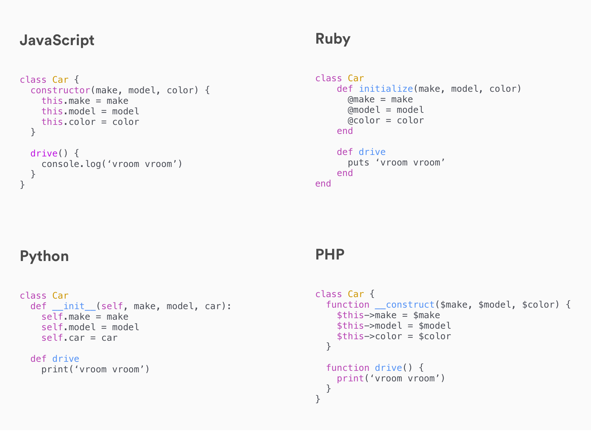

# Intro to Object-Oriented Programming in Ruby

## Learning Objectives

- Review the principles of Object Oriented Programming
- Describe the relationship between a class and an instance
- Define a Ruby Class and instantiate it
- Explain the relationship between `.new()` and `def initialize()`
- Distinguish local, instance, and class variables
- Examine interactions with objects through methods
- Understand the difference between `attr_accessor`, `attr_reader`,
  `attr_writer`, and know when to use each one.

## Review: What is OOP? (15 min / 0:15)

Back when we were first learning JavaScript, we learned about
Object-Oriented Programming and it's advantages. Why do we write programs in an
Object-Oriented style? What are those advantages?

Let's start with the first question:

<details>
  <summary><strong>What is Object-Oriented Programming?</strong></summary>

Object oriented programming is a **paradigm** of Software Engineering that
attempts to solve the problems of building applications imperatively by
organizing applications into discrete units, called objects. Rather than
imperatively describe everything we want our application to do, in OOP we define
objects that represent our understanding of the different parts of our
application, what information describes those parts and what behavior those
parts have.

</details>

Second question: the advantages to OOP are:

1. Encapsulation
2. Modularity
3. Inheritance

What do each of these mean?

<details>
  <summary><strong>Encapsulation</strong></summary>

The complexity of our objects is hidden and a user can interact with a well
defined set of methods. We can redefine internal behavior without changing
anything externally - a huge benefit for refactoring.

</details>

<details>
  <summary><strong></strong></summary>

Because the interface (set of methods) for an object is well defined, it is easy
to exchange one object for another and reorganize objects without breaking them.

</details>

<details>
  <summary><strong>Inheritance</strong></summary>

Object Oriented design lets certain classes inherit from, or borrow the behavior
of another, more general class. The inheriting class can add and overwrite
inherited methods.

</details>

### OOP Vocabulary Review (10 min / 0:25)

From that first lesson on OOP and how you've used it since, we know that there
are a couple of key words that can help us understand OOP:

- Classes
- Instances
- Attributes
- Methods
- Constructor/Initializer

Let's review each of these.

#### Classes & Instances

What is a class and what is an instance? The class is the `type of thing`. This
may seem complicated but can be intuitive: think of a car. Boom 💥 - you just
thought of a car. That car in your mind is a class (it's a type of thing). Now
think of your own car, the one you own or one you maybe used to own or would
like to someday own. Boom 💥 - you just thought of an instance of that car
class.

A class is a type of thing and how we define it (it's characteristics and
behaviors). An instance, is a single example of that thing.

#### Attributes & Methods

The units of our program will have characteristics and behaviors, like our car
class from above. In OOP, we call these attributes and methods. An attribute is
descriptive data of something, i.e. it's color, make and model in the example of
our car; A method is some behavior that instances of our class have, i.e.
driving, turning left and right, speeding up, slowing down and (hopefully)
stoping for our car.

#### Constructor or Initializer

Finally, when we defined a class in JavaScript, we had to define a
`constructor` function. What did this function do? It created the instance
object for us.

### All Together

When we left off with OOP in JavaScript, we mentioned that most of what we
were learning was not specific to JavaScript but part of OOP generally. The
syntax for defining a class and creating instances of that class is unique to
JavaScript, but not the idea of defining a class and creating instances. That
applies to all object-oriented programming languages - like Ruby!



> This graphic shows you how to define a `Car` class in JavaScript, Ruby, Python
> and PHP.

## Ruby Classes (20 min / 0:45)

Let's now transition into writing Ruby classes.

Let's define a `User` class. We'll be using `binding.pry` to test our code.

> Aside: pry is a ruby gem that allows us to work with ruby code in an IRB
> (interactive ruby shell). It's a REPL like the javascript console in the
> browser.

In the Terminal:

```bash
touch app.rb
gem install pry # run this if you haven't installed pry yet
```

In `app.rb`:

```ruby
require "pry"

class User

  def set_name(some_string)
    @name = some_string
  end

  def get_name
    return @name
  end

  def greet
    puts "Hi! My name is #{@name}!"
  end

end

me = User.new
me.set_name("Spencer")
me.greet # prints: Hi! My name is Perry!

binding.pry

puts "end of file"
```

In JavaScript, we could write this class:

```js
class User {
  setName (name) {
    this.name = name
  }
  getName () {
    return this.name
  }
  greet () {
    console.log(`Hi! My name is ${this.name}`)
  }
}

const me = new User()
me.setName('Perry')
me.greet() // prints: Hi! My name is Perry!
```

These two snippets are very similar. What differs between the two?

Notice the `@` that starts every **instance variable**. Instance variables are
like properties of JS objects - part the objects' internal data. The main
difference is that in Ruby, *instance variables can only be accessed/changed by
methods* of that object. More on that when we discuss getters and setters below.

By instantiating multiple `User` objects, we can see that all of the methods
defined for the class can be called on any instance of `User`.

```ruby
alice = User.new
alice.set_name("Alice")
puts alice.get_name

madhatter = User.new
madhatter.set_name("Mad Hatter")
puts madhatter.get_name

alice.greet
madhatter.greet
```

### Some Questions

Is `User` a(n):

- [ ] class?
- [ ] instance?

Is `alice` a(n):

- [ ] class?
- [ ] instance?

`User.greet` throws an error. `alice.greet` works fine. So we can deduce that
the `greet` method can only be called on:

- [ ] instances of the `User` class?
- [ ] the `User` class itself?

Thus, would it make sense to call `greet` a(n):

- [ ] "instance method"?
- [ ] "class method"?

`User.new` works fine. `alice.new` throws an error. So we can deduce that the
`new` method can only be called on:

- [ ] instances of the `User` class?
- [ ] the `User` class itself?

Thus, it would be make sense to call `new` a(n):

- [ ] "instance method"?
- [ ] "class method"?

<details>
  <summary>
    `class User` works fine. `class user` throws an error. What's a rule we can deduce about classes from this?
  </summary>

  > Class names must begin with a capital letter. This is not optional.

</details>

<details>
  <summary>
    `class UserName` works fine. `class User Name` throws an error. What's a rule we can deduce about classes from this?
  </summary>

  > Class names cannot contain spaces.

</details>

## Initializing Users (15 min / 1:00)

<details>
  <summary><strong>What was the purpose of a constructor function in Javascript classes?</strong></summary>

  > When an instance of a class is created (the class is instantiated) the
  > constructor function is run to do set up (or initialization) of any
  > properties we want a class instance to have.

</details>

Ruby classes have a method analogous to `constructor` in JS: the `initialize`
method

```ruby
require 'pry'

class User

  def initialize
    puts "I'm a new User"
  end

  # ...

end
```

```ruby
alice = User.new

madhatter = User.new

puts alice
puts madhatter
```

<details>
  <summary>What can we conclude about the relationship of `def initialize` and `.new`? (Hint: it serves the same purpose as Javascript's constructor function)</summary>

When the class method `.new` is called, a new object is instantiated and the
instance method `initialize` is called with the arguments given to `.new`

</details>

<details>
  <summary>How is this different from other User instance methods we've seen?</summary>

`initialize` can only be called by the `.new` class method (i.e. it only runs
once - when the object is initially created).

</details>

`initialize` methods are often used to set values for instance variables:

```ruby
class User

  def initialize(first_name, last_name)
    @first_name = first_name
    @last_name = last_name
  end

  def full_name
    return "#{@first_name.capitalize} #{@last_name.capitalize}"
  end

end
```

In `pry`:
```ruby
harry = User.new("Harry", "Potter")
# => #<User:0x007faf3903f670 @first_name="Harry", @last_name="Potter">
harry.full_name
# => "Harry Potter"
```

### Ruby Variables (10 min / 1:10)

In our exploration of Ruby so far, you may have notice that scope works
differently than in JavaScript. Specifically, you may have seen that in Ruby,
normal variables are available only inside the method in which they were
created.

This is because Ruby is intended to always be written in an object oriented
style. Instead of having access to data defined previously in the code (called
lexical scope), Ruby gives you access to internal data of the object a method is
called on.

- **Global Variables**: start with `$` (`$my_global_var`) and are available
  anywhere in the Ruby app. Not very commonly used.
- **Local Variables**: starts with any letter (`my_local_var`) and are available
  only in the method in which it is defined. Very commonly used.
- **Instance Variables**: starts with `@` (`@my_instance_var`) and are available
  to any method called on the instance. Also very commonly used.
- **Class Variables**: starts with `@@` (`@@my_class_var`) and are available to
  all instances of a class. Not very common (we'll look at these in more detail
  later on).

> Want to learn more? Check out the [Ruby variables cheatsheet](variables.md) we
> put together

## Break (10 min / 1:20)

### Getting and Setting Instance Variables (20 min / 1:40)

Let's update our JavaScript user class with a constructor to match our
initialize method:

```js
class User {
  constructor (firstName, lastName) {
    this.firstName = firstName
    this.lastName = lastName
  }
  fullName () {
    return `${this.firstName} ${this.lastName}`
  }
}

let harry = new User('Harry', 'Potter')
```

With our JS instance, we can call `harry.fullName()` and get back the
concatenated full name.

We can also access the properties on `harry` using dot notation:
`harry.firstName` and `harry.lastName`

The fact that we can access instance variables directly in JavaScript is often
criticized as it is seen to violate encapsulation.

By contrast, we can't simply type `harry.first_name` in Ruby. Ruby will try to
find a method `first_name` and will throw an error when one isn't found. Trying
to **set** Harry's first name throws a similar error `harry.first_name = "Harry"`

The only things available **outside** an instance are its methods. `@first_name`
is a property, not a method. If we want to get at the instance variables, we
need methods to do that. In Object Oriented programming there is an extremely
common pattern of defining [**getter** and **setter**
methods](https://en.wikipedia.org/wiki/Mutator_method) that allow internal
variables to be read/manipulated.

Why might a method be preferable to an exposed variable?

```ruby
class User

  def initialize(first_name, last_name)
    @first_name = first_name
    @last_name = last_name
  end

  def full_name
    return "#{@first_name.capitalize} #{@last_name.capitalize}"
  end

  def get_first_name
    return @first_name
  end

  def set_first_name(first_name)
    @first_name = first_name
  end

end
```

```ruby
# pry
harry = User.new("Harry", "Potter")
# => #<User:0x007faf3903f670 @first_name="Harry", @last_name="Potter">
puts harry.get_first_name
# "Harry"
harry.set_first_name("Ginny")
puts harry.get_first_name
# "Ginny"
```

Javascript perhaps makes it too easy to access and change our properties, the
dot syntax (`object.property`) is pretty convenient.

By defining a getter method with the same name as the property being retrieved,
we can make our initial attempt at reading the variable (`harry.first_name`)
work:

```ruby
class User

  def initialize(first_name, last_name)
    @first_name = first_name
    @last_name = last_name
  end

  def full_name
    return "#{@first_name.capitalize} #{@last_name.capitalize}"
  end

  def first_name
    return @first_name
  end

  def set_first_name(first_name)
    @first_name = first_name
  end

end
```

```ruby
harry = User.new("Harry", "Potter")
puts harry.first_name
# => "Harry"
```

**You Do:** Go ahead and do the same for the `last_name` property!

A nice bit of Ruby syntactical sugar lets us also write setter methods that look
like assignment.

Recall the error we saw after trying `harry.first_name = 'Ginny'`. It was
`undefined method 'first_name='`

Ruby will let us define a method ending in an `=` and when we call it, have a
space between the last letter in the method name and the `=`.

The important thing here is to note that while this looks like an assignment, it
is not, we're calling and invoking a method.

```ruby
class User

  def initialize(first_name, last_name)
    @first_name = first_name
    @last_name = last_name
  end

  def full_name
    return "#{@first_name.capitalize} #{@last_name.capitalize}"
  end

  def first_name
    return @first_name
  end

  def first_name=(first_name)
    @first_name = first_name
  end
end

harry = User.new("Harry", "Potter")
harry.first_name = "Ginny" # same as harry.first_name=("Ginny") or harry.first_name = ("Ginny")
puts harry.first_name
# => Ginny
```

**You Do:** Go a head and do the same for the `last_name` property!

### attr_accessor

This is such a common pattern that it is built into Ruby in **accessors**.

The three accessors are `attr_reader`, `attr_writer`, and `attr_accessor`.

They take symbols as arguments and will create (respectively) **getter**,
**setter**, or both methods for instance variables.

The following snippets replace the manually defined getter and setter with the
accessors

### attr_reader

```ruby
class User
  attr_reader :first_name

  def initialize(first_name, last_name)
    @first_name = first_name
    @last_name = last_name
  end

  def full_name
    return "#{@first_name.capitalize} #{@last_name.capitalize}"
  end

  # def first_name
  #   return @first_name
  # end

  def first_name=(first_name)
    @first_name = first_name
  end

end

harry = User.new("Harry", "Potter")
harry.first_name = "Ginny" # Using the manually defined method
puts harry.first_name # Using the attr_reader defined method
# => Ginny
```

**You Do:** Go ahead and do the same for the `last_name` property!

### attr_writer

```ruby
class User
  attr_reader :first_name
  attr_writer :first_name

  def initialize(first_name, last_name)
    @first_name = first_name
    @last_name = last_name
  end

  def full_name
    return "#{@first_name.capitalize} #{@last_name.capitalize}"
  end

  # def first_name
  #   return @first_name
  # end

  # def first_name=(first_name)
  #   @first_name = first_name
  # end

end

harry = User.new("Harry", "Potter")
harry.first_name = "Ginny" # Using the attr_writer defined method
puts harry.first_name # Using the attr_reader defined method
# => Ginny
```

**You Do:** Go ahead and do the same for the `last_name` property!

### attr_accessor

```ruby
class User
  attr_accessor :first_name
  # attr_reader :first_name
  # attr_writer :first_name

  def initialize(first_name, last_name)
    @first_name = first_name
    @last_name = last_name
  end

  def full_name
    return "#{@first_name.capitalize} #{@last_name.capitalize}"
  end

  # def first_name
  #   return @first_name
  # end

  # def first_name=(first_name)
  #   @first_name = first_name
  # end

end

harry = User.new("Harry", "Potter")
harry.first_name = "Ginny" # Using the attr_accessor defined method
puts harry.first_name # Using the attr_accessor defined method
# => Ginny
```

**You Do:** Go ahead and do the same for the `last_name` property!

> Note: an accessor can be used for multiple variables at once:

```ruby
class User
  attr_accessor :first_name, :last_name
  # attr_reader :first_name
  # attr_writer :first_name

  def initialize(first_name, last_name)
    @first_name = first_name
    @last_name = last_name
  end

  def full_name
    return "#{@first_name.capitalize} #{@last_name.capitalize}"
  end

  # def first_name
  #   return @first_name
  # end

  # def first_name=(first_name)
  #   @first_name = first_name
  # end

end

harry = User.new("Harry", "Potter")
harry.first_name = "Ginny"
harry.last_name = "Weasley"
puts harry.first_name
puts harry.last_name
# => Ginny
```

<details>

  <summary>We now can directly access properties on the User instance, so we can deduce that `attr_accessor` is a shortcut that does what?</summary>

  > It creates getter and setter methods for the `first_name` instance variable.

</details>

`attr_reader` makes an attribute readable, `attr_writer` makes an attribute
writeable. `attr_accessor` makes an attribute both readable **AND** writeable.

## You Do: [Monkies!](https://git.generalassemb.ly/ga-wdi-exercises/oop_monkey) (20 minutes / 11:50)

For the next exercise, clone down [this repo](https://git.generalassemb.ly/ga-wdi-exercises/oop_monkey)

## Break (10 min / 2:10)

## Inheritance (5 min / 2:15)

Just like we get traits from our parents, we can use a feature called
**inheritance** to create classes (children) that *inherit* properties and
methods from a parent class.

```rb
class User
  attr_accessor :first_name, :last_name
  # attr_reader :first_name
  # attr_writer :first_name

  def initialize(first_name, last_name)
    @first_name = first_name
    @last_name = last_name
  end

  def say_name
    return "#{@first_name.capitalize} #{@last_name.capitalize}"
  end

end

# Inheritance is indicated using the `<` symbol after the child class' name.
class SuperUser < Person
  def say_name
    puts "#{@name.upcase} IS A SUPERUSER!"
  end
end

james = User.new("Max", "Power")
ali = SuperUser.new("Ali", "Spittel")

# The `say_name` methods produce different results because the original was overwritten in the `LoudPerson` class.
max.say_name
# => "Max Power"
ali.say_name
# => "ALI IS A SUPERUSER!"
```

## You Do: [Codebar](https://git.generalassemb.ly/ga-wdi-exercises/codebar) (25 minutes)

> 20 minutes exercise. 5 minutes review.

Clone down [this repo](https://git.generalassemb.ly/ga-wdi-exercises/codebar)
and follow the instructions in the readme.

> If you finish early, get started on the optional Shopping List exercise.

## You Do: [Shopping List](https://git.generalassemb.ly/ga-wdi-exercises/shopping_list/) (Optional)

Clone down [this repo](https://git.generalassemb.ly/ga-wdi-exercises/shopping_list/) and follow the instructions in the readme.

## Review Questions (5 minutes / 12:30)

- What is the relationship between a class and an instance?
- What is special about the method `def initialize`?
- Explain the difference between local, instance, and class variables
- What is the difference between `attr_accessor`, `attr_reader`, and
  `attr_writer`?

## You Do: Orange Tree (Rest of Class)

> From Chris Pine's "Learn to Program - Second Edition": p 112, section 13.6

Make an OrangeTree class that has...

- a `height` method that returns its height in feet
  - it's initial value should be determined by some input
  - hint: you don't necessarily have to define the method
- a `one_year_passes` method that, when called, ages the tree one year. Start
  the age at `0`.

> Test your code.

- Each year the tree grows taller by one foot
- After 50 years the tree should "die" (its height goes to 0)

> Test your code.

- After the first 5 years, the tree bears 20 oranges
- You should be able to `count_the_oranges`, which returns the number of oranges
  on the tree

> Test your code.

- You should be able to `pick_an_orange`, which reduces the number of oranges by
  1
- Ensure that your tree cannot have negative oranges
- Ensure that after each year your tree has 20 total oranges again

> Test your code.

- The number of oranges the tree bears each year is equal to 20 plus the age of
  the tree

### Bonus

Create an `OrangeTreeOrchard` class that manages multiple `OrangeTrees`. It
can...

- Age all the trees by one year
- Pick and count all the fruit
- Calculate average height and fruit of all orange trees

## Glossary

- **Class**: a blueprint for objects
- **Instance**: an object that is created using a class
- **Instance Variable**: a property that is particular to an instance
- **Class Variable:** a property that is accessible by all instances of a class
- **Instance Method**: a method that can be called by an instance of a class
  (e.g., `sample_user.reset_password`)
- **Class Method**: a method that can be called by a class (e.g.,
  `User.list_user`)
- **`initialize`**: a class method that, when triggered, creates an instance and
  assigns initial properties
- **`.new`**: a class method that, when called, triggers its `initialize` method
- **`attr_accessor`**: a setting that allows you to directly "get" or "set" an
  instance variable

## Bonus: Class Attributes / Variables

Let's come up with a way of keeping track of how many users have been created
total...

```ruby
class User
  attr_accessor :first_name, :last_name
  @@all = 0

  def count
    return @@all
  end

  def initialize(first_name, last_name)
    @first_name = first_name
    @last_name = last_name
    @@all += 1
  end

  def full_name
    return "#{@first_name.capitalize} #{@last_name.capitalize}"
  end
end
```

```ruby
harry = User.new("Harry", "Potter")
harry.count
# => 1
ron = User.new("Ron", "Weasley")
harry.count
# => 2
ron.count
# => 2
draco = User.new("Draco", "Malfoy")
harry.count
# => 3
ron.count
# => 3
draco.count
# => 3
```

But there's something weird going on here: note that we aren't counting the
number of Rons, Harrys or Dracos. Think about what `.count` might be returning.
More on this in a moment!

A variable name beginning with `@@` is a **class variable**. Every instance of a
class has the same value for this variable. It cannot be accessed with
`attr_accessor`. You have to actually create a method to access it.

### Class Attributes and Methods Together (10 minutes / 12:15)

A method name beginning with the class name is a **class method**. It is
attached to the class itself, rather than to instances. There are also methods
you call on `User` itself. So far we've only seen `.new`. It would make more
sense if, in order to retrieve the total number of users, we ran `User.count`
instead of `harry.count`...

```ruby
class User
  attr_accessor :first_name, :last_name
  @@all = 0

  def initialize(first_name, last_name)
    @first_name = first_name
    @last_name = last_name
    @@all += 1
  end

  def full_name
    return "#{@first_name.capitalize} #{@last_name.capitalize}"
  end

  # You could also define this as `def self.count`, where self represents the class
  def User.count
    return @@all
  end

end
```

```ruby
ginny = User.new("Ginny", "Weasley")
ginny.count
# => Error!
User.count
# => 1
```

## Self (10 minutes / 12:25)

`self` is a special variable that contains the current instance of an object
(like `this` in Javascript). It's how the object refers to it*self*.

`self` has another context as well: `def self.all` Here, `self` refers to `class User`.
What does this mean? It means that the method `.all` is called on the
class `User`, much like `.new`, and is therefore a class method.

```ruby
class User
  attr_accessor :first_name, :last_name
  @@all = []

  def initialize(first_name, last_name)
    @first_name = first_name
    @last_name = last_name
    # here, `self` refers to the current instance
    puts "Creating #{self.first_name}"
    @@all.push(self)
  end

  def full_name
    return "#{@first_name.capitalize} #{@last_name.capitalize}"
  end

  # Can also be written as `def User.all`
  # here, `self` refers to the class
  def self.all
    return @@all
  end

end
```

```ruby
draco = User.new("Draco", "Malfoy")
# "Creating Draco"
luna = User.new("Luna", "Lovegood")
# "Creating Luna"
bellatrix = User.new("Bellatrix", "LeStrange")
# "Creating Bellatrix"
User.all
# => [#<User @first_name="Draco">, #<User @first_name="Luna">, #<User @first_name="Bellatrix">]
```

## Bonus: Public and Private Methods

### You Do

- Draw a picture of a machine, real or imaginary, that has inputs (buttons,
  switches, keypads...) and displays (dials, lights, screens...). Label what
  they do.
- Most machines have internal gauges or memories that help it make decisions:
  temperature monitors, voltage monitors, hard disks, and so on. These are
  visible only inside the machine: whoever's using the machine can't see them.
  Draw two of these on your machine and label them.

By default all instance and class methods are *public*, except for `def
initialize` which is *private*. This means they're visible to other objects. An
analogy: they're functions that have their own buttons on the outside of the
machine, like a car's turn signal.

There may be methods that all other objects don't need to know about.

```ruby
class User
  attr_accessor :first_name, :last_name
  @@all = []

  def initialize(first_name, last_name, password)
    @first_name = first_name
    @last_name = last_name
    @password = encrypt(password)
    @@all.push(self)
  end

  def full_name
    return "#{@first_name.capitalize} #{@last_name.capitalize}"
  end

  def User.all
    return @@all
  end

  private
  def encrypt(input)
    return input.reverse
  end

end
```

```ruby
harry = User.new("Harry", "Potter", "Expecto Patronum")
# #<User @first_name="Harry" @password="munortaP otcepxE">
harry.encrypt("Expecto Patronum")
# Error! Private method `encrypt`
```

Putting `private` in front of methods means they can be used inside the object,
but are not available outside it. An analogy: they're functions that do not have
their own buttons on the outside of the machine, like a car's air filter.

`private` is useful mostly for keeping things organized. Consider jQuery: It's
already cluttered enough, with all these methods like `.fadeOut` and `.css`. It
has lots of other methods hidden inside it that we don't really need to know
about.

## Review: Why OOP?

### Easy to Understand

Objects help us build programs that model how we tend to think about the world.
Instead of a bunch of variables and functions (procedural style), we can group
relevant data and functions into objects, and think about them as individual,
self-contained units. This grouping of properties (data) and methods is called
*encapsulation*.

### Managing Complexity

This is especially important as our programs get more and more complex. We can't
keep all the code (and what it does) in our head at once. Instead, we often want
to think just a portion of the code.

Objects help us organize and think about our programs. If I'm looking at code
for a Squad object, and I see it has associated *people*, and those people can
dance when the squad dances, I don't need to think about or see all the code
related to a person dancing. I can just think at a high level "ok, when a squad
dances, all it's associated people dance". This is a form of *abstraction*... I
don't need to think about the details, just what's happening at a high-level.

### Ensuring Consistency

One side effect of *encapsulation* (grouping data and methods into objects) is
that these objects can be in control of their data. This usually means ensuring
consistency of their data.

Consider the bank account example... I might define a bank account object such
that you can't directly change it's balance. Instead, you have to use the
`withdraw` and `deposit` methods. Those methods are the *interface* to the
account, and they can enforce rules for consistency, such as "balance can't be
less than zero".

### Modularity

If our objects are well-designed, then they interact with each other in
well-defined ways. This allows us to refactor (rewrite) any object, and it
should not impact (cause bugs) in other areas of our programs.

## Extra Practice: Scrabble

Clone this exercise and follow the instructions in the readme.

**[Scrabble Word
Scorer](https://git.generalassemb.ly/ga-wdi-exercises/scrabbler)**

## Resources

- [OOP Inheritance
  Class](https://git.generalassemb.ly/ga-wdi-lessons/ruby-oop-inheritance/blob/master/readme.md)
- [Variables cheat sheet](variables.md)
- Other exercises
  - [Monkeys](https://git.generalassemb.ly/ga-wdi-exercises/oop_monkey)
  - [Application
    Config](https://git.generalassemb.ly/ga-wdi-exercises/ruby_application_configuration)
  - [Superheroes](https://git.generalassemb.ly/ga-wdi-exercises/superheros)