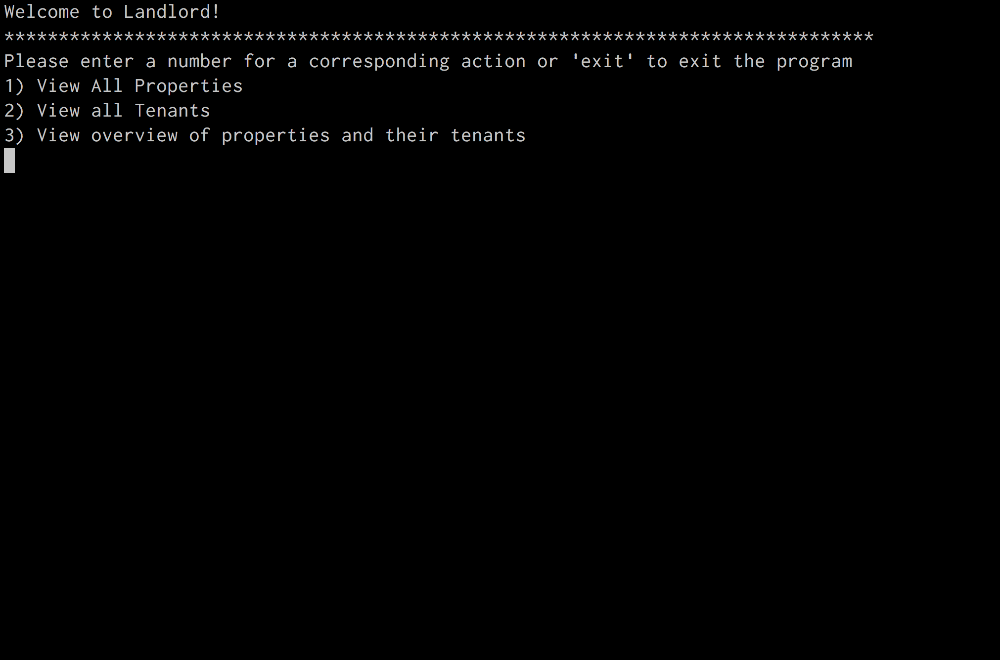

# Intro to Sinatra

## Learning Objectives

- Describe what Sinatra is and what it is used for
- Build a Sinatra app that responds to HTTP requests
- Distinguish between a route and a path
- Define routes with URL parameters and access those parameters
- Access data from the params hash in Sinatra

## Intro
(10 minutes)

In the first unit of WDI, we used HTML, CSS and Javascript to build **client-side** applications that run entirely in the browser. We didn't need to do anything involving a server, let alone a database. Today, we're going to get into building our first **full-stack applications** in Ruby, with the help of **Sinatra**, a lightweight server application framework and alternative to Rails.

All week, we've been approaching this WDI milestone by studying Ruby, which we've been running from the command line, outside of the browser. You probably noticed that we've been stuck writing boring CLI apps that wouldn't be suitable for the vast majority of web users...

-----



-----

Today, we will bridge the Ruby we've been writing in the last week with our prior knowledge on creating web-based views in HTML & CSS.

## The Role of the Server

Before we start writing our first server-side applications, let's take a moment to think about what a server does. As we know them, servers are entities that deliver or serve data and webpages to users' browsers.

Ultimately, the job of a server is to respond to client requests. If a server application receives a request it can't fulfill, it still provides a response. If a server doesn't respond with anything, we'll assume that it is down or that something has gone wrong with our connection.

What often happens when we try to access a page that doesn't exist, we usually see a familiar error code...


The server still gives us feedback instead of no feedback at all.

There is a 'contract' between servers and clients where a client makes requests to a server, which in turn responds to each request. This is a paradigm known as [request-response](https://en.wikipedia.org/wiki/Request%E2%80%93response). The rules laid down by this paradigm enforce a standard baseline for a reliable internet that we've grown to depend on.

### Enter Sinatra


Well, maybe not that Sinatra...

## What is Sinatra?

Sinatra is a Ruby **framework** for quickly creating **server-side applications**. [Frameworks](https://www.infoworld.com/article/2902242/application-development/7-reasons-why-frameworks-are-the-new-programming-languages.html) are similar to libraries, but serve to enforce structure for your codebase.

A **framework** is a set of opinionated conventions around the structure and functionality of an app that lets programmers focus on the specifics of the business logic that they're trying to build. Other popular frameworks include Rails, Express, and Django.

Sinatra isn't as prevalent a Ruby framework as Rails, but is useful when building lightweight applications. Rails has much more functionality built-in than Sinatra does, but is much larger and more complex.

## Our first Sinatra app!

Let's create a folder to work in. There, we'll create 2 files: `app.rb` and `Gemfile`...

```bash
 $ mkdir sinatra_intro
 $ cd sinatra_intro
 $ touch app.rb
 $ touch Gemfile
```

### Dependencies

The modules that applications need in order to run are referred to as **dependencies**. **Gems** are *Ruby* modules (usually written by other developers) that we can bring into our projects. A `Gemfile` is a list of all the **gems** that a Ruby application depends on.

Let's make sure we include our Sinatra dependency in the `Gemfile`...

```ruby
source "https://rubygems.org"

gem "sinatra"
```

Then run the following command in the terminal to install the dependencies listed in the `Gemfile`...

```bash
 $ bundle install
```

A new file called `Gemfile.lock` will be generated by running `bundle install`. This file shows the exact versions of the gems you installed. When an application is loaded on another machine, the same versions will be installed when `bundle install` runs.

### Writing Server Behavior

In `app.rb`, we'll define our server's first route...

```ruby
require 'sinatra'

get '/' do
  return '<h1>Hello world!</h1>'
end
```

Later, we'll talk about the significance of Sinatra's `get` method, and how Sinatra methods relate to types of HTTP requests.

Now, in your terminal, run `app.rb` as you normally would...

```bash
 $ ruby app.rb
```

After executing `app.rb`, you should see something like...

```
== Sinatra/1.4.4 has taken the stage on 4567 for development with backup from Thin
/Users/accounty_mc_username/.rvm/gems/ruby-2.4.0/gems/sinatra-1.4.4/lib/sinatra/base.rb:1208: warning: constant ::Fixnum is deprecated
Thin web server (v1.7.0 codename Dunder Mifflin)
Maximum connections set to 1024
Listening on localhost:4567, CTRL+C to stop
```

> Part of the 'flavor' of Sinatra are various puns related to Frank Sinatra.

Believe it or not, that's it! You now have a server running on your computer. It can respond to requests, just like any other server. To test that out, go to `localhost:4567/` in your browser. You should see "Hello world!"

> Note that this isn't a server anyone else can see, but it's still a server. Each of us is running a server at `localhost:4567`, but each one of us is only seeing their own application.

### Port Number 4567

Where does that `4567` come from?

This is Sinatra's default **port number**, meaning that our application will be 'served' from our local machine at port `4567`, at the url `localhost:4567`.

## Routes

A **route** is a **verb** plus a **path**.

> Example route: `get '/'`

|verb| path|
| ---  | --- |
| get  |`'/'`|

> **Verb + Path = Route**

A route matches a path (`/` or `/users`, for example) with a specific HTTP request type. The type of request is called the **HTTP verb**. The Sinatra method `get` corresponds to the HTTP verb `GET`.

When we access a webpage from our browsers, that server receives a `GET` request from our browsers. If we travel to `taco-pandas.com/`, we're making a `GET` request to the path `/`. We've been making `GET` requests all of our lives without realizing it, each time we've typed in a URL into our browser's address bar.

In order to run our code in `get '/'`'s `do` block we have to navigate to `localhost:4567/` in our browser. This is known as the route's **action**.

### Test a Non-Existent Route

Try going to `localhost:4567/oh_hello` in your browser. What do we see?

You should get a page saying "Sinatra doesn't know this ditty." That's Sinatra's `404` page. It's saying, "I don't know what to do when someone goes to `/oh_hello`". In other words, it doesn't have a route defined.

### Mini-Exercise: Add another route (5 minutes)

Add a second **route**, such that when the user visits `/oh_hello`, they see a page that says: "Hello Yourself!"

> You must restart your server AND refresh it in your browser to see changes!

It probably feels like a major hindrance that you have to restart your server every time you want to make a change to your server application's code. Fortunately, there's a gem that will automatically restart Sinatra every time a change is made to your `app.rb`.

Let's add one more gem to our Gemfile...

```ruby
source 'https://rubygems.org/'

gem 'sinatra'
gem 'sinatra-contrib'
```

> `sinatra-contrib` is a gem that packages a lot of functionality. One of those functionalities is `sinatra/reloader`, which detects every time you save your `app.rb` file and restarts the server so that it uses the newest version of the file.

Then run...

```bash
 $ bundle install
```

Finally, require Sinatra's reloader in your `app.rb`, after requiring Sinatra...

```ruby
require 'sinatra'
require 'sinatra/reloader'

# 1st route
get '/' do
  return '<h1>Hello world!</h1>'
end

# 2nd route
get '/oh_hello' do
  return "<h1>Hello Yourself!</h1>"
end
```

## Exercise: Sinatra Games
(20 minutes)

Check out the [Sinatra Games](https://git.generalassemb.ly/ga-wdi-exercises/sinatra_games) repo.

> Note: You can use your current Sinatra app you've been working in, and don't need to create a new application.

> Hint: Look up the `Array#sample` method for ones that involve randomness.

## User Input via the URL

It's clear that `gets.chomp` is no way for us to get input from our users on the web.

To move beyond this, we'll look at two other potential sources of user input...

1. Info from the URL
2. Info from submitted forms

In this lesson we'll explore getting data from a URL, and explore handling data from forms in the following lesson.

What does it mean to get info from the URL? Here are some examples -- omitting
the `localhost:4567` part...

  * `/artists/4/songs`
  * `/say_hello/adam`
  * `/forecast/20003`
  * `/forecast?zip=20003`
  * `/forecast?city=washington,dc&date=tomorrow`
  * `/artists?name=drake`
  * `/search?name=kroll%20show&format=tv`

> What's up with that `%20`? It's a code for a single space (` `). We can't have spaces in URLs, so we have to [percent encode](https://www.w3schools.com/tags/ref_urlencode.asp) them.

How can we capture this data in our Sinatra apps? We can access pieces of data contained in the URL using named parameters.

### The Params Hash & Getting Data from the URL

Named parameters are like placeholders in our route. Any info in that part of the URL will get stored automatically by Sinatra in the params hash for *that particular request*.

Let's add the following example to our app...

```rb
get '/hi/:name' do
  return "<h1>Hi there, #{params[:name]}!</h1>"
end
```

Try going to `/hi/you_handsome_devil`. What happens? What if you change the URL?

What does this tell us? **Params is a hash!** The *keys* are the placeholders we define in our paths, in this case `hi\:name`, and the values are the values users include in their URLs.

### Mini-exercise: Another route w/ Params! (5 minutes)

Try creating a new route that doubles a number. When you go to...

* `/double/2`
  * You should see: `4`
* `/double/8`
  * You should see: `16`

**Hint:** you will need to convert a value from params to an integer using `to_i` for
multiplication to work **and** then convert the result back to a string `to_s` before returning it.

> If you return an integer, Sinatra will interpret it as you returning a status code. For example, if you return `404`, you will see a `404` error message in the console.

### Multiple Params

You can have multiple params in one route...

```ruby
get '/fancy_hi/:firstname/:lastname' do
  "<h1>The name's #{params[:lastname]}. #{params[:firstname]} #{params[:lastname]}.</h1>"
end
```

You can also put params placeholders *around* fixed sections of
the route...

```ruby
get '/:firstname/another_fancy_hi/:lastname' do
  "<h1>The name's #{params[:lastname]}. #{params[:firstname]} #{params[:lastname]}.</h1>"
end
```

Add these routes, then test them by visiting the correct URLs to trigger that route's action (the code in the `do` block).


## Exercise: 99 Bottles of Beer (20 minutes)

[Exercise Repo](https://git.generalassemb.ly/ga-wdi-exercises/99_bottles_sinatra)

# [Next: Views](views.md)
