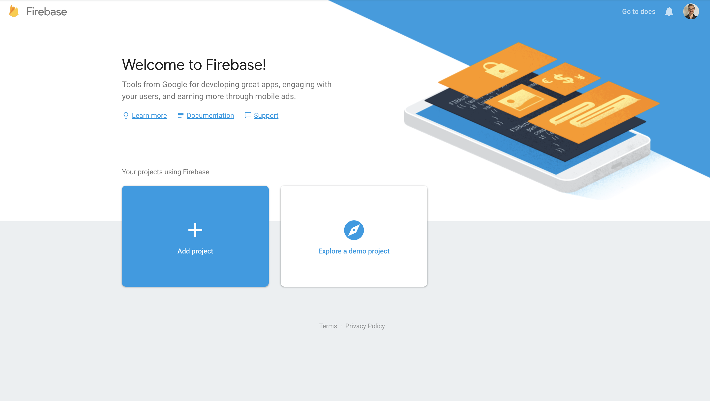
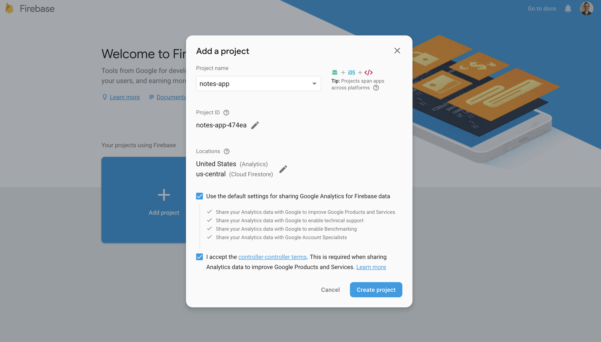
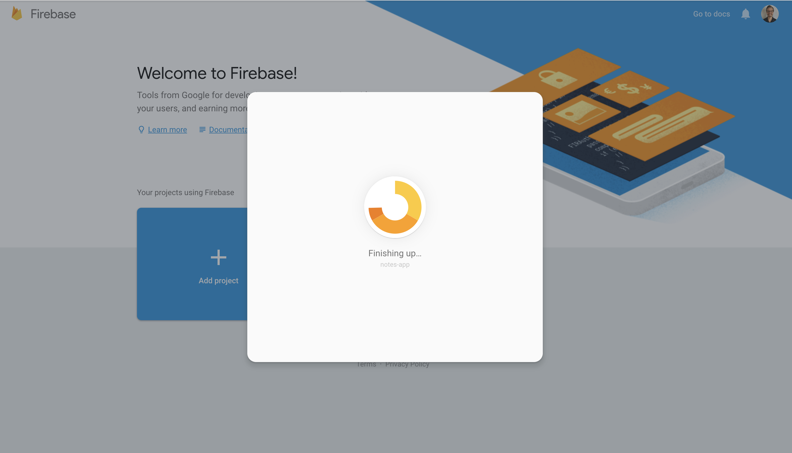
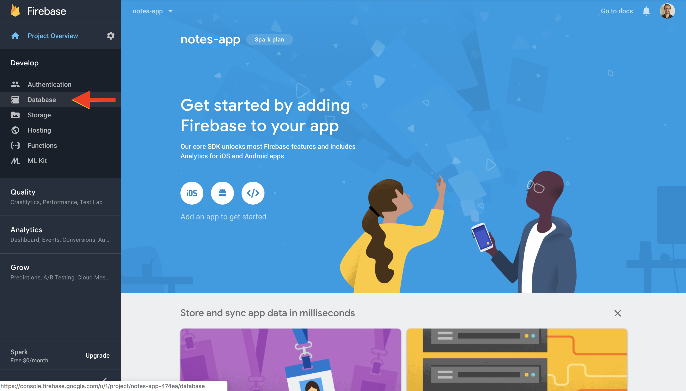
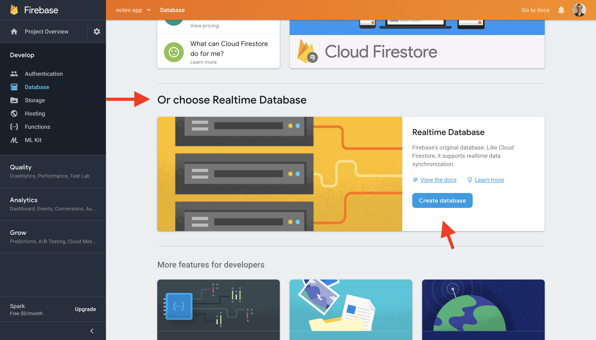
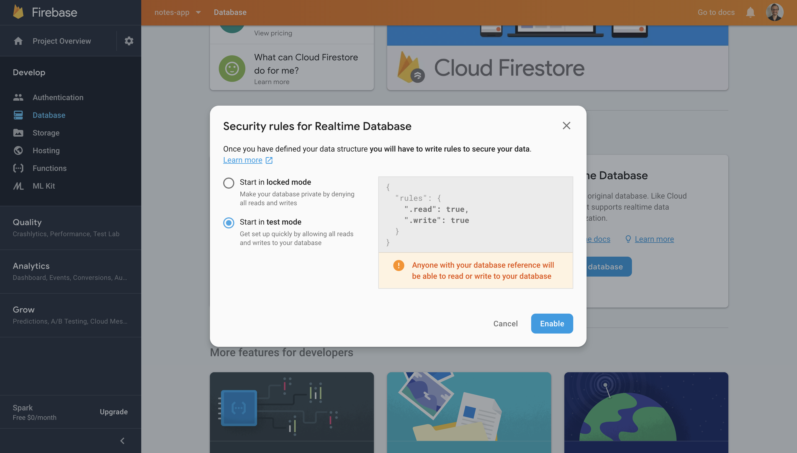
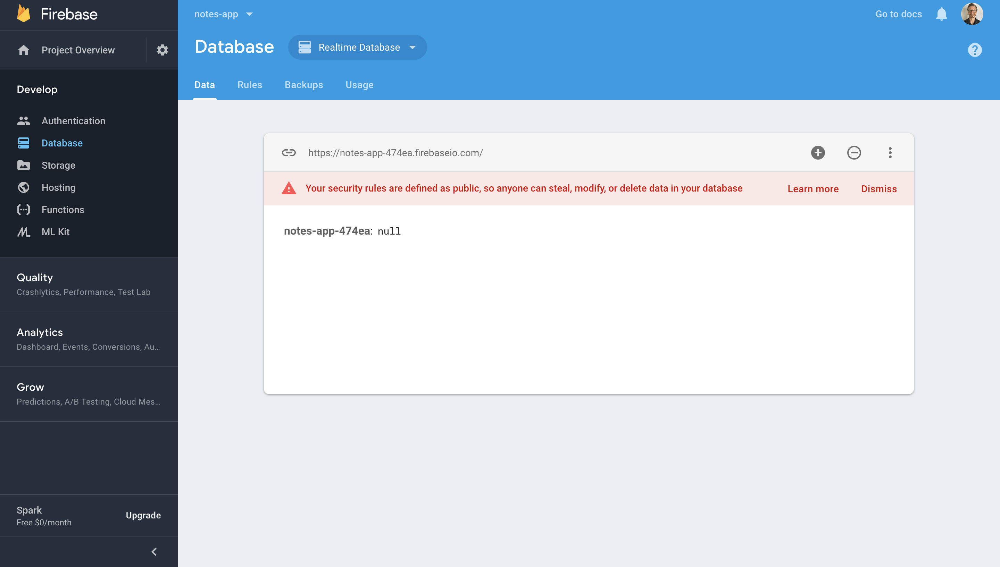
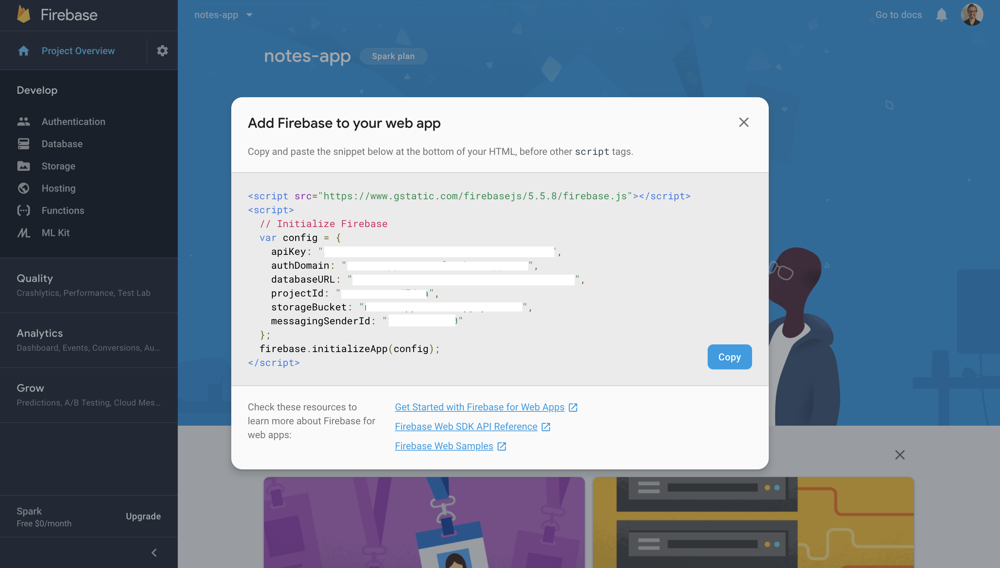
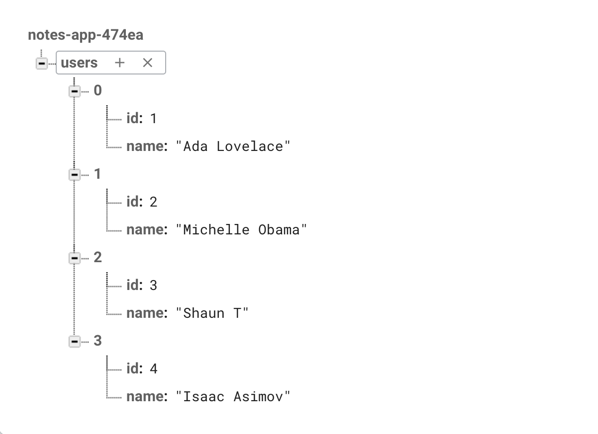
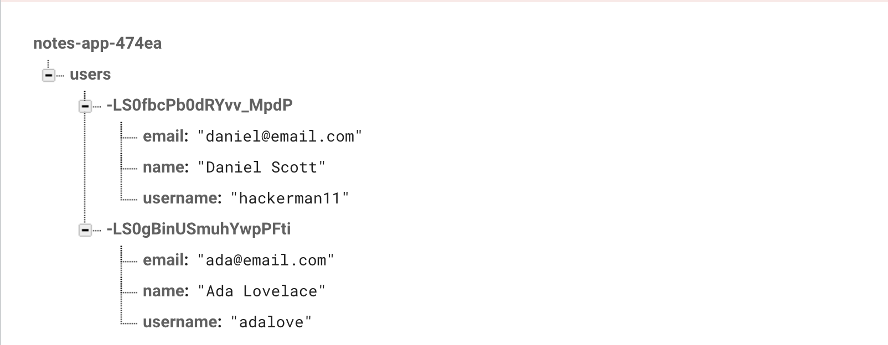

#  Google Firebase 101


This is a tutorial focused around how to integrate Google Firebase into your React Application.

**Pre-Requisites**

- Students have a beginner/intermediate understanding of React.js.

- Students understand how client-side http requests are made.

**Fun Fact**

The Firebase real-time database is considered a `noSQL` database.


## Step One

Before we get started, we need to create a Google Firebase account.

Go to: [https://firebase.google.com](https://firebase.google.com).


**Once signed up, go to the console**



**Then select the option to create a project**

- Choose a project name.
- We'll name our project `notes-app`; this is the name of the assignment/mini project you can complete later.
- Opt in to the user agreement, click submit, and you're all set.




**Select the option to create a real-time database**



**You'll get a page like this...**


**Scroll down until you see the real-time database option**



**Once selected, you'll be prompted to choose the security rules for your real-time database**



**Select the `test mode` option, this will allow us to easily access our real-time database without issues during development**

**Perfect! Your real-time database is now setup!**



## Step Two

We need to configure our react application for firebase integration.

- First, create a `firebase` directory inside the `src` directory.
    - `mkdir src/firebase`.
  
- Then create a file inside the `firebase` directory called `firebase.js`
    - `touch src/firebase/firebase.js`
  
- Next, install `firebase` using the following command:
    - `npm i --save firebase`
  
- Then set up our firebase configuration file as follows below:

```js
import firebase from 'firebase/app'
import 'firebase/database'
```
This will expose all of the methods available from the firebase database package

- Now grab the configuration code from firebase, and paste it into our file:

**To get the configuration code, click on `Project Overview`**


**Then click on 'Add Firebase to Webapp'**



Once you've copied the code, paste it into `firebase.js`; your file should look like this:

```js
import firebase from 'firebase/app'
import 'firebase/database'

const config = {
      apiKey: "YOUR_API_KEY",
      authDomain: "YOUR_AUTH_DOMAIN",
      databaseURL: "YOUR_DB_URL",
      projectId: "notes-app",
      storageBucket: "YOUR_STORAGE_BUCKET",
      messagingSenderId: "00000000000000"
  };
  firebase.initializeApp(config); 
```

Then we initialize an instance of the database object inside the file like this:

```js
const database = firebase.database()
```

Your code should look like this:

```js
import firebase from 'firebase/app'
import 'firebase/database'

const config = {
      apiKey: "YOUR_API_KEY",
      authDomain: "YOUR_AUTH_DOMAIN",
      databaseURL: "YOUR_DB_URL",
      projectId: "notes-app",
      storageBucket: "YOUR_STORAGE_BUCKET",
      messagingSenderId: "00000000000000"
  };
  firebase.initializeApp(config); 
  const database = firebase.database()

  // don't forget to export
  export default database
```

Let's see if it works! 

Import firebase into `Playground.js` like this:

```js
import React, { Component } from 'react';
import database from './firebase/firebase'
```
...Let's use a React lifecycle method to write some data to our real-time database

```js
  componentDidMount(){
    database.ref().set({
      "name": "Daniel Scott"
    })
    .then(() => console.log('Data Written Successfully'))
    .catch((error) => console.log('Firebase Error ', error))
  }
// don't worry, we'll explain what all of this code means shortly
```
**Playground.js should look like this now**

```js
import React, { Component } from 'react';
import database from './firebase/firebase'

class Playground extends Component {
  componentDidMount(){
    database.ref().set({
      "name": "Daniel Scott"
    })
    .then(() => console.log('Data Written Successfully'))
    .catch((error) => console.log('Firebase Error ', error))
    /* 
      the firebase .set() method returns a promise as do several firebase methods
      so we can handle that promise using .then() and .catch()
    */
  }
  render(){
    ...
  }

```
Now, start up the dev server using the following command:

```bash
npm start
```

Once the root component mounts, we should see data written in our database:


Congratulations! You've succesfully integrated firebase into your react application!

## Step Three

What if we needed to write more complex data to firebase?

Well, there's good news because firebase is fully configured to accept all kinds of data...


```js
  database.ref().set({
    name: "Daniel Scott",
    age: 33,
    isDeveloper: true,
    location:{
        city: "Dallas",
        country: "USA"
    }
})
.then(() => console.log('Data Written Successfully'))
.catch(error => console.log('Firebase Error ', error))
```

We can use strings, numbers, objects, and booleans inside of our firebase real-time database.

> What about arrays?

The firebase real-time database has an interesting way of handling arrays.

[Read this!](https://firebase.googleblog.com/2014/04/best-practices-arrays-in-firebase.html)


If we update `./firebase/firebase.js` with the code above, we could go our firebase console and see the changes reflected immediately.

> Okay, so now you're probably wondering what: `database.ref().set()` does.

First of all, Firebase does more than provide a real-time database. For example, there's authentication, storage, test lab, and many other tools we can use.

```js
const database = firebase.database()
```
- The expression above exposes the `database` object from firebase as a result of calling it as a function and assigns it to the *database* variable.

- Once we make the connection to our `database` object, we can then reference a particular collection inside of it by calling `ref()`
  
- `ref()` allows us to reference a particular collection inside of our database.
  - If we don't pass the name of our collection as a string, this method will reference the root of our database.
- The `.set()` method returns a promise, so we can handle that promise using `.then()` and `.catch()` as before.


## Lists of Objects and Firebase Collections

At this point, we've made a connection to our firebase and even managed to write some data to our real-time database.

> There's one small problem...

This entire time, we've written data at the root of our database. We need to make better use of `ref()` and organize our data into seperate collections, let's begin.

The method, [`ref()`](https://firebase.google.com/docs/reference/js/firebase.database.Reference) allows us to reference the root or a child "`collection`" location in our database

Say we need to create a **users** collection inside our real-time database?

Here's how we can  create the collection, reference it, write data to it, and handle the promise that gets returned:

```js
database.ref('users').set({name: 'Daniel'})
.then(() => console.log('Data Written Successfully'))
.catch(error => console.log('Firebase Error: ', error))
```

If we go back to our real-time database, we should see the changes reflected.

> "Okay, this is great and all, but what if we needed to add another user?"

Let's try to add a different user:

```js
database.ref('users').set({name: 'Danielle'})
.then(() => console.log('Data Written Successfully'))
.catch(error => console.log('Firebase Error: ', error))
```

What happened???

> "The original data was overwritten...Hmmm...that was unexpected"
> Our data was overwritten, and that's a big problem... how do we solve it?

`.set()` has it's purpose, and you can read more about it [here](https://firebase.google.com/docs/reference/js/firebase.database.Reference?authuser=0#set) but it's not the best solution for what we need to do.

What if we add all the user objects to an array and send the array to firebase?

Try it with the following code below:

```js
    const users = [
      {id: 1, name: 'Ada Lovelace'},
      {id: 2, name: 'Michelle Obama'},
      {id: 3, name: 'Shaun T'},
      {id: 4, name: 'Isaac Asimov'}
    ]

    database.ref('users').set(users)
    .then(() => console.log('Data Written Successfully'))
    .catch(error => console.log('Firebase Error: ', error))
```

What happened?



**Important Note*

Whenever we set the value of a reference property to an array, we get this weird indexed structure.

[Read this article, Firebase has an interesting way of handling array data](https://firebase.googleblog.com/2014/04/best-practices-arrays-in-firebase.html)

Try to imagine the real-time database as one big object, with properties we can refer to as collections inside of our database.

> "So, how do we create a list of objects in a meaningful way?"

**Enter .push()**

> ...but not the .push() array method you're familiar with in JavaScript, but the firebase .push() method.

To organize our data in a more meaningful way, firebase give us a special method, [`.push()`](https://firebase.google.com/docs/database/admin/save-data)

This method, save the data as an object property, and create a unique reference to it as well.

Let's see an example:

```js

  database.ref('users').push({
    name: 'Daniel Scott',
    username: 'hackerman11',
    email: 'daniel@email.com'
  })

```

Let's add one more user...

```js
  database.ref('users').push({
    name: 'Ada Lovelace',
    username: 'adalove',
    email: 'ada@email.com'
  })

```

We can also access this special key generated by `.push()` like this:

```js

  const newUser = database.ref('users').push({
    name: 'Ada Lovelace',
    username: 'adalove',
    email: 'ada@email.com'
  })
  console.log(newUser.key)


// -LSG4b_bW1PdMbCwGdXI
```
Say we need to run some sort of operation following the completion of `.push()`?

We can pass an optional callback to run on complete...

```js
    const user = database.ref('users').push({
      name: 'Daniel Scott',
      email: 'daniel@email.com'
    }, () => console.log('Data Written Successfully', user.key))
```

Perfect! When we check our console we should see the following changes



Awesome, now we have a better way of adding data to our real-time database.

**Updating data**

Now, suppose we needed to update our data inside our real-time database?

Google firebase makes this very easy for us with [`.update()`](https://firebase.google.com/docs/database/admin/save-data)

According to the documentation, we start by creating a reference to the resource we wish to update:

```js
const userToUpdateRef = database.ref('users/-LS0fbcPb0dRYvv_MpdP')
                                        // ^ an Id/unique key to the resource
```

Then we can all the `update()` method as pass in the key pairs of the attributes that need to be updated.

```js
    const userRef = database.ref('users/-LS0fbcPb0dRYvv_MpdP')
    userRef.update({
      email: 'ada.lovelace@email.com'
    })
    .then(() => console.log('Data Updated Sucessfully'))
    .catch(error => console.log('Firebase Error ', error))
```


**Delete Data**

> Time to talk about the D in 'CRUD`

So, to delete data inside of firebase, we would write our logic very similarly to how we updated data.

To do this, we use [`.remove()`](https://firebase.google.com/docs/reference/js/firebase.database.Reference?authuser=0#remove)


```js
// We create a reference to the data we want to remove
  const userToDelete = database.ref('users/-LSGiMcRkG4B6u88onN9')
  // We call .remove()
  userToDelete.remove()

  // We then handle the promise
  .then(() => console.log('User Deleted Successfully'))
  .catch(error => console.log('Firebase Error: ', error))
```

**Read Data**

Now, we've reached the point where we need to be able to read data from our firebase real-time database.

Firebase gives us two common ways to do this... `.on()` and `.once()`

[`.on()`](https://firebase.google.com/docs/reference/js/firebase.database.Reference?authuser=0#on) is one of the most common read methods for the firebase database

```js

      database.ref('users').on('value', (snapshot) => {
        // value is the event that triggers when something changes
        // the snapshot is the data from firebase in it's current state
          const updatedUsers = []
          /* Then we can use the firebase .forEach method to iterate through each object
            and pushing it into the empty array we created above
          */ 
          snapshot.forEach(childSnapshot => {
              updatedUsers.push(
                      {
                      id: childSnapshot.key,
                      // .key is the property value that gives us the unique key identifier for each object
                      ...childSnapshot.val()
                      // Then, with ES6 destructuring we can add the remaining key value pairs by calling the firebase .val() method
                      }
                  )
              })
          }
      )
```

[`.once()](https://firebase.google.com/docs/reference/js/firebase.database.Reference?authuser=0#once) is a wonderful tool for retrieving a single object

```js
    const singleUser = database.ref('users/-LSGzqXK1aUxfpmKMEfC')
    singleUser.once('value')
    .then((snapshot) => console.log(snapshot.val()))
    .catch(error => console.log('Firebase Error: ', error))
```

**The 'value' event** 

*This event will trigger once with the initial data stored at this location, and then trigger again each time the data changes.*

Excellent! And there we have it!

**Bonus**

Now, that we've had a chance to get familiar with Firebase, it's challenge time! :sunglasses:

Go to `App.js` inside this repo to find an incomplete notes application and attempt to finish it.
