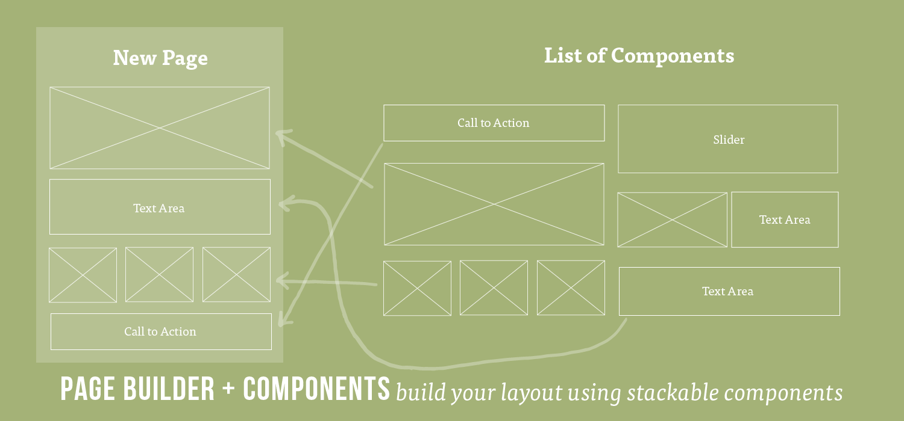

# Intro to React.js


## Learning Objectives

- Explain what a frontend framework is and why they can be helpful in writing
  more complex applications.
- Explain what ReactJS is and where it fits in our applications' stack.
- Explain the component model of web development.
- Create and render React components in the browser.

## Framing

### What is a Frontend Framework? (5 min / 0:05)

- A framework is software providing generic functionality and structure that
  serves as foundation to build and deploy applications.
- Express is a framework that runs on the server, receives incoming requests
  from the client, performs some work that you have defined, and returns a
  response to the client. React is a front-end framework, which runs in the
  browser only. It makes building complex user interfaces easier.
- Frameworks can help standardize code, give you additional functionality and
  performance, and can help get your code off the ground faster.
- There are [many](https://2018.stateofjs.com/front-end-frameworks/overview/) front end frameworks
  and each go about solving problems of how state is managed, updated, and
  displayed on the page in their own way, but there are many commonalities.
- There is a lot of debate over whether frontend frameworks count as frameworks
  at all -- some people say that they are just libraries and should be referred
  to as such.

### What is ReactJS? (5 min / 0:10)

React is a JavaScript library used to craft modern day UI and views for the
front-end in web applications.

> **Selling Point:** By modeling small compatible components that focus on just
> rendering a view, we can move business logic out of the DOM, and therefore
> improve our app's performance, maintainability, modularity and readability.

#### Some History

The first thing most people hear about React is "Facebook uses it."

- First used by Facebook in 2011.
- Then Instagram in 2012.
- Went open source in May 2013.

React was born out of Facebook's frustration with the traditional MVC model and
how..

- Re-rendering something meant re-rendering everything (or just a lot).
- That had negative implications on processing power and ultimately user
  experience, which at times became glitchy and laggy.

> If you want to get a taste of what React is all about,
> [here's an introduction from React.js Conf 2015](https://www.youtube.com/watch?v=KVZ-P-ZI6W4&feature=youtu.be&t=510).
> Recommend starting around the 8:35 mark and watching until 16:30.

### React in MVC

React can be thought of as the V in MVC.

React will work with any back-end language, but for project 3 and in our
in-class examples we will be using Sequelize and Express for the models and
controllers, since we already have them set up.

<details>
  <summary><strong>What is the role of a "view" in a front-end Javascript application?</strong></summary>
  The visual template the user sees, often populated with data from our models.
</details>

## Components (15 min / 0:25)

The way we've been building our pages so far is using
HTML or simply rendering JSON data. We display a whole page at a time, and in order to display an
update, we have to reload the entire page.

A core part of the React philosophy is to build everything out using components,
instead of templates.

You can think of a component as a small piece of a webpage that has a singular
purpose. It can be as little as a single `<input>` field or as big as a sidebar
containing other components. Yes, components can hold other components.


Going back to how our backend worked, we rendered data based the route we were on.
That's just fine, but it's not the only way.



With components, we define them once (each React component should be defined in
its own file), and we can reuse them as many times as we want, on different
pages.

When we need to make updates, we only have to make those updates in one file.

### Examples!

Let's take a look at an example webapp and see how it might be broken down into
components.


> [MakeTea - Building Robust Apps with React](http://maketea.co.uk/2014/03/05/building-robust-web-apps-with-react-part-1.html)

Notice the structure of how the various components are nested.

```
- TubeTracker
    - Network
        - Line
    - Predictions
        - DepartureBoard
            - Trains
```

- TubeTracker contains the application
- Network displays each line on the network
- Line displays the stations on a line
- Predictions controls the state of the departure board
- DepartureBoard displays the current station and platforms
- Trains displays the trains due to arrive at a platform

### [F.I.R.S.T. Components](https://addyosmani.com/first/)

Best practice is that React components follow the **F.I.R.S.T.** guidelines

#### Focused

Components should do one thing and do it well.

#### Independent

Components should increase cohesion and reduce coupling. Behavior in one
component should not impact the behavior of another. In other words, components
should not rely on one another.

> But they should compliment one another.

#### Reusable

Components should be written in a way that reduces the duplication of code.

#### Small

Ideally, components should be short and condensed.

#### Testable

Because the same input will always produce the same output, components are
easily unit testable.

> If you're interested,
> [Jest](https://facebook.github.io/jest/docs/tutorial-react.html) is a popular
> testing library for React.

## Exercise: Identifying Components (15 min / 0:40)

> 10 minutes exercise. 5 minutes review.

- Break into groups of three and take a look at Facebook, Craigslist, Ebay, or a
  website of your choice. Identify the visual "components" the website is
  comprised of. Use markers to draw these out on the wall.

As you're drawing this out, think about the following questions...

- Where do you see "nested components"? Where do you not?
- Are there any components that share the same structure?
- Of these similar components, what is different about them?

## Initial Setup (15 min / 0:55)

In order to create a new project and to get our development environment setup,
we are going to use the Terminal command `create-react-app`. It will create a
new folder in your current directory for the in-class application.

`create-react-app` is an NPM package also built by Facebook that writes our
build dependencies for us so that we can do less configuration. It allows us to
use React, JSX, and ES6. It also allows us to import our CSS, it autoprefixes
our CSS so that we don't have to worry about cross browser compatibility, it
gives us a dev server to run, and it enables hot reloading which updates the
code in our browser without us refreshing the page.

It uses Webpack which is a build tool that enables many of the features listed
above. It also includes Babel which transpiles our JavaScript from ES6 to be
compatible with older browsers. It also includes Autoprefixer for CSS
compatibility, ESLint for linting, and Jest for testing.

You can also set up all this yourself, but for now `create-react-app` allows us
to worry more about our code and less about configuration.

```bash
$ npx create-react-app blog-app
$ cd blog-app
$ code .
$ npm run start
```

> Here you will begin setting up a blog app that you will continue working on
> during this lesson's exercises. For demonstration purposes, We will be
> creating a simple "hello world" app.

After running `$ npm run start`, we can view the app at `http://localhost:3000`

`create-react-app` provides us with a lot of nice tools and configuration to
start writing React. It isn't required but it makes things easier, and we'll use
it a lot throughout the rest of this unit.

Along with installing the necessary dependencies, it creates an initial app
skeleton that looks like this...

```bash
├──README.md
├──  favicon.ico
├──  index.html
├──  node_modules
├──  package.json
└──  src
    ├──  App.css
    ├──  App.js
    ├──  index.css
    ├──  index.js
    └──  logo.svg
```

Most of the important files, which are primarily the ones where we will be
working today, are in the `/src` directory.

Take some time and look at what's been generated. Specifically look in `App.js`
and `index.js`

## Break: (10 min / 1:05)

---

### We Do: Hello World - A Very Basic Component (10 min / 1:15)

The basic unit you'll be working with in ReactJS is a **component**.

- Components can be thought of as functional elements (literally a JS function)
  that take in data and as a result, produce a dynamic UI.

Throughout class we have separated HTML, CSS and Javascript in different files.

- With components, the lines between those three become a bit blurry.
- Instead, we organize our web apps according to small, reusable components that
  define their own content, presentation and behavior.

What does a component look like? Let's start with a simple "Hello World"
example.

To start, in our `/src/App.js` file, let's remove ALL the contents and in its
place add this component definition...

```jsx
// Bring in React instance from React
import React from 'react';
import logo from './logo.svg';
import './App.css';

// Define our Hello component
function Hello() {
  // Make sure to return some UI
  return <h1>Hello World</h1>;
}

export default Hello;

```

> Note: We're using a more modern version of javascript called ES6. It's still
> javascript, but it has some additional features. We can use them without fear
> because create-react-app has configured everything for us.

Let's break down the things we see here...

##### `function Hello`

This is the component we're creating. In this example, we are creating a "Hello"
component.

##### `return`

Every component returns something. It generates a **Virtual DOM**
node that will be added to the actual DOM.

Looks just like HTML right!?

##### `export default Hello`

This exposes the Hello class to other files which import from the App.js file.
The `default` keyword means that any import that's name doesn't match a named
export will automatically revert to this. Only one default is allowed per file.

### JSX (5 min / 1:20)

> Hey you got your html in my javascript!
>
> You got your javascript in my html!
>
> (https://youtu.be/O7oD_oX-Gio?t=5s)

Let's talk about the value that the component returns. It looks an awful lot
like an HTML heading, but it's not. We often write out React components in JSX.

JSX is technically
[a language that compiles to Javascipt](https://medium.com/yld-engineering-blog/getting-started-with-react-and-node-js-2d39018ebe26)
that allows us to write code that strongly resembles HTML. It is eventually
compiled to lightweight JavaScript objects, which are then turned into HTML on
the page.

So what you write here does eventually wind up on the page (mostly) as you wrote
it.

Your Hello component:

- Currently returns JSX, not HTML. The JSX creates a heading with 'Hello
  World!'.
- Your component reads this and renders a "Hello World!" heading.

> React can be written without JSX, or with other syntax alternatives. If you
> want to learn more,
> [check out this blog post](http://jamesknelson.com/learn-raw-react-no-jsx-flux-es6-webpack/).

## Virtual DOM (5 min / 1:25)

You may have noticed that our `src/index.js` code mentions ReactDOM. ReactDOM
doesn't refer to the same DOM we know. Instead, it refers to a Virtual DOM. The
Virtual DOM is a key piece of how React works.

The Virtual DOM is a Javascript representation of the actual DOM. The virtual
DOM is a staging area for changes that will eventually be implemented.

- Because of that, React can keep track of changes in the actual DOM by
  comparing different instances of the Virtual DOM.
- React then isolates the changes between old and new instances of the Virtual
  DOM and then only updates the actual DOM with the necessary changes.
- By only making the "necessary changes," as opposed to re-rendering an entire
  view altogether, it's significantly more efficient.
- This is not unlike Git, with which you compare the difference -- or `diff` --
  between two commits. It just happens really fast and behind the scenes a bit.


> If you're interested in learning more about the Virtual DOM,
> [check this video out](https://www.youtube.com/watch?v=-DX3vJiqxm4).

So we've created the template for our component. Now, let's use `/src/index.js`
to load in our new component and render it on the DOM...

```jsx
import React from 'react';
import ReactDOM from 'react-dom';
import './index.css';
import Hello from './App';
import * as serviceWorker from './serviceWorker';

ReactDOM.render(
  <React.StrictMode>
    <Hello />
  </React.StrictMode>,
  document.getElementById('root')
);
```

`ReactDOM.render` takes the Virtual DOM node created by `extends Component` and
adds it to the actual DOM. It takes two arguments...

1. The component.
2. The DOM element we want to append it to.

> Note: `StrictMode` is a new addiciton to React. It is a tool for highlighting potential problems in an application. `StrictMode` does not render any visible UI. It activates additional checks and warnings for its descendants.

We only have to use this when "attaching" react to our html, which should only
happen once. That's why we do it at the root of the page, so that the rest of
our site can be built using react components.

> Note: We have to use an uppercase letter when describing components in JSX.
> Otherwise React thinks we're just writing an HTML tag.

> **NOTE:** Whenever you use a self-closing tag in JSX, you **MUST** end it with
> a `/` like `<Hello />` in the above example. Just like regular HTML!

---

### Hello World: A Little Dynamic (15 min / 1:40)

Our `Hello` component isn't too helpful. Let's make it more interesting.

- Rather than simply display "Hello world", let's display a greeting to the
  user.
- So the question is, how do we feed a name to our `Hello` component without
  hardcoding it inside of the component?

First, we pass in data wherever we are rendering our component, in this case in
`src/index.js`...

```jsx
import React from 'react';
import ReactDOM from 'react-dom';
import './index.css';
import Hello from './App';

ReactDOM.render(
  <React.StrictMode>
    <Hello name={'Nick'} />
  </React.StrictMode>,
  document.getElementById('root')
);
```

Then in our component definition, we have a reference to that data via as a
property on the `props` object...

```jsx
function Hello(props) {
  return <h1>Hello {props.name}</h1>;
}
```

In the above example, we first have to add the `props` parameter to our component in order to access the `props` property
We then replaced "world" with `{props.name}`.

#### What are `props`?

Properties! Every component has `.props`

- Properties are immutable. That is, they cannot be changed while your program
  is running.
- We define properties in development and pass them in as attributes to the JSX
  element in our `.render` method.

First we can pass multiple properties to our component when its rendered in
`src/index.js`..

```jsx
import React from 'react';
import ReactDOM from 'react-dom';
import './index.css';
import Hello from './App';

ReactDOM.render(
  <React.StrictMode>
    <Hello name={'Nick'} age={24} />
  </React.StrictMode>,
  document.getElementById('root')
);
```

Then in our component definition we have access to both values...

```jsx
function Hello(props) {
  return (
    <div>
      <h1>Hello {props.name}</h1>
      <h1>You are {props.age} years old</h1>
    </div>
  );
}
```

> **NOTE:** The return statement can only return one DOM element.
> You can, however, place multiple elements within a parent DOM element, like we
> do in the previous example with `<div>`.

## You Do: A Blog Post (15 min / 1:55)

> 10 min to work, 5 min review

Let's have some practice creating a React component from scratch. How about a
blog post?

- Create a variable `post` object in `src/index.js` above `ReactDOM.render()`
  that has the below properties.
  1. `title`
  2. `author`
  3. `body`
  4. `comments` (array of strings)
- Create a `Post` component.
- Render these properties using a Post component.
- The composition of your Post is up to you.

## Nested Components (30 minutes / 2:25)

#### Q: What problems did you encounter when trying to add multiple comments to your Post?

It would be a pain to have to explicitly define every comment inside of
`<Post />`, especially if each comment itself had multiple properties, or if we
didn't know how many comments there were.

- This problem is a tell tale sign that our separation of concerns is being
  stretched, and it's time to break things into a new component.

We can nest a Comment component within a Post component.

- We create these comments the same way we did with posts
- Then we can reference a comment using `<Comment />` inside of Post's return
  method.

Let's create a new file for our Comment component, `src/Comment.js`...

```jsx
import React from "react";

function Comment(props) {
   return <li>{props.message}</li>;
}

export default Comment;
```

Then in `src/Post.js`, we need to load in our `Comment` component and return it
inside of our `Post` component...

```jsx
import Reactfrom "react";
import Comment from "./Comment";

function Post(props) {
   return (
     <div>
       <h1>{props.title}</h1>
       <p>By: {props.author}</p>
       <div>{props.body}</div>
       <ul>
         <Comment message={props.comments[0]} />
         <Comment message={props.comments[1]} />
         <Comment message={props.comments[2]} />
       </ul>
     </div>
   );
}

export default Post;
```
> **Note**: We could put all of our code in one file, but it's considered a good
> practice to break components out into different files to help practice
> separation of concerns. Just remember to **export** each component from its
> file and **import** it where you want to use it!

The above code works, but as you can see we have hard-coded all of our
`Comments`. This is not very DRY.

There must be a better way!

Since `comments` (in index.js) is an array, we can use `.map` wherever we've
passed it down. In this case, we've got it in the props object.

```js
function Post(props) {
    let comments = props.comments.map((comment, index) => (
      <Comment message={comment} key={index} />
    ));

    // now comments is equal to a list of components
    return (
      <div className="post-page">
        <h1>{props.title}</h1>
        <h2>By {props.author}</h2>
        <p>{props.body}</p>
        <ul>{comments}</ul>
      </div>
    );
}
```

---

## Closing (5 min / Rest of Class)

- Why do we use components in React?
- What is the Virtual DOM?
- What is JSX?
- What features does `create-react-app` give us?
